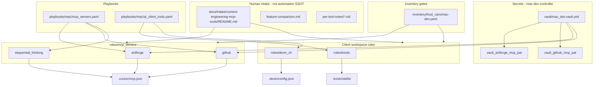

# Context Engineering MCP Tool Roles

## Scope (confirmed)

**In scope for this plan:**
- [Artiforge MCP](https://docs.artiforge.ai/getting-started/installation/) — remote HTTP MCP with PAT
- [GitHub MCP Server](https://github.com/github/github-mcp-server) — **does not exist in repo today** (confirmed via grep)
- [Sequential Thinking MCP](https://mcpservers.org/servers/modelcontextprotocol/sequentialthinking) — npm stdio, no secrets
- **Knotic** — IDE install on mac-dev **plus** `.knotic/skills/` scaffold ([comparison source](https://knotic.dev/vs/cursor))
- **Devin** — Devin CLI install **plus** project `.devin/config.json` MCP entries ([MCP config docs](https://docs.devin.ai/cli/extensibility/mcp/configuration))

**Explicitly out of scope:** fetch, firebase, and any API-usage plans you are handling elsewhere.

**Precedent already in repo:** [roles/mcp_servers/firecrawl/](roles/mcp_servers/firecrawl/) (vault + mac MCP playbook pattern from prior work).

---

## Architecture



---

## Human-readable reference area (for you, not framework SSOT)

Create intake packet: [`docs/intake/context-engineering-mcp-tools/`](docs/intake/context-engineering-mcp-tools/)

| File | Contents |
|---|---|
| `README.md` | Index, links to upstream docs, role mapping, implementation order |
| `feature-comparison.md` | Your requested table — **Artiforge vs GitHub Copilot vs Cursor vs Devin** (Windsurf column renamed per your note). Rows sourced from [Artiforge blog](https://artiforge.ai/blog/context-engineering-mcp), [Knotic vs Cursor](https://knotic.dev/vs/cursor), and Devin docs — labeled `pending_research` where not verified live |
| `notes/artiforge.md` | Context Engineering MCP summary, PAT flow, IDE install snippets |
| `notes/knotic.md` | Team-governance positioning vs Cursor; Skills-as-Code; Gatekeeper/quarantine steps from [knotic.dev/download](https://knotic.dev/download) |
| `notes/devin.md` | Cloud agent vs CLI; MCP namespacing (`mcp__server__tool`); `.devin/config.local.json` for secrets |
| `notes/github-mcp.md` | Remote vs local Docker decision record |
| `notes/sequential-thinking.md` | Tool purpose, verification prompts |

This stays under `docs/intake/` until you promote it; roles READMEs link back with one line each.

---

## Role design (by tool)

### 1. `roles/mcp_servers/artiforge/` — HTTP MCP (secret required)

**Upstream pattern** (from Artiforge docs):

```json
{
  "mcpServers": {
    "Artiforge": {
      "url": "https://tools.artiforge.ai/mcp?pat=xxxxxxxxxxxxxxx",
      "type": "http"
    }
  }
}
```

**Role interface:**
- `artiforge_mcp_state: present|absent`
- `artiforge_mcp_targets: [cursor, codex]` (default `cursor` only initially)
- Vault: `vault_artiforge_mcp_pat` in [`vault/mac_dev.vault.yml`](vault/mac_dev.vault.yml)
- Load vault via `include_vars` + `name: vault_vars` (same pattern as [firecrawl load_vault.yml](roles/mcp_servers/firecrawl/tasks/load_vault.yml))
- **No npm install** — configure-only HTTP MCP (like [langfuse_docs](roles/mcp_servers/langfuse_docs/))
- Extend `configure_target.yml` to support optional `type: http` and URL-only entries (Cursor already accepts bare `url` for HF/Langfuse; Artiforge docs show explicit `type`)

**Apply / Verify / Undo / Class:** idempotent config; verify with `uri` probe to endpoint (expect 401/405 without valid PAT during dry checks — document in README); undo via `absent` + remove server key.

---

### 2. `roles/mcp_servers/github/` — HTTP MCP (secret required)

**Does not exist today** — new role.

**Recommended default (architecture assertion):** **remote HTTP** at `https://api.githubcopilot.com/mcp/` with Bearer PAT — avoids Docker dependency on mac-dev and matches GitHub’s “easiest path” guidance. Local Docker (`ghcr.io/github/github-mcp-server`) remains an optional override via `github_mcp_transport: remote|docker`.

**Role interface:**
- `github_mcp_state`, `github_mcp_targets`, `github_mcp_server_key: github`
- Vault: `vault_github_mcp_pat` in `vault/mac_dev.vault.yml`
- Remote entry shape:

```json
{
  "url": "https://api.githubcopilot.com/mcp/",
  "type": "http",
  "headers": { "Authorization": "Bearer <PAT>" }
}
```

- Codex target via shared [`configure_codex_target.yml`](roles/mcp_servers/_shared/tasks/configure_codex_target.yml)

---

### 3. `roles/mcp_servers/sequential_thinking/` — npm stdio (no secret)

**Upstream package:** `@modelcontextprotocol/server-sequential-thinking`

**Role interface:** mirror [drawio](roles/mcp_servers/drawio/) / [firecrawl](roles/mcp_servers/firecrawl/):
- Global npm install via `node_npm_executable`
- Resolve binary or use `npx -y @modelcontextprotocol/server-sequential-thinking`
- Optional env: `DISABLE_THOUGHT_LOGGING`
- Targets: `cursor`, `codex` (default `cursor`)

Simplest role — implement **first** to validate the batch pattern before vault-gated roles.

---

### 4. `roles/knotic/` — IDE install + Skills scaffold (not `mcp_servers/`)

Knotic is a **VS Code fork workspace**, not an npm MCP server. Per your choice: **install IDE on mac-dev + scaffold repo skills**.

**Role interface:**
- `knotic_state: present|absent`
- `knotic_install_method: dmg` (default; `pending_research` until live probe of download URL from [knotic.dev/download](https://knotic.dev/download))
- `knotic_dmg_url` — provisional, verified at implementation via probe (unsigned ARM64 beta)
- `knotic_app_path: /Applications/Knotic.app`
- `knotic_skills_dir: "{{ dotfiles_home }}/.knotic/skills"`
- `knotic_skills_seed: true` — deploy starter skill files (e.g. `ansible-conventions.md`, `homelab-context.md`) from role templates

**Install tasks (bootstrap/semi-manual class):**
1. `get_url` DMG to cache dir
2. Mount/copy app to `/Applications` (macOS-specific tasks in `mac.yml`)
3. `xattr -d com.apple.quarantine` on DMG/app (documented Gatekeeper flow from Knotic download page)
4. Template seed skills into `.knotic/skills/` (idempotent)

**Not in v1:** Knotic account/credits, BYOK keys, or `.knot` session files — human docs only.

**README:** Use [Knotic vs Cursor](https://knotic.dev/vs/cursor) comparison table (tab completion, Context Lens, Skills-as-Code, pricing) as human-facing product context; do not duplicate full marketing copy.

---

### 5. `roles/devin_cli/` — CLI install + Devin MCP config

Per your choice: **install CLI + manage MCP config**.

**CLI install (bootstrap/semi-manual):**
- Official installer: `curl -fsSL https://cli.devin.ai/install.sh | bash` ([Devin intro](https://docs.devin.ai/get-started/devin-intro))
- Wrap in idempotent `creates:` guard on resolved `devin` binary path
- Document that full cloud Devin IDE remains at app.devin.ai — role manages **local CLI + repo config**, not SaaS signup

**Config surface:**
- Project file: `.devin/config.json` — committed baseline with `mcpServers` stubs and `read_config_from.cursor: true` optional
- Gitignored template: `.devin/config.local.json.example` → operator copies to `.devin/config.local.json` for personal tokens
- Role merges MCP entries for servers this repo already manages (Artiforge, GitHub, Sequential Thinking) using same vault vars — **secrets stay in local override or vault-rendered local file**, not committed JSON

**Role interface:**
- `devin_cli_state: present|absent`
- `devin_cli_mcp_servers: [artiforge, github, sequential_thinking]` — composes entries from facts set by vault load tasks or inline templates
- Tags: `devin_cli`, `devin_mcp`

---

## Playbook wiring

| Playbook | Roles | When to run |
|---|---|---|
| [`playbooks/mac/mcp_servers.yaml`](playbooks/mac/mcp_servers.yaml) | `sequential_thinking`, `artiforge`, `github` (+ existing servers) | Controller MCP convergence |
| **New** [`playbooks/mac/ai_client_tools.yaml`](playbooks/mac/ai_client_tools.yaml) | `knotic`, `devin_cli` | mac-dev IDE/CLI tooling |

Keep MCP servers out of [`deploy_development_nodes.yaml`](playbooks/deploy_development_nodes.yaml) per [ai.mcp_servers.instructions.md](roles/mcp_servers/ai.mcp_servers.instructions.md) — optional cross-link in playbook header comments only.

**Inventory gates** in [`inventory/host_vars/mac-dev.yaml`](inventory/host_vars/mac-dev.yaml):

```yaml
sequential_thinking_mcp_state: present
artiforge_mcp_state: absent      # enable after PAT ingested
github_mcp_state: absent         # enable after PAT ingested
knotic_state: absent             # enable when ready for unsigned beta install
devin_cli_state: absent          # enable when CLI desired
```

Defaults stay conservative in role `defaults/`; host_vars flip to `present` when commissioned (AGENTS.md §18 pattern).

---

## Vault / secret ingestion

Add to [`vault/mac_dev.vault.yml`](vault/mac_dev.vault.yml):

| Variable | Used by |
|---|---|
| `vault_artiforge_mcp_pat` | artiforge MCP URL |
| `vault_github_mcp_pat` | GitHub MCP Bearer header |

**Operator commands** (for plan execution phase — same pattern as firecrawl):

```bash
cd /Users/joshc/develop/dotfile-vnext
sed -i '' '/^vault_artiforge_mcp_pat: ""$/d' vault/mac_dev.vault.yml
bin/codex-env ansible-vault encrypt_string 'YOUR_ARTIFORGE_PAT' \
  --name 'vault_artiforge_mcp_pat' >> vault/mac_dev.vault.yml

sed -i '' '/^vault_github_mcp_pat: ""$/d' vault/mac_dev.vault.yml
bin/codex-env ansible-vault encrypt_string 'ghp_YOUR_GITHUB_PAT' \
  --name 'vault_github_mcp_pat' >> vault/mac_dev.vault.yml
```

Then set corresponding `*_state: present` in `mac-dev.yaml`.

---

## Shared implementation checklist (each role)

Scaffold from [`roles/mcp_servers/_template/`](roles/mcp_servers/_template/) for MCP roles; custom layout for `knotic` and `devin_cli`.

Every role gets:
- `defaults/main.yml`, `meta/argument_specs.yml`, `README.md`
- MCP roles also: `mcp_contract.yml`, `tasks/{main,present,absent,configure_target,remove_target,openapi_stub}.yml`
- Row in [`roles/mcp_servers/README.md`](roles/mcp_servers/README.md) (MCP roles only)
- Validation stub under `docs/reports/mcp_server_validations/<name>/README.md`

**Executor gates before live apply:**
1. `inventory-parse` / `inventory-find-host` for mac-dev merged vars
2. `validate-playbook` + `ansible-lint`
3. First run: read-only tag preview showing targets + vault key presence (no mutation without PAT)
4. `-vvv` apply on mac-dev

---

## Recommended implementation order

1. **Intake packet** + feature comparison table (human review first)
2. **Sequential Thinking** — no vault; proves npm MCP path
3. **Artiforge** — HTTP + vault; extends configure_target for `type: http`
4. **GitHub MCP** — HTTP + vault; remote default
5. **Devin CLI** — install script + `.devin/config.json` composer
6. **Knotic** — DMG bootstrap + skills scaffold (highest bootstrap/manual class)
7. Update [`docs/tool_access/README.md`](docs/tool_access/README.md) diagram with new MCP/client surfaces

---

## Risks and decisions

| Risk | Mitigation |
|---|---|
| Knotic unsigned DMG URL changes | Probe at implementation; pin URL in role var with `pending_research` until verified |
| Artiforge PAT in URL visible in `.cursor/mcp.json` | Document as upstream pattern; same class as netbox token in env today |
| GitHub remote MCP needs org policy | README links to GitHub policies doc; fail with clear assert if probe returns 403 |
| Devin CLI install script is imperative | Label bootstrap/semi-manual; guard with `creates` |
| HTTP MCP entries need `headers` in Cursor JSON | Test merge shape against live `.cursor/mcp.json`; extend configure_target once for `headers` + `type` |

---

## Diagram gate receipt

- Architecture/Structure: included above
- Capability Routing: N/A (no runtime router — playbook tags only)
- Naming/Modeling: N/A for NetBox; role prefixes follow `artiforge_mcp_`, `github_mcp_`, `sequential_thinking_mcp_`, `knotic_`, `devin_cli_`

## Diagram Inventory

**Included:** Architecture/Structure diagram

**Available on request:** Deployment flow (ordered playbook chain), vault-to-config data flow, Devin vs Cursor MCP config comparison
