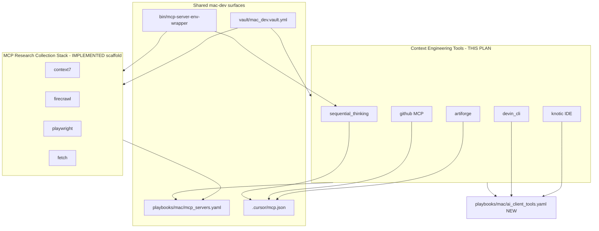

# Context Engineering MCP Tool Roles

## Project state review (2026-06-24)

A sibling capability landed since this plan was first drafted. **Review against live repo before building.**

### Already implemented — MCP Research Collection Stack

| Surface | Status |
|---|---|
| Plan | [`docs/plans/2026-06-24--mcp-research-collection-stack/README.md`](docs/plans/2026-06-24--mcp-research-collection-stack/README.md) — `lifecycle: in_progress` |
| Framework doc | [`docs/codex_framework/mcp-research-collection-stack.md`](docs/codex_framework/mcp-research-collection-stack.md) |
| Capability manifest | [`docs/codex_framework/capabilities/mcp-research-collection-stack.yml`](docs/codex_framework/capabilities/mcp-research-collection-stack.yml) |
| Roles | `context7`, `firecrawl` (hardened), `playwright`, `fetch` under [`roles/mcp_servers/`](roles/mcp_servers/) |
| Playbook | [`playbooks/mac/mcp_servers.yaml`](playbooks/mac/mcp_servers.yaml) — tags `context7`, `firecrawl`, `playwright`, `fetch` |
| Host gates | [`inventory/host_vars/mac-dev.yaml`](inventory/host_vars/mac-dev.yaml) — all four `*_mcp_state: present`, Cursor+Codex targets |
| Secret runtime | [`bin/mcp-server-env-wrapper`](bin/mcp-server-env-wrapper), [`roles/mcp_servers/_shared/tasks/render_env_file.yml`](roles/mcp_servers/_shared/tasks/render_env_file.yml) |
| Vault placeholders | `vault_firecrawl_mcp_api_key`, `vault_context7_mcp_api_key` in [`vault/mac_dev.vault.yml`](vault/mac_dev.vault.yml) — **still empty** |
| Validation report | [`docs/reports/mcp_server_validations/research_collection_stack/README.md`](docs/reports/mcp_server_validations/research_collection_stack/README.md) |

**Receipt summary:** 15/19 in-scope obligations `pass`; **4 blocked** on empty Context7/Firecrawl vault keys (O-14–O-17). Playwright and Fetch applied idempotently on mac-dev.

**Not done by research-stack slice:** [`docs/tool_access/README.md`](docs/tool_access/README.md) still lacks the new stack surfaces.

### Still not in repo — this plan's targets

| Target | Status |
|---|---|
| `roles/mcp_servers/artiforge/` | absent |
| `roles/mcp_servers/github/` | absent |
| `roles/mcp_servers/sequential_thinking/` | absent |
| `roles/knotic/` | absent |
| `roles/devin_cli/` | absent |
| `playbooks/mac/ai_client_tools.yaml` | absent |
| `docs/intake/context-engineering-mcp-tools/` | absent |

### Relationship between the two capabilities



**Boundary:** Research stack = external docs/web/browser collection. Context Engineering plan = Artiforge orchestration MCP, GitHub repo automation MCP, structured reasoning MCP, plus optional alternate IDE/CLI workspaces (Knotic, Devin).

**User note (still in force):** fetch/firebase **API usage planning** is handled in a separate conversation. The `fetch` **role** is owned by the research stack — do not re-implement it here.

---

## Scope (confirmed)

**In scope for this plan:**
- [Artiforge MCP](https://docs.artiforge.ai/getting-started/installation/) — remote HTTP MCP with PAT
- [GitHub MCP Server](https://github.com/github/github-mcp-server) — not in repo
- [Sequential Thinking MCP](https://mcpservers.org/servers/modelcontextprotocol/sequentialthinking) — npm stdio, no secrets
- **Knotic** — IDE install on mac-dev + `.knotic/skills/` scaffold
- **Devin** — Devin CLI install + `.devin/config.json` MCP entries

**Explicitly out of scope:** Context7, Firecrawl, Playwright, Fetch roles (research stack); fetch/firebase API usage plans (other conversation).

**Mandatory implementation patterns (from research stack — do not regress):**
- Secret-backed **stdio** MCP: `render_env_file.yml` + `bin/mcp-server-env-wrapper`; no API keys in tracked `.cursor/mcp.json` / `.codex/config.toml`
- Role prefix + vault naming: `vault_<role>_mcp_*` in `vault/mac_dev.vault.yml`
- Playbook home for MCP servers: [`playbooks/mac/mcp_servers.yaml`](playbooks/mac/mcp_servers.yaml) with per-role tags
- Commissioned defaults in [`inventory/host_vars/mac-dev.yaml`](inventory/host_vars/mac-dev.yaml)

---

## Build readiness assessment

| Slice | Ready to build? | Blocker |
|---|---|---|
| Intake packet + comparison table | **Yes** | None |
| Sequential Thinking role | **Yes** | Copy `playwright`/`fetch` npm pattern; no vault |
| Artiforge role | **No** | HTTP MCP with PAT-in-URL conflicts with secret-safe tracked config — needs `http-secret-design-spike` |
| GitHub MCP role | **No** | Bearer token in `headers` has same tracked-config problem — same spike |
| Knotic role | **Yes** (with bootstrap label) | DMG URL `pending_research` probe at implementation |
| Devin CLI role | **Yes** (with bootstrap label) | Use `.devin/config.local.json` for secrets; compose MCP entries from other roles |
| Full plan execute-complete | **No** | Prerequisite vault keys for research stack + HTTP secret pattern + intake review |

**Recommendation before build:** (1) finish research-stack vault ingest for Context7/Firecrawl, (2) complete HTTP secret design spike, (3) approve intake comparison table, then implement Sequential Thinking first, then vault-gated HTTP roles.

---

## Human-readable reference area

Create intake packet: [`docs/intake/context-engineering-mcp-tools/`](docs/intake/context-engineering-mcp-tools/)

| File | Contents |
|---|---|
| `README.md` | Index, upstream links, role mapping, **explicit sibling link** to MCP Research Collection Stack |
| `feature-comparison.md` | Artiforge vs GitHub Copilot vs Cursor vs Devin (Windsurf → Devin); `pending_research` where unverified |
| `notes/artiforge.md` | Context Engineering MCP; PAT flow; relationship to research stack routing |
| `notes/knotic.md` | [Knotic vs Cursor](https://knotic.dev/vs/cursor) summary; Gatekeeper/quarantine from [knotic.dev/download](https://knotic.dev/download) |
| `notes/devin.md` | Cloud vs CLI; MCP namespacing; `.devin/config.local.json` |
| `notes/github-mcp.md` | Remote HTTP vs Docker; org policy links |
| `notes/sequential-thinking.md` | Tool purpose; verification prompts |

---

## Role design (by tool)

### 1. `roles/mcp_servers/artiforge/` — HTTP MCP (secret required)

Upstream Cursor shape:

```json
{
  "mcpServers": {
    "Artiforge": {
      "url": "https://tools.artiforge.ai/mcp?pat=xxxxxxxxxxxxxxx",
      "type": "http"
    }
  }
}
```

**Role interface:** `artiforge_mcp_state`, `artiforge_mcp_targets`, vault `vault_artiforge_mcp_pat`.

**Build gate:** Do not copy netbox-style inline secrets or pre-hardening firecrawl pattern. Resolve PAT-in-URL vs secret-safe tracked config in `http-secret-design-spike` first (options: header-based auth if supported, gitignored local fragment, or thin stdio proxy wrapper).

---

### 2. `roles/mcp_servers/github/` — HTTP MCP (secret required)

**Default:** remote HTTP at `https://api.githubcopilot.com/mcp/` with Bearer PAT. Docker override via `github_mcp_transport: remote|docker`.

Vault: `vault_github_mcp_pat`.

**Build gate:** Same as Artiforge — Bearer in `headers` must not land in committed `.cursor/mcp.json`.

---

### 3. `roles/mcp_servers/sequential_thinking/` — npm stdio (no secret)

Package: `@modelcontextprotocol/server-sequential-thinking`.

**Template roles:** [`playwright`](roles/mcp_servers/playwright/) / [`fetch`](roles/mcp_servers/fetch/) (not legacy firecrawl pre-wrapper).

Optional env: `DISABLE_THOUGHT_LOGGING`. Implement **first** in this plan.

---

### 4. `roles/knotic/` — IDE install + Skills scaffold

Per user choice: DMG install + `.knotic/skills/` seed. Bootstrap/semi-manual class. Not under `mcp_servers/`.

---

### 5. `roles/devin_cli/` — CLI install + Devin MCP config

Install: `curl -fsSL https://cli.devin.ai/install.sh | bash` (bootstrap, `creates` guard).

Config: `.devin/config.json` (committed baseline) + `.devin/config.local.json.example` for secrets. Compose MCP entries for servers managed by this repo; secrets in local override only.

---

## Playbook wiring

| Playbook | Roles |
|---|---|
| [`playbooks/mac/mcp_servers.yaml`](playbooks/mac/mcp_servers.yaml) | Existing + research stack + **new:** `sequential_thinking`, `artiforge`, `github` |
| **New** [`playbooks/mac/ai_client_tools.yaml`](playbooks/mac/ai_client_tools.yaml) | `knotic`, `devin_cli` |

Do not add MCP servers to [`deploy_development_nodes.yaml`](playbooks/deploy_development_nodes.yaml) per [`ai.mcp_servers.instructions.md`](roles/mcp_servers/ai.mcp_servers.instructions.md).

**Suggested mac-dev host_vars gates (additive — do not disturb research stack block):**

```yaml
sequential_thinking_mcp_state: absent
artiforge_mcp_state: absent
github_mcp_state: absent
knotic_state: absent
devin_cli_state: absent
```

---

## Vault / secret ingestion

**Research stack (prerequisite — already scaffolded):**

```bash
# vault_context7_mcp_api_key, vault_firecrawl_mcp_api_key in vault/mac_dev.vault.yml
bin/codex-env ansible-vault encrypt_string 'YOUR_KEY' --name 'vault_context7_mcp_api_key' >> vault/mac_dev.vault.yml
bin/codex-env ansible-vault encrypt_string 'fc-YOUR_KEY' --name 'vault_firecrawl_mcp_api_key' >> vault/mac_dev.vault.yml
```

**This plan (when roles are built):**

| Variable | Used by |
|---|---|
| `vault_artiforge_mcp_pat` | artiforge |
| `vault_github_mcp_pat` | github |

---

## HTTP secret design spike (required before Artiforge/GitHub)

Research stack solved **stdio** secrets. These two roles are **HTTP** transports:

| Server | Secret shape | Problem |
|---|---|---|
| Artiforge | PAT in query string | URL with secret would be committed in `mcp.json` |
| GitHub remote | Bearer in `headers` | Header value would be committed in `mcp.json` |

**Spike deliverable:** one repo-owned pattern (shared task or wrapper) documented in intake + framework, consistent with [`mcp-research-collection-stack.md`](docs/codex_framework/mcp-research-collection-stack.md) secret model. Until resolved, Artiforge/GitHub todos stay blocked.

---

## Recommended implementation order

1. **Prerequisite:** ingest Context7 + Firecrawl vault keys; close research-stack O-14–O-17
2. **Intake packet** + feature comparison (human review)
3. **HTTP secret design spike**
4. **Sequential Thinking** — npm, no vault
5. **Artiforge** + **GitHub MCP** — after spike
6. **Devin CLI** — can parallel with step 4–5
7. **Knotic** — highest bootstrap/manual class
8. Update [`docs/tool_access/README.md`](docs/tool_access/README.md) for **both** capabilities

---

## Risks and decisions

| Risk | Mitigation |
|---|---|
| HTTP secrets vs research-stack hygiene | Mandatory design spike; do not ship plaintext PAT/Bearer in tracked config |
| Knotic unsigned DMG URL changes | Probe at implementation; pin with `pending_research` until verified |
| GitHub remote MCP org policy | README + fail-fast assert on 403 |
| Devin/Knotic bootstrap installers | Label bootstrap/semi-manual; idempotent guards |
| Plan overlap with research stack | Explicit capability boundary; no duplicate fetch/context7/firecrawl/playwright work |
| NetBox token still in tracked mcp.json | Legacy debt; new roles must not follow that pattern |

---

## Diagram gate receipt

- Architecture/Structure: included (updated with sibling stack)
- Capability Routing: N/A for this plan (research stack owns collection routing; Artiforge is orchestration MCP)
- Naming/Modeling: role prefixes `artiforge_mcp_`, `github_mcp_`, `sequential_thinking_mcp_`, `knotic_`, `devin_cli_`

## Diagram Inventory

**Included:** Architecture/Structure (dual-capability)

**Available on request:** HTTP secret-flow diagram, Devin vs Cursor MCP config comparison, playbook dependency chain
