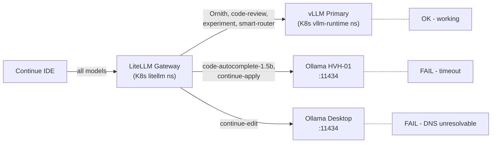

# Continue IDE 500 Errors and Ollama Backend Health

## Findings Summary (from initial probe)

### Healthy services
- **Docker**: Open WebUI (4d, healthy), NetBox stack (2w, healthy), Grafana+Loki (3w), Semaphore (3w, healthy)
- **K8s**: LiteLLM (running, API 200), Langfuse (running, 200), vLLM primary pod 1/2 (running, chat completions work), CoreDNS, Traefik, metrics-server all running
- **LiteLLM gateway** lists all model routes including `continue-edit`, `continue-apply`, `code-autocomplete-1.5b`

### Broken services
- **vllm-primary-5f7db988d-kpx9b** (pod 2/2): `UnexpectedAdmissionError`, container unavailable, no logs. Stale — traffic is served by the healthy replica
- **Ollama on HOM-LAB-HVH-01** (`ollama-hvh01.hom.lab:11434`): TCP connection timeout from Mac. Service down or firewall blocking
- **Ollama on dev-workstation-win** (`ollama-desktop.hom.lab:11434`): DNS resolution failed — host not reachable from Mac
- **LiteLLM routes `continue-edit`, `continue-apply`, `code-autocomplete-1.5b`**: all timeout because their Ollama backends are unreachable. LiteLLM returns **500** to Continue

### Root cause of Continue 500 error
Continue talks exclusively to LiteLLM (`http://litellm.hom.lab`). LiteLLM proxies `continue-edit` to `ollama-desktop.hom.lab:11434` and `continue-apply`/`code-autocomplete-1.5b` to `ollama-hvh01.hom.lab:11434`. Both Ollama instances are down, so LiteLLM returns 500 upstream timeout to Continue.

## Architecture clarification — "shouldn't everybody point to LiteLLM?"

**Yes, and they already do.** The architecture is correct:

```
Continue IDE → LiteLLM (http://litellm.hom.lab) → backend (vLLM or Ollama)
```

Continue config at `~/.continue/config.yaml` points all models at `http://litellm.hom.lab`. LiteLLM then routes each model alias to the correct backend. The problem is not the routing design — it is that the Ollama backends LiteLLM tries to reach are offline.



## Repo config surfaces

- **Continue IDE config** is managed by Ansible role [roles/continue_ide/](roles/continue_ide/)
  - Template: [roles/continue_ide/templates/config.yaml.j2](roles/continue_ide/templates/config.yaml.j2)
  - Defaults: [roles/continue_ide/defaults/main.yml](roles/continue_ide/defaults/main.yml)
  - Deployed to: `~/.continue/config.yaml`
- **LiteLLM gateway routes** managed by role [roles/k3s_litellm_gateway/](roles/k3s_litellm_gateway/)
  - Route builder: [roles/k3s_litellm_gateway/tasks/build_helm_values.yml](roles/k3s_litellm_gateway/tasks/build_helm_values.yml)
  - Defaults: [roles/k3s_litellm_gateway/defaults/main.yml](roles/k3s_litellm_gateway/defaults/main.yml)
- **Ollama api_base vars** set in [inventory/host_vars/hom-lab-ctl-k3s-02.yaml](inventory/host_vars/hom-lab-ctl-k3s-02.yaml) lines 124-136

## New dependency — HOM-LAB-HVH-02 storage prestage before steady-state convergence

This plan now depends on a **named, one-off robocopy prestage** on
`HOM-LAB-HVH-02` before repo-managed storage roots are changed. The move itself
should be treated as exception-class work via
`windows-robocopy-scheduledtask-pack`, not baked into steady-state roles.

### July 29, 2026 storage refresh

Current live readings remove the earlier "is there enough room to do this
safely?" concern without changing the desired target layout:

| Host | Disk | Size | Free | Plan impact |
|------|------|------|------|-------------|
| HOM-LAB-HVH-01 | C: | 476.15 GB | 279.60 GB | No storage blocker for Ollama diagnostics on HVH-01 |
| HOM-LAB-HVH-01 | D: | 952.92 GB | 842.49 GB | No storage blocker for any follow-up Ollama/runtime staging if needed later |
| HOM-LAB-HVH-02 | C: | 476.04 GB | 190.80 GB | Still avoid using the OS disk as the bulky Hyper-V VM root |
| HOM-LAB-HVH-02 | D: | 931.50 GB | 410.78 GB | Confirms the planned VM storage target is viable before additional robocopy frees more source space |
| HOM-LAB-HVH-02 | E: | 732.42 GB | 214.61 GB | Keep as reserve only; not needed for this plan's main cutover |
| HOM-LAB-HVH-02 | F: | 1130.58 GB | 773.25 GB | Plenty of room to keep `F:\ProgramData\Ansible` and the temporary prestage pack in place |
| HOM-LAB-HVH-02 | G: | 4.59 GB | 0.60 GB | Ignore for planning; not a realistic candidate |
| HOM-LAB-HVH-02 | H: | 2.79 GB | 0.51 GB | Ignore for planning; not a realistic candidate |

What changes from this refresh:

- no emergency storage-expansion or extra cleanup slice needs to be added to
  this build
- no fallback retargeting to `E:` is needed
- no reason to move the bulky Hyper-V VM tree onto `C:`

What does **not** change:

- keep the steady-state HVH-02 Hyper-V VM storage convergence on
  `D:\ProgramData\Ansible\hyperv_ubuntu_vm`
- keep the one-off robocopy pack rooted under `F:\ProgramData\Ansible\oneoffs`
- keep `windows_hyperv_ansible_root` on `F:\ProgramData\Ansible` for this plan

### Prestage job contract

- **job_ref:** `hvh02-continue-ollama-storage-prestage`
- **host / ssh_alias:** `HOM-LAB-HVH-02`
- **ansible_root for the one-off pack:** `F:\ProgramData\Ansible`
- **staging_root:** `F:\ProgramData\Ansible\oneoffs\hvh02-continue-ollama-storage-prestage`
- **config_basename:** `moves`

### Prestage move set

These are the file moves the plan should assume are pre-staged before role /
playbook cutover:

- `F:\ProgramData\Ansible\hyperv_ubuntu_vm` →
  `D:\ProgramData\Ansible\hyperv_ubuntu_vm`
- `C:\Users\joshc\hom-lab-ctl-k3s-02-autoinstall.iso.upload` →
  `F:\shares\public\hyperv-cache\remastered-isos\`
- `C:\Users\joshc\PktMon.etl` →
  `D:\ai\diagnostics\events\PktMon.etl`
- `C:\Users\joshc\Downloads\*` →
  `D:\software\` or `F:\shares\public\hyperv-cache\staging\`

Explicitly **not** part of this move set:

- `F:\shares\public\Bloodstained - Ritual of the Night [FitGirl Repack]`
  stays where it is by operator choice

### Repo-managed path changes that must follow the prestage

The meaningful steady-state repo change is the **Hyper-V VM storage root** for
`HOM-LAB-HVH-02`. This should be updated only after the prestaged files are in
place and verified.

Affected surfaces already identified:

- `inventory/host_vars/hom-lab-hvh-02.yaml`
  - `hyperv_ubuntu_k3s_vm_host_vhdx_path`
  - `hyperv_ubuntu_docker_vm_host_vhdx_path`
  - comment text that still says sustained I/O should stay on `F:`
- `roles/hyperv_ubuntu_vm/defaults/main.yml`
  - `hyperv_ubuntu_vm_host_storage_root` consumes
    `windows_hyperv_vm_storage_root`
- `playbooks/hyperv_ubuntu_docker_vm.yaml`
  - falls back to `windows_hyperv_vm_storage_root`
- `playbooks/hyperv_ubuntu_k3s_vm.yaml`
  - falls back to `windows_hyperv_vm_storage_root`
- `playbooks/hyperv_move_vm_storage.yaml`
- `playbooks/hyperv_move_k3s_vm_storage.yaml`
- `roles/troubleshooting_collectors/tasks/hyperv_ubuntu_vm.yml`
  - still contains old default-path assumptions that need review
- `roles/hyperv_ubuntu_vm/tasks/align_legacy_vm_identity.yml`
  - still contains old default-path assumptions that need review

Important guardrail:

- `windows_hyperv_ansible_root` is currently lane-scoped to `F:\ProgramData\Ansible`
  and should **not** be blindly moved as part of this plan
- `windows_hyperv_vm_storage_root` is also lane-scoped today, so this plan
  should prefer a **host-specific override on `HOM-LAB-HVH-02` first** rather
  than changing the group var in a way that would also alter
  `HOM-LAB-HVH-01` unintentionally
- the `Downloads` and `PktMon.etl` moves are cleanup / organization items, not
  proof that a steady-state role variable must change
- the current disk readings are strong enough that this plan does **not** need
  an added "free space first" prerequisite beyond normal before/after capture
  during prestage verification

## Deployed vs role defaults mismatch

The **deployed** `~/.continue/config.yaml` has `continue-edit` (Ollama qwen3-coder:30b) and `continue-apply` (Ollama phi4-mini) as separate model entries. But the **role defaults** (`roles/continue_ide/defaults/main.yml`) have already been corrected — edit and apply now point at `deepreinforce-ai/Ornith-1.0-35B-GGUF` (vLLM, which works). The deployed config is stale and needs a re-apply.

## Plan

### 1. Pre-stage the HOM-LAB-HVH-02 storage moves as a named one-off

Run the prestage as `windows-robocopy-scheduledtask-pack` work on
`HOM-LAB-HVH-02`, keeping the one-off pack rooted under
`F:\ProgramData\Ansible\oneoffs\...` while the actual Hyper-V VM storage target
becomes `D:\ProgramData\Ansible\hyperv_ubuntu_vm`.

Do **not** treat this robocopy job as the steady-state implementation. The
steady-state implementation comes from inventory / role / playbook updates that
follow after the prestaged data is validated.

### 2. Update the repo-managed Hyper-V storage paths for HOM-LAB-HVH-02

After prestage verification:

- add or use a **host-specific** `windows_hyperv_vm_storage_root` override for
  `HOM-LAB-HVH-02` pointing at `D:\ProgramData\Ansible\hyperv_ubuntu_vm`
- update the explicit HVH-02 VHDX host paths in `inventory/host_vars/hom-lab-hvh-02.yaml`
- update any playbook / collector / role surfaces that still assume the old
  root when defaults are used
- keep `windows_hyperv_ansible_root` on `F:\ProgramData\Ansible` unless a
  separate plan intentionally moves the whole bulky Ansible root
- keep `E:` out of scope unless the live cutover evidence later shows an
  unexpected D:/F: constraint that is not present in the July 29, 2026 readings

### 3. Re-apply the `continue_ide` role to update the deployed config
The role defaults already have the correct model list (Ornith for chat/edit/apply, code-autocomplete-1.5b for autocomplete). Re-deploying the role will overwrite the stale `~/.continue/config.yaml` with the corrected entries, removing the broken Ollama model entries from Continue's view.

**After this**: Continue edit/apply will route through LiteLLM to vLLM (working). Autocomplete will still fail if Ollama on HVH-01 is down.

### 4. Investigate Ollama on HOM-LAB-HVH-01
SSH into HOM-LAB-HVH-01 and check `systemctl status ollama`, firewall state, and port 11434 binding. This affects `code-autocomplete-1.5b` and `code-fast` LiteLLM routes.

### 5. Investigate Ollama on dev-workstation-win
DNS for `ollama-desktop.hom.lab` is not resolving. Check if the Windows desktop is powered on and if the DNS entry exists. This affects the `continue-edit` LiteLLM route (though after step 1, Continue will no longer use this route).

### 6. Clean up stale vLLM pod
Delete the `UnexpectedAdmissionError` pod: `kubectl delete pod vllm-primary-5f7db988d-kpx9b -n vllm-runtime`. It is not serving traffic and will not be rescheduled (the deployment already has a healthy replica).

### 7. Decide whether Ollama routes should stay in LiteLLM
Even after fixing Continue's config, LiteLLM still advertises `continue-edit`, `continue-apply`, and `code-autocomplete-1.5b` routes that point to Ollama backends. If those Ollama services are not reliably available, consider either:
- Blanking the `api_base` vars in `hom-lab-ctl-k3s-02.yaml` (routes will not be generated)
- Fixing the Ollama services so they stay up
- Both: fix Ollama AND update Continue to not depend on them for edit/apply

### 8. Create brainstorming design entry for fuzlang.contract.yaml deprecation

[contracts/fuzlang.contract.yaml](contracts/fuzlang.contract.yaml) is a legacy scaffold file that already carries a `DEPRECATED SCAFFOLD` header. Several issues need a design decision:

- **Misspelled product name**: The filename uses "fuzlang" — this does not match the actual product/project name and should be corrected
- **Stale content**: The file contains node identity, endpoint maps, compose stacks, security policy, and cross-node contract details — much of which has since migrated to inventory, roles, policy files, and other contracts (`litellm.yaml`, `open-webui.yaml`)
- **Decision needed**: Should the file be (a) fully retired and deleted, (b) renamed with correct spelling and pruned to only still-relevant sections, (c) broken apart with live sections moved to their current authoritative locations, or (d) kept as-is for historical reference only
- **References**: `fuzlang` is still referenced in ~15+ files across roles, playbooks, inventory, plans, and docs — some are live variable references (e.g. `fuzlang_external_postgres_*` vars used by LiteLLM), others are documentation/historical

Create a brainstorming entry at `docs/brainstorming_designs/2026-07-29--fuzlang-contract-deprecation-and-rename/README.md` capturing these questions so they can be resolved in a future session.

### 9. Final manual cleanup after the new locations are proven live

Only after:

- the prestaged files are verified at their destination
- repo-managed storage paths now point at the new HVH-02 roots
- Continue no longer returns 500 for the repaired routes
- Ollama / LiteLLM / Hyper-V flows work with the new storage references

perform a final **manual one-off cleanup** of the superseded source locations
from the prestage table and any additional old source paths identified by the
updated roles / playbooks / inventory.

## Apply / Verify / Undo / Change class

- **Apply**: Pre-stage HVH-02 moves with a named robocopy one-off; update HVH-02 storage path variables and consumers; re-run `continue_ide` role on Mac; SSH diagnostics on HVH-01 and desktop; kubectl delete stale pod
- **Verify**: capture before/after free space on HVH-02 `D:` and `F:` during prestage/cutover; confirm prestaged files at destination; confirm HVH-02 playbooks / roles resolve the new VM storage root; `curl http://litellm.hom.lab/v1/chat/completions` for each model alias; check Continue IDE no longer shows 500
- **Undo**: Role supports `continue_ide_state: absent` to remove config; stale pod deletion is harmless
- **Change class**: One-off file prestage + repo config convergence (idempotent after cutover) + diagnostics (read-only) + pod cleanup (non-destructive)
