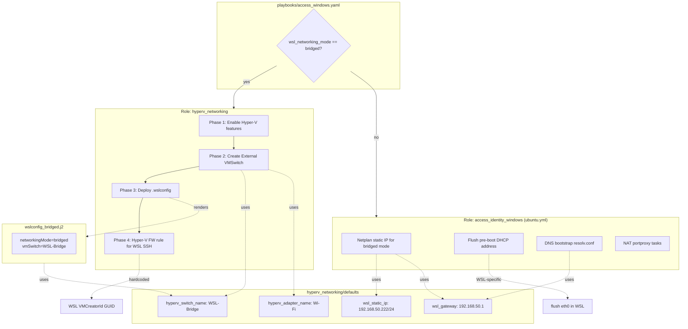

# Assessment: Hyper-V Networking Role — WSL Coupling

## Current Architecture




## Where the Coupling Lives

The role currently mixes **three distinct concerns**:


| Phase                       | What it does                                | WSL-coupled?                                                                                 | Could serve other VMs?          |
| --------------------------- | ------------------------------------------- | -------------------------------------------------------------------------------------------- | ------------------------------- |
| **Phase 1** (lines 17-42)   | Enable Hyper-V features                     | **No** — pure Windows feature                                                                | Yes — any Hyper-V VM needs this |
| **Phase 2** (lines 49-115)  | Create External VMSwitch                    | **Partially** — switch name is `WSL-Bridge`, but the switch itself is generic infrastructure | Yes — any VM could use it       |
| **Phase 3** (lines 117-133) | Deploy `.wslconfig` with bridged networking | **100% WSL** — `.wslconfig` is only for WSL                                                  | No — purely WSL2 config         |
| **Phase 4** (lines 139-160) | Hyper-V firewall rule for SSH to WSL        | **100% WSL** — hardcoded WSL VMCreatorId GUID, rule name `WSL-SSH-Inbound-TCP-22`            | No — hardcoded to WSL           |


### Variable Coupling

In [roles/hyperv_networking/defaults/main.yml](roles/hyperv_networking/defaults/main.yml):

- `hyperv_switch_name: "WSL-Bridge"` — name implies WSL, but the switch is generic infra
- `hyperv_adapter_name: "Wi-Fi"` — generic, no WSL dependency
- `hyperv_allow_management_os: true` — generic
- `wsl_static_ip`, `wsl_gateway` — **100% WSL-specific**, consumed by `ubuntu.yml` Netplan tasks

### Downstream Consumers

[roles/access_identity_windows/tasks/ubuntu.yml](roles/access_identity_windows/tasks/ubuntu.yml) consumes `wsl_static_ip` and `wsl_gateway` from the hyperv_networking defaults for:

- Netplan bridged networking config (line 481-482)
- DNS bootstrap resolv.conf (line 325)

[inventory/host_vars/hom-lab-ctl-hvh-02.yaml](inventory/host_vars/hom-lab-ctl-hvh-02.yaml) sets:

- `wsl_networking_mode: bridged` (triggers the role)
- `hyperv_adapter_name: "Wi-Fi"` (override)

### The `.wslconfig` Template

[roles/hyperv_networking/templates/wslconfig_bridged.j2](roles/hyperv_networking/templates/wslconfig_bridged.j2) is 3 lines:

```ini
[wsl2]
networkingMode=bridged
vmSwitch={{ hyperv_switch_name }}
```

This is entirely WSL2-specific.

### Playbook Gate

In [playbooks/access_windows.yaml](playbooks/access_windows.yaml), the role only runs when `wsl_networking_mode == 'bridged'`. This means the entire role is currently gated behind a WSL decision variable — you can't get Hyper-V + External Switch without also opting into WSL bridged networking.

## Summary of Issues

1. **Phases 1-2 are general Hyper-V infrastructure** that any VM (WSL, dev VMs, test labs) could use, but they're locked behind a WSL-specific gate.
2. **Phases 3-4 are purely WSL-specific** (`.wslconfig` deployment + WSL firewall rule) and don't belong in a "Hyper-V networking" role.
3. **The default variable names** (`hyperv_switch_name: "WSL-Bridge"`, `wsl_static_ip`, `wsl_gateway`) mix Hyper-V infra concerns with WSL guest concerns in one namespace.
4. **The playbook condition** (`wsl_networking_mode == 'bridged'`) means you can never enable Hyper-V networking without also choosing WSL bridged mode.

## Possible Decoupling Approach (for discussion)

Split into two layers:

- `**hyperv_networking`** — Phases 1-2 only: enable Hyper-V, create External VMSwitch. Generic. Triggered by a host having `hyperv_switch_name` defined (or a boolean like `hyperv_external_switch: true`).
- **WSL bridged config** — Phases 3-4: `.wslconfig` deployment + Hyper-V FW rule. Move into `access_identity_windows` (where the rest of the WSL config already lives in `ubuntu.yml`), gated by `_wsl_networking_mode == 'bridged'`.
- **Variables**: `wsl_static_ip` and `wsl_gateway` move to `access_identity_windows/defaults` (they're only consumed there). `hyperv_switch_name` and `hyperv_adapter_name` stay in `hyperv_networking`.
