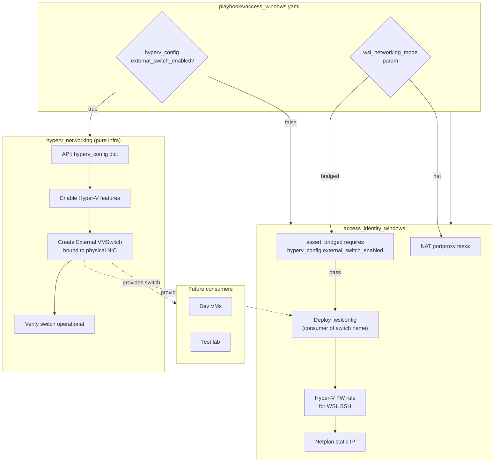

# Decouple Hyper-V Networking from WSL

## Design Principles

1. **Infrastructure is backbone, not guest config.** The Hyper-V External Switch bridges a physical NIC to a virtual switch. Any VM guest (WSL, dev VMs, test labs) can consume it. WSL is just one consumer.
2. **Roles are APIs, not bundles of tasks.** Each role exposes a public contract (a dictionary variable) with documented inputs. No leaking flat vars across role boundaries.
3. **No cross-role `set_fact` coupling.** Consumers declare dependency via intent variables (what was requested), not runtime state (what happened to run). The playbook controls execution order. If the infra role ran, the switch exists.
4. **Gate independently.** Infrastructure does not know about consumers. Consumers do not assume infra auto-runs. Each is gated on its own declared intent.

## Target Architecture




## Pattern 1: Dictionary-Based API Contract

Instead of leaking flat variables (`hyperv_switch_name`, `hyperv_adapter_name`, `hyperv_allow_management_os`) across role boundaries, each role exposes a single public contract dictionary.

### `hyperv_config` -- Infrastructure role contract

Defined in host_vars (or group_vars) by the operator:

```yaml
hyperv_config:
  external_switch_enabled: true
  switch_name: "External-Bridge"
  adapter_name: "Wi-Fi"
  allow_management_os: true
```

Inside the role, resolved once with safe defaults:

```yaml
vars:
  _hyperv: "{{ hyperv_config | default({}) }}"
```

Then all references use `{{ _hyperv.switch_name | default('External-Bridge') }}` etc.

The role's [defaults/main.yml](roles/hyperv_networking/defaults/main.yml) provides the full default structure:

```yaml
hyperv_config:
  external_switch_enabled: false
  switch_name: "External-Bridge"
  adapter_name: "Ethernet"
  allow_management_os: true
```

### `wsl_config` -- WSL guest concerns (separate namespace)

Stays in [access_identity_windows/defaults/main.yml](roles/access_identity_windows/defaults/main.yml):

```yaml
wsl_config:
  networking_mode: "nat"
  static_ip: "192.168.50.222/24"
  gateway: "192.168.50.1"
```

Host_vars override selectively:

```yaml
wsl_config:
  networking_mode: "bridged"
  static_ip: "192.168.50.222/24"
  gateway: "192.168.50.1"
```

Inside `ubuntu.yml`, resolved once:

```yaml
vars:
  _wsl: "{{ wsl_config | default({}) }}"
```

## Pattern 2: `include_role` with Scoped Vars

Instead of flat `roles:` list with `when:` leaking all host_vars into the role:

**Current** (variable bleed):

```yaml
roles:
  - role: hyperv_networking
    when: wsl_networking_mode | default('nat') == 'bridged'
```

**Proposed** (explicit interface, no bleed):

```yaml
tasks:
  - name: Configure Hyper-V bridge infrastructure
    ansible.builtin.include_role:
      name: hyperv_networking
    vars:
      hyperv_config: "{{ hyperv_config | default({}) }}"
    when: (hyperv_config | default({})).external_switch_enabled | default(false) | bool

  - name: Configure Windows identity and WSL
    ansible.builtin.include_role:
      name: access_identity_windows
```

This makes it explicit: the only thing the infra role receives is its `hyperv_config` dictionary. Nothing else bleeds in. The role is called like a function with typed arguments.

## Pattern 3: No Cross-Role `set_fact`

**Removed from the plan:** `hyperv_bridge_ready` and `hyperv_bridge_switch_name` cacheable facts.

Why:

- Facts can go stale
- Fact cache may be off
- Execution order becomes implicit
- Role dependency becomes invisible

Instead, the consumer declares dependency on **intent**, not runtime state:

```yaml
- name: Ensure bridged WSL requires Hyper-V bridge infrastructure
  ansible.builtin.assert:
    that:
      - _wsl.networking_mode != 'bridged' or
        (_hyperv.external_switch_enabled | default(false) | bool)
    fail_msg: >-
      WSL bridged mode requires hyperv_config.external_switch_enabled=true
      in host_vars. The Hyper-V External Switch must be configured as
      infrastructure before WSL can consume it.
```

This reads as: "Either we are NOT in bridged mode, OR if we are, then the bridge must have been declared enabled." It asserts on what the operator requested, not on what some other role happened to do at runtime.

For the switch name, the `.wslconfig` template references `hyperv_config.switch_name` directly -- the variable is available from host_vars/group_vars, no fact needed:

```ini
[wsl2]
networkingMode=bridged
vmSwitch={{ (hyperv_config | default({})).switch_name | default('External-Bridge') }}
```

## What Changes in Each File

### 1. `hyperv_networking/tasks/main.yml`

- Remove Phase 3 (lines 117-133: `.wslconfig` deploy + WSL shutdown)
- Remove Phase 4 (lines 139-160: Hyper-V FW rule for WSL SSH)
- Remove all `set_fact` exports (no `hyperv_bridge_ready`)
- Add local `vars:` block resolving `_hyperv` from `hyperv_config`
- Replace all `{{ hyperv_switch_name }}` with `{{ _hyperv.switch_name | default('External-Bridge') }}`
- Replace all `{{ hyperv_adapter_name }}` with `{{ _hyperv.adapter_name | default('Ethernet') }}`
- Replace all `{{ hyperv_allow_management_os }}` with `{{ _hyperv.allow_management_os | default(true) }}`
- Update header comment to describe pure infra scope

### 2. `hyperv_networking/defaults/main.yml`

**Before:**

```yaml
hyperv_switch_name: "WSL-Bridge"
hyperv_adapter_name: "Wi-Fi"
hyperv_allow_management_os: true
wsl_static_ip: "192.168.50.222/24"
wsl_gateway: "192.168.50.1"
```

**After:**

```yaml
hyperv_config:
  external_switch_enabled: false
  switch_name: "External-Bridge"
  adapter_name: "Ethernet"
  allow_management_os: true
```

No `wsl_*` vars. No WSL awareness.

### 3. Move `wslconfig_bridged.j2`

- From: `roles/hyperv_networking/templates/wslconfig_bridged.j2`
- To: `roles/access_identity_windows/templates/wslconfig_bridged.j2`
- Update template to reference `hyperv_config.switch_name`:
  ```ini
  [wsl2]
  networkingMode=bridged
  vmSwitch={{ (hyperv_config | default({})).switch_name | default('External-Bridge') }}
  ```

### 4. `access_identity_windows/tasks/ubuntu.yml`

Near the top (after existing variable resolution block around line 52-54):

- Resolve `_wsl` from `wsl_config` dictionary (replacing current flat `_wsl_networking_mode`)
- Add intent-based assert for bridged mode requiring `hyperv_config.external_switch_enabled`

Replace current Step 1.2 comment block (lines 103-106) with actual tasks:

- Deploy `.wslconfig` via `ansible.windows.win_template` (moved from hyperv_networking Phase 3)
- Shutdown WSL if `.wslconfig` changed (moved from hyperv_networking Phase 3)
- Hyper-V FW rule for WSL SSH (moved from hyperv_networking Phase 4)
- All gated by `_wsl.networking_mode == 'bridged'`

Update existing references:

- `_wsl_networking_mode` --> `_wsl.networking_mode`
- `wsl_static_ip` --> `_wsl.static_ip`
- `wsl_gateway` --> `_wsl.gateway`

### 5. `access_identity_windows/defaults/main.yml`

Add at end:

```yaml
wsl_config:
  networking_mode: "nat"
  static_ip: "192.168.50.222/24"
  gateway: "192.168.50.1"
```

The existing flat `wsl_networking_mode: nat` can be kept temporarily for backward compatibility or removed.

### 6. `playbooks/access_windows.yaml`

**Before:**

```yaml
roles:
  - role: hyperv_networking
    when: wsl_networking_mode | default('nat') == 'bridged'
  - access_identity_windows
```

**After:**

```yaml
tasks:
  - name: Configure Hyper-V bridge infrastructure
    ansible.builtin.include_role:
      name: hyperv_networking
    vars:
      hyperv_config: "{{ hyperv_config | default({}) }}"
    when: (hyperv_config | default({})).external_switch_enabled | default(false) | bool

  - name: Configure Windows identity and WSL
    ansible.builtin.include_role:
      name: access_identity_windows
```

### 7. `inventory/host_vars/server-225-win.yaml`

**Before:**

```yaml
wsl_networking_mode: bridged
hyperv_adapter_name: "Wi-Fi"
```

**After:**

```yaml
# Infrastructure: Hyper-V External Switch (backbone, independent of guests)
hyperv_config:
  external_switch_enabled: true
  switch_name: "External-Bridge"
  adapter_name: "Wi-Fi"
  allow_management_os: true

# WSL: consumer of the bridge
wsl_config:
  networking_mode: "bridged"
  static_ip: "192.168.50.222/24"
  gateway: "192.168.50.1"
```

### 8. `hyperv_networking/README.md`

Rewrite to document:

- Role purpose: pure Hyper-V infrastructure (External VMSwitch)
- Public API: `hyperv_config` dictionary with field descriptions
- No WSL awareness, no guest configuration
- Example consumption via `include_role` with scoped vars

## Variable Ownership Summary

- `hyperv_config` -- infra contract, defined in host_vars, consumed by `hyperv_networking` role
- `wsl_config` -- guest contract, defined in host_vars, consumed by `access_identity_windows` role
- No cross-role facts
- No flat variable bleed
- Each role resolves its contract into a `_private` local var with safe defaults

