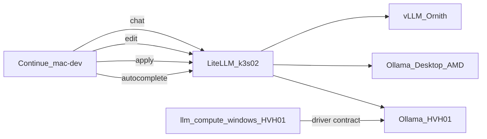

# Opt-in Desktop + HVH-01 Ollama → LiteLLM → Continue (playbook-first)

## Main thesis

`DESKTOP-C1ACPUM` = inventory host **`dev-workstation-win`**. It is **not** in the normal Windows server apply set. This plan commissions **opt-in Ollama** on that desktop and a small **apply** model on HVH-01 by **extending existing playbooks/roles**, then routes both through **LiteLLM** the same way HVH-01 autocomplete already works. Continue talks only to `http://litellm.hom.lab`.

**Do not invent parallel Chocolatey/SSH one-offs.** Capability owners already exist:

| Capability | Existing owner | Playbook entrypoint |
| --- | --- | --- |
| NVIDIA Studio Driver + driver contract | `roles/llm_compute_windows` | [`playbooks/llm_compute_windows.yaml`](playbooks/llm_compute_windows.yaml) / [`playbooks/llm_compute_windows_hvh01.yaml`](playbooks/llm_compute_windows_hvh01.yaml) |
| Network-reachable Ollama (bind, firewall, boot task, model pull) | `roles/windows_ollama_runtime` | Composed in [`playbooks/deploy_hvh01_secondary_model_runtime.yaml`](playbooks/deploy_hvh01_secondary_model_runtime.yaml) |
| LiteLLM gateway routes | `roles/k3s_litellm_gateway` | [`playbooks/deploy_litellm_gateway.yaml`](playbooks/deploy_litellm_gateway.yaml) |
| Continue client config | `roles/continue_ide` | [`playbooks/deploy_continue_ide.yaml`](playbooks/deploy_continue_ide.yaml) |

The **5090 / k3s-02** surface stays **LiteLLM gateway + Ornith chat only** — no new edit/apply GPU serve there.

---

## Hardware / driver correction (blocking assumption)

Repo truth for the desktop is **AMD**, not NVIDIA:

| Host | GPU (inventory) | Driver playbook |
| --- | --- | --- |
| `dev-workstation-win` | **AMD Radeon RX 9060 XT 16 GB** ([`inventory/group_vars/dev_workstation.yaml`](inventory/group_vars/dev_workstation.yaml)) | **Do not** run `llm_compute_windows` — that installs Chocolatey `nvidia-studio-driver` and would be wrong on this box |
| `HOM-LAB-HVH-01` | GTX 1060 6 GB NVIDIA | **Do** use `llm_compute_windows_hvh01.yaml` — same Studio Driver contract used on other Windows NVIDIA servers |
| `hom-lab-ctl-k3s-02` | 5090 lane (guest GPU-P) | Out of scope for edit/apply serve |

`windows_ollama_runtime` defaults `windows_ollama_runtime_require_driver_contract: true` and expects the NVIDIA contract file written by `llm_compute_windows`. That gate is correct for HVH-01. For the AMD desktop, host_vars must set:

```yaml
windows_ollama_runtime_require_driver_contract: false
```

If the desktop has been re-GPUed to NVIDIA since the last inventory/diagnostics pass, stop and re-probe first — only then would `llm_compute_windows` with `--limit dev-workstation-win` be valid.

---

## 1. Current state of DESKTOP-C1ACPUM

### Inventory placement

| Group | Member? | Meaning |
| --- | --- | --- |
| `windows_hosts_offline` | yes | Reachable, but **excluded** from routine `windows_hosts` desired-state runs |
| `windows_access_hosts` | yes (via offline child) | Eligible for access / OpenSSH playbooks |
| `dev_workstation` | yes | Gaming desktop; `node_purpose: interactive_desktop`; `automation_management_model: opt_in_special_projects` |
| `windows_hosts` | **no** | Not a steady-state Hyper-V/server target |
| `windows_nvidia_gpu_hosts` | **no** | Correct — AMD desktop must stay out of NVIDIA driver targeting |
| `deploy_development_nodes` | **no** | `interactive_desktop` intentionally out of that play |

### Playbooks that already touch this host

| Playbook | Role | Notes |
| --- | --- | --- |
| [`playbooks/troubleshoot/deploy_dev_workstation_gpu_diagnostics.yaml`](playbooks/troubleshoot/deploy_dev_workstation_gpu_diagnostics.yaml) | `gpu_diagnostics_windows` | AMD diagnostics path |
| [`playbooks/homelab_hosts_file_windows.yaml`](playbooks/homelab_hosts_file_windows.yaml) | `homelab_hosts_file_windows` | Opt-in hosts file |
| [`playbooks/access_windows.yaml`](playbooks/access_windows.yaml) | `access_identity_windows` | OpenSSH convergence |

### Host_vars already set ([`inventory/host_vars/dev-workstation-win.yaml`](inventory/host_vars/dev-workstation-win.yaml))

- `openssh_server_state: present`
- `gpu_diagnostics_windows_state: present`
- Paths under `D:\ai`

### Not applied today

- No `windows_ollama_runtime` on desktop
- No LiteLLM routes pointing at `192.168.50.133:11434`
- Continue edit/apply still point at Ornith on LiteLLM (not desktop/HVH Ollama)

---

## 2. Pattern already proven (reuse, do not redesign)

Same stack as Continue autocomplete on HVH-01:

| Layer | Contract | Already implemented by |
| --- | --- | --- |
| NVIDIA driver (HVH only) | Chocolatey `nvidia-studio-driver` + `nvidia_driver_contract.json` | `llm_compute_windows` |
| Ollama | `OLLAMA_HOST=0.0.0.0:11434`, `OLLAMA_MODELS`, firewall rule, boot scheduled task, `POST /api/pull` | `windows_ollama_runtime` |
| LiteLLM | `openai/<ollama-model>` + `api_base: http://<lan-ip>:11434/v1` | `k3s_litellm_gateway` when `k3s_litellm_gateway_autocomplete_1_5b_api_base` is set on k3s-02 |
| Continue | `apiBase: http://litellm.hom.lab` only | `continue_ide` |

```text
Continue --> LiteLLM (litellm.hom.lab)
               |--> openai/... @ Desktop:11434/v1   (edit)
               |--> openai/... @ HVH-01:11434/v1    (apply + autocomplete)
               |--> hosted_vllm Ornith              (chat)
```

Live autocomplete example already in inventory:

- [`inventory/host_vars/hom-lab-ctl-k3s-02.yaml`](inventory/host_vars/hom-lab-ctl-k3s-02.yaml) → `k3s_litellm_gateway_autocomplete_1_5b_api_base: "http://192.168.50.234:11434/v1"`

**Must-pass verification:** local Ollama completion → k3s-02 can reach `:11434` → LiteLLM alias 200 → Continue role uses alias.

---

## 3. Locked model placement

| Surface | Deploy status | Continue role | Model | Why |
| --- | --- | --- | --- |
| Desktop AMD 16 GB | **Deploy** Ollama + model | **`edit` only** | **Qwen3-Coder 30B** (pinned Ollama tag) | Fits 16 GB MoE A3B + quant |
| Desktop AMD 16 GB | **Do not deploy** | — | Qwen3-Coder **480B** | Needs ~250 GB class memory |
| HVH-01 1060 6 GB | **Already deployed** | **`autocomplete`** | Keep `qwen2.5-coder:1.5b` | Live |
| HVH-01 1060 6 GB | **Deploy** into existing Ollama | **`apply` only** | **Phi-4 Mini** | Fits with autocomplete on 6 GB |
| 5090 LiteLLM/vLLM | **Already deployed** | **`chat` only** | Keep Ornith | No new edit/apply GPU serve on 5090 |
| 5090 LiteLLM | **Deploy** route aliases only | Gateway | `continue-edit` → Desktop; `continue-apply` → HVH-01 | Clients stay on LiteLLM |



---

## 4. Ansible implementation — playbook chain (no one-offs)

### 4.1 HVH-01 NVIDIA driver (reuse as-is)

**Playbook:** [`playbooks/llm_compute_windows_hvh01.yaml`](playbooks/llm_compute_windows_hvh01.yaml)  
→ imports [`playbooks/llm_compute_windows.yaml`](playbooks/llm_compute_windows.yaml) with `llm_compute_windows_hosts: HOM-LAB-HVH-01`

This is the **same NVIDIA Studio Driver path** used for other Windows NVIDIA servers. It is already the first import of [`deploy_hvh01_secondary_model_runtime.yaml`](playbooks/deploy_hvh01_secondary_model_runtime.yaml).

- **Apply when:** driver contract missing / Ollama gate fails / intentional driver pin bump
- **Do not** retarget this playbook at `dev-workstation-win` while inventory says AMD

### 4.2 HVH-01 Ollama + apply model (extend host_vars, reuse playbook)

**Playbook:** [`playbooks/deploy_hvh01_secondary_model_runtime.yaml`](playbooks/deploy_hvh01_secondary_model_runtime.yaml)

Already runs, in order:

1. `llm_compute_windows` (NVIDIA contract)
2. `huggingface_hub`
3. `windows_ollama_runtime` (bind `0.0.0.0`, firewall `:11434`, boot task, model pull)
4. `deploy_litellm_gateway.yaml`
5. health probes

**Inventory change only** on [`inventory/host_vars/hom-lab-hvh-01.yaml`](inventory/host_vars/hom-lab-hvh-01.yaml):

```yaml
windows_ollama_runtime_models_present:
  - "qwen2.5-coder:1.5b"
  - "<pinned-phi-4-mini-ollama-tag>"   # pending_research until tag pinned
```

No new HVH-01 playbook required.

### 4.3 Desktop Ollama (new thin opt-in playbook composing existing role)

**Do not** fold the desktop into `windows_hosts` or `windows_nvidia_gpu_hosts`.

**Add** a thin opt-in playbook (name proposal: `playbooks/deploy_dev_workstation_ollama_runtime.yaml`) that:

- `hosts: dev-workstation-win` (or a small opt-in group)
- runs **only** `windows_ollama_runtime` (no `llm_compute_windows`)
- optional post-verify from `execution_nodes` against `http://192.168.50.133:11434/api/tags` (same pattern as HVH-01 verify tasks)

**Host_vars** on [`inventory/host_vars/dev-workstation-win.yaml`](inventory/host_vars/dev-workstation-win.yaml):

```yaml
windows_ollama_runtime_state: present
windows_ollama_runtime_require_driver_contract: false   # AMD — skip NVIDIA contract
windows_ollama_runtime_bind_host: "0.0.0.0"
windows_ollama_runtime_port: 11434
windows_ollama_runtime_models_path: 'D:\ai\models\ollama'  # under existing D:\ai roots
windows_ollama_runtime_default_model: "<pinned-qwen3-coder-30b-tag>"
windows_ollama_runtime_models_present:
  - "<pinned-qwen3-coder-30b-tag>"
```

Role already owns LAN reachability:

- machine env `OLLAMA_HOST` / `OLLAMA_MODELS`
- `community.windows.win_firewall_rule` for the API port
- boot scheduled task → `ollama serve`

**Role tweak (minimal):** keep AMD skip via existing `windows_ollama_runtime_require_driver_contract` — no parallel role. Document in role README that NVIDIA contract is required on NVIDIA hosts and skipped only for explicit AMD opt-in.

### 4.4 LiteLLM routes (extend gateway role + k3s-02 host_vars)

Today `continue-edit` is wired to DiffuCoder only when `k3s_litellm_gateway_diffucoder_api_base` is set ([`roles/k3s_litellm_gateway/tasks/build_helm_values.yml`](roles/k3s_litellm_gateway/tasks/build_helm_values.yml)). Autocomplete already uses the Ollama `api_base` pattern.

**Extend** that build path (same opt-in `api_base` gate style) with:

| Alias | Provider/model | `api_base` |
| --- | --- | --- |
| `continue-edit` | `openai/<desktop-ollama-model>` | `http://192.168.50.133:11434/v1` |
| `continue-apply` | `openai/<phi-4-mini-tag>` | `http://192.168.50.234:11434/v1` |

Set on [`inventory/host_vars/hom-lab-ctl-k3s-02.yaml`](inventory/host_vars/hom-lab-ctl-k3s-02.yaml) (alongside existing autocomplete vars). Keep DiffuCoder / 480B deferred — do not collide aliases.

**Playbook:** [`playbooks/deploy_litellm_gateway.yaml`](playbooks/deploy_litellm_gateway.yaml) (also pulled by HVH-01 secondary runtime playbook).

### 4.5 Continue client (reuse deploy playbook)

**Playbook:** [`playbooks/deploy_continue_ide.yaml`](playbooks/deploy_continue_ide.yaml) `--limit mac-dev`

Update [`inventory/host_vars/mac-dev.yaml`](inventory/host_vars/mac-dev.yaml) `continue_ide_models`:

- chat → Ornith (unchanged)
- autocomplete → `code-autocomplete-1.5b` (unchanged)
- **edit** → `continue-edit` (desktop Ollama via LiteLLM)
- **apply** → `continue-apply` (HVH-01 Phi-4 Mini via LiteLLM) — split from current shared Ornith edit/apply entry

Catalog notes in [`inventory/group_vars/model_catalog/manifest.yml`](inventory/group_vars/model_catalog/manifest.yml).

---

## 5. Operator apply order (executable)

Preview target scope before first mutate (`--check` / inventory graph / limit proof).

```bash
# 1) HVH-01 NVIDIA contract (same as other Windows NVIDIA servers) — only if needed
ansible-playbook playbooks/llm_compute_windows_hvh01.yaml

# 2) HVH-01 Ollama (+ new apply model) + LiteLLM refresh + health
ansible-playbook playbooks/deploy_hvh01_secondary_model_runtime.yaml

# 3) Desktop Ollama (opt-in; no NVIDIA role)
ansible-playbook playbooks/deploy_dev_workstation_ollama_runtime.yaml

# 4) LiteLLM if gateway vars changed outside step 2
ansible-playbook playbooks/deploy_litellm_gateway.yaml

# 5) Continue client
ansible-playbook playbooks/deploy_continue_ide.yaml --limit mac-dev
```

Optional orchestrator later: one umbrella playbook that imports 2→5 in order for this capability packet — only if repeated operator use warrants it. Dependency order must stay in Ansible, not only this prose.

### Apply / Verify / Undo / Change class

- **Apply:** host_vars `*_state: present` + playbooks above
- **Verify:**
  - desktop / HVH-01 `GET /api/tags` and `POST /v1/chat/completions` on LAN `:11434`
  - firewall rule present; Ollama bound `0.0.0.0`
  - from k3s-02 / controller: reach both Ollama bases
  - LiteLLM aliases `continue-edit` / `continue-apply` / autocomplete return 200
  - Continue roles resolve through `litellm.hom.lab` only
  - desktop: AMD VRAM activity (not CPU-only fallback)
  - HVH-01: NVIDIA contract present before Ollama when `require_driver_contract: true`
- **Undo:** `windows_ollama_runtime_state: absent` on desktop; remove Phi-4 from HVH models list; clear new LiteLLM api_base vars; revert `continue_ide_models`; re-run owning playbooks
- **Change class:** Idempotent config + large first model pull on desktop; NVIDIA driver path may reboot HVH-01

### Non-goals

- No Traefik “GET /v1 returns 200” hack
- No 480B local serve on Desktop or HVH-01
- No ad-hoc SSH/Chocolatey outside roles
- No `llm_compute_windows` / NVIDIA Studio Driver on the AMD family desktop
- No forcing the family desktop into always-awake server policy beyond opt-in Ollama while powered on
- No silently adding `dev-workstation-win` to `windows_hosts` or `windows_nvidia_gpu_hosts`

### Open research pins (block model pull until set)

- Exact Ollama tag for Qwen3-Coder 30B on AMD (VRAM-fit quant)
- Exact Ollama tag for Phi-4 Mini co-resident with `qwen2.5-coder:1.5b` on 6 GB
- Live AMD accel probe after first pull (document CPU fallback as fail if observed)

---

## Diagram Inventory

| Included | Diagram |
| --- | --- |
| yes | Architecture/Structure (Continue → LiteLLM → Desktop/HVH/vLLM + HVH NVIDIA contract) |
| yes | Capability routing table (playbook/role owners) |
| optional later | Naming/Modeling if NetBox service objects are added for desktop Ollama |
