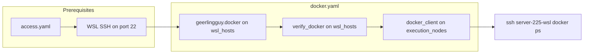

# Docker Integration — Organization Options

## Current State

You already have:

- `roles/docker_engine/` — a minimal role that installs `docker.io` via apt on WSL hosts
- `roles/verify_docker/` — validates Docker Engine + Compose v2
- `playbooks/docker_engine.yaml` — targets `wsl_hosts`, applies `docker_engine` role
- `group_vars/server_225.yaml` — already declares `docker_engine_in_wsl: true`, `docker_runtime: wsl2-ubuntu-docker-engine`
- `group_vars/mac_dev.yaml` — defined as `development-control-plane`, `outbound_only: true`

The existing `docker_engine` role is bare (no GPG key, no official Docker repo, no Compose plugin install, no idempotency guards). Replacing it with `geerlingguy.docker` is the right move.

---

## Decision 1: Where does Docker Engine installation go?

### Option A: Standalone role via geerlingguy.docker (recommended)

Keep Docker as its own concern, separate from `access_identity_windows`. The `geerlingguy.docker` role runs against the WSL host directly over SSH (port 22, which is now working).

```
playbooks/docker.yaml          (orchestrator)
  Play 1: wsl_hosts  →  geerlingguy.docker   (install engine)
  Play 2: wsl_hosts  →  verify_docker         (validate)
  Play 3: execution_nodes → docker_client      (configure Mac context)
```

- Pros: Clean separation. Docker install is a Linux concern, not a Windows concern. Runs over real SSH to the distro's own sshd — `become: true` works natively.
- Cons: Requires the WSL host to be SSH-reachable first (depends on `access` playbook having run).

### Option B: Docker install stays inside ubuntu.yml via WinRM + wsl.exe

Add Docker installation tasks to `roles/access_identity_windows/tasks/ubuntu.yml` using `win_powershell` + `wsl.exe`, similar to how openssh-server is installed today.

- Pros: Single playbook sets up everything on the Windows host (WSL + Docker) in one pass.
- Cons: Every apt/systemctl command needs the `bash -c` + `wsl.exe` wrapping pattern. No `become: true`. Can't use `geerlingguy.docker` (it expects a real Linux connection). Fights the tool rather than using it.

**Recommendation: Option A.** Docker is a Linux workload. Now that WSL has its own sshd on port 22, you can target it directly with standard Ansible Linux roles. Reserve `ubuntu.yml` for the WSL bootstrapping that *must* happen via WinRM (feature install, distro creation, sshd setup, portproxy).

---

## Decision 2: How to organize the Mac Docker client?

### Option A: New role `docker_client` (recommended)

```
roles/docker_client/
  tasks/main.yml       — brew install docker-cli, create SSH docker context
  defaults/main.yml    — docker_context_name, docker_host_ssh_url
```

The Mac never runs a Docker daemon. It only needs:

1. `docker` CLI (via `brew install docker`)
2. A Docker context pointing at the WSL engine: `docker context create server-225 --docker "host=ssh://joshc@DESKTOP-VLLM"`

- Pros: Reusable if you add more Mac clients or more Docker hosts. Clean role boundary.
- Cons: One more role to maintain.

### Option B: Tasks inside `access_identity_controller`

Add Docker client setup to the existing controller role since it already manages the Mac's SSH config.

- Pros: Fewer roles. The controller already "knows about" the deployed hosts via cached facts.
- Cons: Muddies the purpose of `access_identity_controller` (identity/SSH vs Docker tooling).

**Recommendation: Option A.** The controller role is about SSH identity. Docker client config is a separate concern.

---

## Decision 3: Playbook orchestration

### Option A: Dedicated `docker.yaml` orchestrator (recommended)

Similar to your `access.yaml` pattern — a top-level playbook that imports sub-playbooks or arranges plays:

```yaml
# playbooks/docker.yaml
- name: Docker — install engine in WSL
  hosts: wsl_hosts
  become: true
  roles:
    - role: geerlingguy.docker
      when: docker_engine_in_wsl | default(false) | bool

- name: Docker — verify engine
  hosts: wsl_hosts
  roles:
    - verify_docker
      when: docker_engine_in_wsl | default(false) | bool

- name: Docker — configure Mac client context
  hosts: execution_nodes
  connection: local
  roles:
    - docker_client
```

Guard with `docker_engine_in_wsl` (already in `group_vars/server_225.yaml`) so only WSL hosts that should have Docker get it.

### Option B: Fold into existing `access.yaml` pipeline

Add Docker plays to the end of `access.yaml` so one command sets up SSH + Docker.

- Cons: Makes `access.yaml` responsible for too much. Docker isn't an "access" concern.

**Recommendation: Option A.** Keep `docker.yaml` separate. Run it after `access.yaml` in your workflow or compose both into a `site.yaml` if you want a single command.

---

## Decision 4: geerlingguy.docker — role vs collection?

`geerlingguy.docker` is available as both:

- **Ansible Galaxy role** (`geerlingguy.docker`) — installed via `ansible-galaxy role install`
- **Collection** (`geerlingguy.docker` collection) — installed via `ansible-galaxy collection install`

### Recommendation: Galaxy role

Add to `requirements.yml` as a role (not a collection). Your project already uses Galaxy collections for `ansible.windows` etc., and standalone Galaxy roles for capability-specific installs. The role is simpler and more widely documented.

Add a `roles` section to `requirements.yml`:

```yaml
roles:
  - name: geerlingguy.docker
    version: "7.4.1"  # or latest
```

---

## Proposed File Layout

```
requirements.yml                          # add geerlingguy.docker role
roles/
  docker_client/                          # NEW — Mac Docker CLI + SSH context
    tasks/main.yml
    defaults/main.yml
  verify_docker/                          # EXISTS — keep as-is
    tasks/main.yml
playbooks/
  docker.yaml                             # NEW — orchestrates engine + client
  docker_engine.yaml                      # UPDATE — use geerlingguy.docker
  verify_docker.yaml                      # EXISTS — update hosts: to wsl_hosts
inventory/
  group_vars/server_225.yaml              # EXISTS — already has docker_engine_in_wsl
  group_vars/mac_dev.yaml                 # add docker_context vars
```

---

## Execution Order




## Security Note

No TCP port exposure needed. The Docker daemon listens only on its default Unix socket (`/var/run/docker.sock`). The Mac connects via `ssh://joshc@DESKTOP-VLLM` which tunnels Docker API over the existing SSH connection on port 22 — the same portproxy you just set up. No firewall changes required.