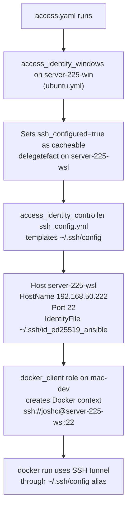

# Docker Client / SSH Setup — Sync Audit

## Answer: The systems are in sync by design

The Docker client and SSH config are **coupled through a deliberate Ansible pipeline**. Here is the full dependency chain:




### How the SSH alias gets into `~/.ssh/config`

- `[roles/access_identity_windows/tasks/ubuntu.yml](roles/access_identity_windows/tasks/ubuntu.yml)` line 826: at the end of Windows SSH setup, it runs `delegate_to: server-225-wsl` and sets `ssh_configured: true` as a **cacheable fact** on the WSL companion host
- `[roles/access_identity_controller/tasks/ssh_config.yml](roles/access_identity_controller/tasks/ssh_config.yml)`: the template loops `groups['ssh_targets']` and only emits entries for hosts where `ssh_configured=true` — this produces the `Host server-225-wsl` block
- This is why `server-225-wsl.yaml` host_vars does NOT have `ssh_configured: true` in the file — it gets set as a fact at runtime and cached

### How the Docker context depends on the SSH alias

- `[inventory/host_vars/mac-dev.yaml](inventory/host_vars/mac-dev.yaml)`: `docker_engine_ssh_host: "server-225-wsl"` — a symbolic reference to the SSH alias, not an IP
- `[roles/docker_client/tasks/main.yml](roles/docker_client/tasks/main.yml)`: creates context `server-225` pointing at `ssh://joshc@server-225-wsl:22` — this is a one-time write; re-running docker_client.yaml updates it if the endpoint changes
- The Docker context therefore requires the SSH config alias to exist and to be valid before any `docker` command can succeed

### What is currently broken

The SSH config alias IS correct and present (`HostName 192.168.50.222`, `IdentityFile ~/.ssh/id_ed25519_ansible`). But the connection is actively refused:

```
ssh: connect to host 192.168.50.222 port 22: Connection refused
```

This means either:

- The WSL distro (`Ubuntu-24.04`) on `server-225` is not running (idle-shutdown)
- `sshd` inside the WSL distro is not running
- The WSL bridged IP (`192.168.50.222`) has changed since the config was written

### One real sync gap found

`[inventory/host_vars/server-225-wsl.yaml](inventory/host_vars/server-225-wsl.yaml)` does not have `ssh_configured: true` in the file — it relies entirely on the Ansible fact cache being populated by a prior `access.yaml` run. If the fact cache is stale or cleared, re-running `access.yaml` is required before `docker_client.yaml` will produce a working context.

## What needs to happen

1. Verify the WSL distro is running and sshd is alive on `server-225`
2. If the bridged IP has changed, update `ansible_host` in `[inventory/host_vars/server-225-wsl.yaml](inventory/host_vars/server-225-wsl.yaml)` and re-run `access.yaml` + `docker_client.yaml`
3. If sshd is simply not running, wake the WSL distro and start sshd — the existing pre-task in `docker.yaml` is designed to do exactly this (via WinRM to the Windows host)

