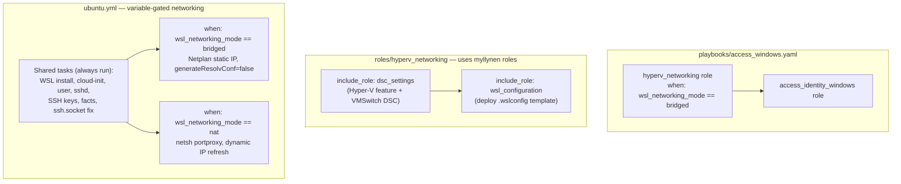

# Hyper-V Bridge Networking for WSL

## Architecture




WSL gets its own LAN IP (e.g. `192.168.50.222`) on the same subnet as the Windows host (`192.168.50.158`). No `netsh portproxy` needed — WSL is directly reachable.

## Variable gate: `wsl_networking_mode`

A single variable controls which networking path runs:

- `**wsl_networking_mode: bridged**` — `hyperv_networking` role runs, `ubuntu.yml` applies Netplan static IP, skips portproxy
- `**wsl_networking_mode: nat**` (default) — `hyperv_networking` role is skipped, `ubuntu.yml` applies portproxy with dynamic WSL IP, skips Netplan

Set in `host_vars/server-225-win.yaml`. Default is `nat` in `roles/access_identity_windows/defaults/main.yml` so existing hosts are unaffected.

All networking-agnostic tasks (WSL install, cloud-init, user setup, sshd, SSH keys, fact publishing, ssh.socket fix) always run regardless of mode.

## Note: `networkingMode=bridged` is deprecated

Microsoft deprecated `bridged` in WSL 2.4.5 (your version is 2.6.3.0). The option is still present and may work. If it fails similarly to `mirrored` (`0x803b0015`), switch back to `wsl_networking_mode: nat` in host_vars — no code changes needed.

---

## 1. New role: `roles/hyperv_networking/`

### Approach: compose from myllynen roles, not raw PowerShell

The `myllynen/windows-ansible-roles` collection (already in [requirements.yml](requirements.yml) line 19-21) provides:

- `**dsc_settings**` — generic `ansible.windows.win_dsc` wrapper. We feed it a list to enable Hyper-V and create the VMSwitch via the `HyperVDsc` DSC resource.
- `**wsl_configuration**` — handles `.wslconfig` deployment via `wsl_configuration_config_file` template variable.

### `defaults/main.yml`

```yaml
hyperv_switch_name: "WSL-Bridge"
hyperv_adapter_name: "Wi-Fi"
hyperv_allow_management_os: true

wsl_static_ip: "192.168.50.222/24"
wsl_gateway: "192.168.50.1"
wsl_dns_server: "8.8.8.8"
```

### `tasks/main.yml`

```yaml
---
# Phase 1: Ensure HyperVDsc DSC module is available on the host
- name: Ensure HyperVDsc DSC module is installed
  ansible.windows.win_powershell:
    error_action: stop
    script: |
      $Ansible.Changed = $false
      if (-not (Get-Module -ListAvailable -Name HyperVDsc)) {
        Install-Module -Name HyperVDsc -Force -AllowClobber -Scope AllUsers
        $Ansible.Changed = $true
      }

# Phase 2: Enable Hyper-V + create External VMSwitch via dsc_settings role
- name: Apply Hyper-V and VMSwitch DSC settings
  ansible.builtin.include_role:
    name: dsc_settings
  vars:
    dsc_settings:
      - setting: Enable Hyper-V management tools
        resource_name: WindowsOptionalFeature
        parameters:
          Name: Microsoft-Hyper-V
          Ensure: Enable
        reboot: true

      - setting: Ensure External Virtual Switch for WSL bridged networking
        resource_name: VMSwitch
        parameters:
          Name: "{{ hyperv_switch_name }}"
          Type: External
          NetAdapterName: "{{ hyperv_adapter_name }}"
          AllowManagementOS: "{{ hyperv_allow_management_os }}"
          Ensure: Present

# Phase 3: Deploy .wslconfig with bridged networking via wsl_configuration role
- name: Configure WSL with bridged networking
  ansible.builtin.include_role:
    name: wsl_configuration
  vars:
    wsl_configuration_enable: true
    wsl_configuration_config_file: wslconfig_bridged.j2
    wsl_configuration_reboot: false
    wsl_configuration_update: false
    wsl_configuration_distributions: []
```

### `templates/wslconfig_bridged.j2`

```ini
[wsl2]
networkingMode=bridged
vmSwitch={{ hyperv_switch_name }}
```

### `README.md` — Documents the role, warns about deprecation, references the myllynen roles it composes.

---

## 2. Update `ubuntu.yml` — variable-gated networking

In [roles/access_identity_windows/tasks/ubuntu.yml](roles/access_identity_windows/tasks/ubuntu.yml):

### Remove

Lines 98-120 (commented-out Step 1.2 mirrored networking block).

### Add `_wsl_networking_mode` local variable

At the top with the other resolved variables:

```yaml
- name: Resolve WSL networking mode
  ansible.builtin.set_fact:
    _wsl_networking_mode: "{{ wsl_networking_mode | default('nat') }}"
```

### Bridge-specific tasks (`when: _wsl_networking_mode == 'bridged'`)

**Step 1.2 (bridged): Netplan static IP**

- Write `/etc/netplan/01-wsl-bridge.yaml` into the distro via `wsl.exe` with static IP, gateway, DNS
- Run `netplan apply` via `wsl.exe`
- Persistent across reboots

**Update `wsl.conf`**: Add `[network]` section with `generateResolvConf=false`

### NAT-specific tasks (`when: _wsl_networking_mode == 'nat'`)

Restore the `netsh portproxy` + firewall rule tasks that were previously removed (Step 4.6/4.7). These only run when in NAT mode.

### Always-run tasks (no `when:` guard)

Everything else: WSL install, cloud-init, user setup, sshd config, SSH keys, facts. Plus the new ssh.socket fix.

### ssh.socket fix (always run, all modes)

```yaml
- name: Disable ssh.socket to prevent conflict with boot command
  ansible.windows.win_powershell:
    script: |
      wsl.exe -d {{ _wsl_distro }} -u root -- bash -c 'systemctl disable ssh.socket 2>&1; systemctl mask ssh.socket 2>&1'
```

---

## 3. Update defaults

### [roles/access_identity_windows/defaults/main.yml](roles/access_identity_windows/defaults/main.yml)

Add:

```yaml
wsl_networking_mode: nat
```

Default is `nat` so existing hosts work unchanged. Override to `bridged` in host_vars for bridge-enabled hosts.

---

## 4. Update host_vars

### [inventory/host_vars/server-225-win.yaml](inventory/host_vars/server-225-win.yaml)

- Add `wsl_networking_mode: bridged`
- Add `hyperv_adapter_name: "Wi-Fi"` (or rely on default)
- `docker_engine_ssh_host` changes from `"localhost"` to `"192.168.50.222"`

### [inventory/host_vars/server-225-wsl.yaml](inventory/host_vars/server-225-wsl.yaml)

- `ansible_host` changes from `"DESKTOP-VLLM"` to `"192.168.50.222"`
- `host_ip: "192.168.50.222"`

### [inventory/host_vars/mac-dev.yaml](inventory/host_vars/mac-dev.yaml)

- `docker_engine_ssh_host` changes from `"server-225-wsl"` to `"192.168.50.222"`

---

## 5. Update playbook orchestration

### [playbooks/access_windows.yaml](playbooks/access_windows.yaml)

```yaml
roles:
  - role: hyperv_networking
    when: wsl_networking_mode | default('nat') == 'bridged'
  - access_identity_windows
```

`hyperv_networking` only runs for hosts with `wsl_networking_mode: bridged`. NAT hosts skip it entirely.

---

## 6. Ad-hoc: clean up current state

Before running the playbook:

- Delete `.wslconfig` on the host (remove the broken mirrored config)
- Restart WSL to restore NAT temporarily
- Verify sshd starts under NAT mode

Then run the full `access.yaml` playbook to deploy the bridged setup end-to-end.

---

## Switching modes

To switch a host from bridge back to NAT:

1. Change `wsl_networking_mode: nat` in host_vars
2. Re-run the playbook — bridge tasks are skipped, NAT tasks (portproxy) activate
3. Optionally delete `.wslconfig` or run `hyperv_networking` role's cleanup (future enhancement)

