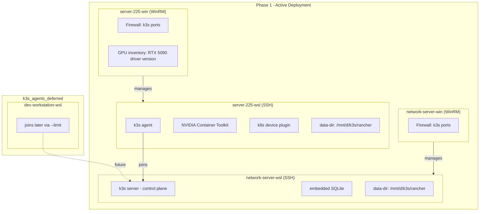

# k3s Lab Cluster: Deployment Plan

## Architecture Principles

### WSL Surfaces Are Standard Ubuntu

All `-wsl` hosts are accessed via SSH. They are standard Ubuntu servers. No `win_shell`, no Windows passthrough, no WSL-specific hacks, no driver installation inside WSL, no `.wslconfig` management. Standard `apt`, standard `systemctl`.

### Windows Surfaces Manage Windows Concerns

Firewall rules and GPU driver inventory go through `-win` hosts via WinRM. Same pattern as [roles/access_identity_windows/tasks/firewall.yml](roles/access_identity_windows/tasks/firewall.yml).

### GPU Boundary

- Windows owns the NVIDIA GPU driver. **Driver lifecycle is manual.**
- WSL consumes the Windows GPU driver via passthrough.
- Ansible **inventories** the Windows driver version and **validates** GPU visibility. It does NOT install, upgrade, or manage the driver.
- NVIDIA Container Toolkit is installed inside WSL via `apt` module.
- k3s embeds containerd -- configure runtime via k3s config, NOT system-level containerd.
- Do NOT use `nvidia.nvidia_driver` Ansible role.
- Do NOT install Linux drivers, DKMS modules, or kernel modules.

### Anti-Overengineering

- No HA, no etcd, no ingress unless needed, no monitoring stack during bootstrap
- No autoscaler, no service mesh, no multi-replica defaults
- No GPU Operator, no Linux driver install
- Do NOT rely on live GitHub URLs -- vendor manifests into repo
- `.wslconfig` is user policy, NOT managed by Ansible
- Resource management is at the kubelet level, not Windows level

---

## Target Nodes




---

## Inventory Group Structure

```yaml
k3s_cluster:
  children:
    server:
      hosts:
        network-server-wsl:
    agent:
      children:
        k3s_agents_active:
          hosts:
            server-225-wsl:
        k3s_agents_deferred:
          hosts:
            dev-workstation-wsl:
  vars:
    k3s_version: v1.31.12+k3s1
    token: "{{ k3s_token }}"
    api_endpoint: "192.168.50.38"
```

Playbooks target `k3s_cluster:!k3s_agents_deferred` or use explicit `--limit`.

---

## Phase 1: Foundation

### Cursor Rule

`.cursor/rules/k3s-cluster.mdc` (alwaysApply: true) with all design constraints, GPU boundary policy, anti-overengineering rules, storage rules.

### Install Collection

Add to `requirements.yml`, install via `galaxy-install` MCP tool, lock with `galaxy-lock`.

### Inventory + Group Vars

Groups as shown above. `inventory/group_vars/k3s_cluster.yaml`:

```yaml
k3s_version: "v1.31.12+k3s1"
token: "{{ lookup('env', 'K3S_TOKEN') }}"
api_endpoint: "192.168.50.38"
k3s_server_location: /mnt/d/k3s/rancher

server_config_yaml: |
  write-kubeconfig-mode: "0644"
  data-dir: /mnt/d/k3s/rancher
  node-label:
    - "role=control"
  kubelet-arg:
    - "system-reserved=cpu=1,memory=1Gi"
    - "kube-reserved=cpu=1,memory=1Gi"
    - "eviction-hard=memory.available<256Mi,nodefs.available<10%"
  disable:
    - servicelb

agent_config_yaml: |
  data-dir: /mnt/d/k3s/rancher
  kubelet-arg:
    - "system-reserved=cpu=500m,memory=512Mi"
    - "kube-reserved=cpu=500m,memory=512Mi"
    - "eviction-hard=memory.available<256Mi,nodefs.available<10%"
```

Control plane: 1 CPU + 1Gi each. Agents: 500m + 512Mi each.

---

## Phase 2: Firewall Role -- `k3s_firewall`

Runs on Windows hosts via WinRM. Same pattern as [roles/access_identity_windows/tasks/firewall.yml](roles/access_identity_windows/tasks/firewall.yml) using `community.windows.win_firewall_rule`.

Ports: TCP 6443 (API), UDP 8472 (Flannel VXLAN), TCP 10250 (kubelet).

Targets `server-225-win` and `network-server-win`.

---

## Phase 3: Storage Prep Role -- `k3s_storage_prep`

Runs on WSL surfaces via SSH BEFORE k3s install.

Tasks:

1. Verify `/mnt/d` mount exists with sufficient space
2. Create `/mnt/d/k3s/rancher` and `/mnt/d/k3s/kubelet`
3. Symlink `/var/lib/rancher` -> `/mnt/d/k3s/rancher`
4. Symlink `/var/lib/kubelet` -> `/mnt/d/k3s/kubelet`

**NOT symlinked**: `/run/k3s` -- `/run` is tmpfs, k3s manages it as ephemeral runtime state.

---

## Phase 4: Node Config Role -- `k3s_node_config`

Runs AFTER collection install, from control plane. Labels nodes: `role=control` (network-server), `role=gpu` (server-225).

---

## Phase 5: GPU Toolkit Role -- `k3s_gpu_toolkit` (BLOCKED)

Waiting on user to complete NVIDIA driver install on server-225 Windows side.

When unblocked:

- Install NVIDIA Container Toolkit via `apt` (no shell pipelines)
- Configure k3s containerd via k3s native config template (NOT `nvidia-ctk runtime configure`)
- Deploy vendored device plugin manifest (pinned version in `files/`, NOT live GitHub URL)

---

## Phase 6: GPU Validation Role -- `k3s_gpu_validation` (BLOCKED)

Reusable standalone role. Run after driver changes, toolkit install, or on-demand.

When unblocked:

- Task A: Windows GPU inventory via `ansible.windows.win_powershell` (WinRM to -win host)
- Task B: WSL `nvidia-smi` validation via `ansible.builtin.command`
- Task C: Docker GPU test via `community.docker.docker_container`

---

## Phase 7: Playbooks

### `playbooks/k3s_bootstrap.yaml`

```yaml
# Play 1: Open firewall ports on Windows hosts
- name: Configure k3s firewall rules
  hosts: server-225-win,network-server-win
  roles:
    - k3s_firewall

# Play 2: Prepare storage on WSL surfaces
- name: Prepare k3s storage directories
  hosts: k3s_cluster:!k3s_agents_deferred
  roles:
    - k3s_storage_prep

# Play 3: Deploy k3s cluster (community collection)
- name: Deploy k3s cluster
  ansible.builtin.import_playbook: k3s.orchestration.site

# Play 4: Label and taint nodes
- name: Configure node labels and taints
  hosts: server
  roles:
    - k3s_node_config
```

GPU plays added later when unblocked.

```bash
source .envrc
export K3S_TOKEN=$(openssl rand -base64 32 | tr '/' '_')
ansible-playbook playbooks/k3s_bootstrap.yaml \
  -i inventory/inventory.yaml \
  --limit network-server-win,network-server-wsl,server-225-win,server-225-wsl
```

### `playbooks/k3s_debug.yaml`

Cluster health checks from control plane.

### `playbooks/k3s_gpu_validate.yaml`

Standalone GPU validation (when unblocked).

---

## Files Summary


| Action | File                                                                                  |
| ------ | ------------------------------------------------------------------------------------- |
| CREATE | `.cursor/rules/k3s-cluster.mdc`                                                       |
| CREATE | `requirements.yml` -- k3s-ansible collection                                          |
| MODIFY | `inventory/inventory.yaml` -- add k3s_cluster, k3s_agents_active, k3s_agents_deferred |
| CREATE | `inventory/group_vars/k3s_cluster.yaml`                                               |
| CREATE | `roles/k3s_firewall/` (defaults, tasks, meta)                                         |
| CREATE | `roles/k3s_storage_prep/` (defaults, tasks, meta)                                     |
| CREATE | `roles/k3s_node_config/` (defaults, tasks, meta)                                      |
| CREATE | `roles/k3s_gpu_toolkit/` (BLOCKED -- defaults, tasks, files, meta)                    |
| CREATE | `roles/k3s_gpu_validation/` (BLOCKED -- defaults, tasks, meta)                        |
| CREATE | `playbooks/k3s_bootstrap.yaml`                                                        |
| CREATE | `playbooks/k3s_debug.yaml`                                                            |
| CREATE | `playbooks/k3s_gpu_validate.yaml` (BLOCKED)                                           |


