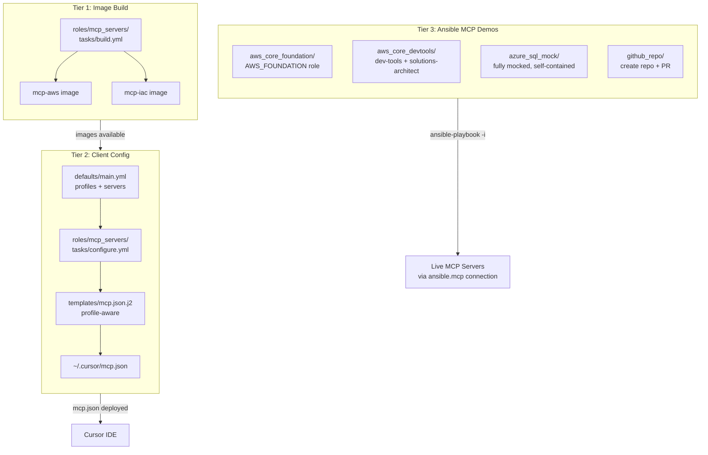

# MCP Server Organization and Deployment Plan

## The Problem

You need a scalable structure for many MCP servers that supports:

- Grouping related servers (AWS together, etc.)
- Role-based AWS Core server profiles with per-host/per-project switching
- Self-contained demos showing how ansible.mcp uses MCP servers as Ansible targets
- Multiple deployment modes (uvx native vs docker container)

## Architecture Overview

Three tiers, each with a distinct purpose:




## Tier 1 + 2: `roles/mcp_servers/` (Expanded from Original Plan)`

The original plan's role gets a profile system added to `defaults/main.yml` and a smarter template.

### File Structure

```
roles/mcp_servers/
  defaults/main.yml              # Server defs, image tags, AND profile system
  tasks/
    main.yml                     # Dispatcher: build + configure
    build.yml                    # Build container images on WSL docker host
    configure.yml                # Template mcp.json per host
  files/
    Dockerfile.aws
    Dockerfile.iac
    docker-compose.build.yml
  templates/
    mcp.json.j2                  # Profile-aware Cursor MCP config
```

### Profile System in `defaults/main.yml`

The key addition is a profile-driven configuration that maps AWS Core roles to environment variables. This is the mechanism that lets you switch server configs per host or per project:

```yaml
# --- Deployment mode ---
mcp_deployment_mode: uvx   # "uvx" (native) or "docker" (containerized)

# --- AWS Core MCP Server profiles ---
# Each profile maps to AWS Core role env vars.
# Activate profiles per host via mcp_active_profiles.
mcp_aws_core_profiles:
  foundation:
    AWS_FOUNDATION: "true"
  dev_tools:
    AWS_FOUNDATION: "true"
    dev-tools: "true"
  solutions_architect:
    AWS_FOUNDATION: "true"
    solutions-architect: "true"
  serverless:
    AWS_FOUNDATION: "true"
    serverless-architecture: "true"
  security_monitoring:
    AWS_FOUNDATION: "true"
    security-identity: "true"
    monitoring-observability: "true"
  full_stack:
    AWS_FOUNDATION: "true"
    solutions-architect: "true"
    dev-tools: "true"
    frontend-dev: "true"

# Active profile (override per host_vars or group_vars)
mcp_active_profile: foundation

# --- Common env for all AWS Core profiles ---
mcp_aws_region: "us-east-1"
mcp_aws_profile: "default"

# --- Additional standalone MCP servers ---
# These are non-AWS servers that get their own entries in mcp.json.
# Easy to extend as you add more servers.
mcp_standalone_servers:
  sysoperator:
    enabled: true
    command: docker
    args: ["run", "--rm", "-i", "{{ mcp_iac_image }}", "node", "/app/mcp-sysoperator/build/index.js"]
    env: {}
```

### `templates/mcp.json.j2` (Profile-Aware)

The template merges the active AWS Core profile's env vars with common settings, and adds standalone servers. It also handles the uvx vs docker deployment mode split:

```jinja2
{# Resolve active profile env vars #}

{
  "mcpServers": {
    "awslabs.core-mcp-server": {

      "command": "uvx",
      "args": ["awslabs.core-mcp-server@latest"],

      "command": "docker",
      "args": ["run", "--rm", "-i", ...docker args...],

      "env": {
        "FASTMCP_LOG_LEVEL": "ERROR",
        "AWS_REGION": "{{ mcp_aws_region }}",
        "AWS_PROFILE": "{{ mcp_aws_profile }}",
{# Merge profile-specific role flags #}

        "{{ key }}": "{{ val }}",


      }
    }
{# Standalone servers #}

    ,"{{ name }}": { ... }

  }
}
```

### Per-Host Profile Switching

Override `mcp_active_profile` in host_vars or group_vars:

```yaml
# host_vars/mac-dev.yaml (your daily dev machine)
mcp_active_profile: dev_tools
mcp_deployment_mode: uvx

# host_vars/hom-lab-ctl-hvh-02.yaml (your server)
mcp_active_profile: foundation
mcp_deployment_mode: docker
```

### Per-Project MCP Config (Future Extension)

Cursor also supports project-level `.cursor/mcp.json`. The role can optionally template project-specific configs using a `mcp_project_configs` variable:

```yaml
mcp_project_configs:
  - path: "~/develop/my-serverless-app/.cursor/mcp.json"
    profile: serverless
  - path: "~/develop/my-infra-repo/.cursor/mcp.json"
    profile: solutions_architect
```

This is a natural extension -- not implementing it now, but the profile system is designed to support it.

## Tier 3: `playbooks/mcp_demos/` (Self-Contained Examples)

Each demo is a fully self-contained directory with its own inventory, manifest, and group_vars. They use the `ansible.mcp` connection plugin to treat MCP servers as Ansible inventory hosts.

### File Structure

```
playbooks/mcp_demos/
  README.md                              # Overview and usage

  aws_core_foundation/                   # Demo 1: AWS Core - foundation profile
    inventory.yaml
    manifest.json
    demo.yml
    group_vars/
      mcp_servers.yml

  aws_core_devtools/                     # Demo 2: AWS Core - dev-tools + solutions-architect
    inventory.yaml
    manifest.json
    demo.yml
    group_vars/
      mcp_servers.yml

  azure_sql_mock/                        # Demo 3: Azure SQL - fully mocked
    inventory.yaml
    manifest.json
    playbook.yaml
    group_vars/
      all.yml                            # Mock defaults (subscription, rg, server, db)

  github_repo/                           # Demo 4: GitHub MCP
    inventory.yaml
    manifest.json
    playbook.yaml
    group_vars/
      all.yml
```

### Demo 1: `aws_core_foundation/` -- The Foundation Pattern

This is the reference implementation for AWS Core integration. The inventory defines the MCP server as a host with the `AWS_FOUNDATION` role enabled:

`**inventory.yaml`:**

```yaml
all:
  children:
    mcp_servers:
      hosts:
        aws_core_server:
          ansible_connection: ansible.mcp.mcp
          ansible_mcp_server_name: awslabs.core-mcp-server
          ansible_mcp_server_args: []
          ansible_mcp_server_env:
            AWS_REGION: "{{ aws_region | default('us-east-1') }}"
            AWS_PROFILE: "{{ aws_profile | default('default') }}"
            FASTMCP_LOG_LEVEL: ERROR
            AWS_FOUNDATION: "true"
          ansible_mcp_manifest_path: "{{ playbook_dir }}/manifest.json"
```

`**demo.yml`:** Connects, discovers tools, runs `aws_api_suggest_aws_commands`.

### Demo 2: `aws_core_devtools/` -- Multi-Role Activation

Same structure but enables `dev-tools` + `solutions-architect` roles. Shows how the same Core server exposes different tool sets:

`**inventory.yaml`** env section:

```yaml
ansible_mcp_server_env:
  AWS_REGION: "{{ aws_region | default('us-east-1') }}"
  AWS_PROFILE: "{{ aws_profile | default('default') }}"
  FASTMCP_LOG_LEVEL: ERROR
  AWS_FOUNDATION: "true"
  dev-tools: "true"
  solutions-architect: "true"
```

`**demo.yml`:** Discovers tools, filters by role, demonstrates `diagram_server` and `code_doc_gen` tools from the additional roles.

### Demo 3: `azure_sql_mock/` -- Contained Example with Full Variable Structure

This is the "well-designed project" example you asked for. It uses `group_vars/all.yml` to provide all mock/default values while maintaining proper variable structure that would work in a real deployment. The key is it is fully self-contained but demonstrates production patterns:

`**group_vars/all.yml`:**

```yaml
# All values defaulted for local experimentation.
# In a real deployment, these would come from inventory/host_vars/vault.
azure_subscription: "00000000-0000-0000-0000-000000000000"
azure_resource_group: "rg-mcp-demo"
azure_location: "eastus"
db_server_name: "mcp-demo-sqlserver"
db_name: "mcp-demo-db"
db_admin_login: "ansible"
db_admin_password: "{{ vault_db_admin_password | default('MockP@ssw0rd!') }}"
```

`**playbook.yaml`:** Creates SQL server instance + database using `ansible.mcp.run_tool`, referencing variables from group_vars (exactly like a production playbook would).

### Demo 4: `github_repo/` -- HTTP Transport Example

Shows a different transport (HTTP vs stdio) and bearer token auth:

`**manifest.json`:**

```json
{
  "github": {
    "type": "http",
    "url": "https://api.githubcopilot.com/mcp/",
    "description": "GitHub MCP Server"
  }
}
```

`**inventory.yaml**` uses `ansible_mcp_bearer_token` for auth.

## Playbook Orchestrator

`**playbooks/mcp_servers.yaml**` follows the same pattern as [playbooks/docker.yaml](playbooks/docker.yaml):

```yaml
- name: MCP Servers - build container images
  hosts: wsl_hosts
  tasks:
    - ansible.builtin.include_role:
        name: mcp_servers
        tasks_from: build.yml
      when: docker_engine_in_wsl | default(false)

- name: MCP Servers - configure client mcp.json
  hosts: docker_clients
  tasks:
    - ansible.builtin.include_role:
        name: mcp_servers
        tasks_from: configure.yml
```

## How This Scales

When you add more MCP servers in the future:

- **New AWS Core roles**: Add a profile entry to `mcp_aws_core_profiles` in defaults -- one line per role flag. The template picks it up automatically.
- **New standalone servers** (e.g., Postgres MCP, Terraform MCP): Add an entry to `mcp_standalone_servers` dict. Template iterates over it.
- **New container images**: Add a Dockerfile + compose service. The build task picks it up.
- **New ansible.mcp demos**: Create a new directory under `playbooks/mcp_demos/` with inventory + manifest + playbook. Fully independent, no cross-contamination.
- **Per-project configs**: Add entries to `mcp_project_configs` and the role templates project-level `.cursor/mcp.json` files.

## Summary of What Gets Created


| File                                               | Purpose                             |
| -------------------------------------------------- | ----------------------------------- |
| `roles/mcp_servers/defaults/main.yml`              | Profile system + server definitions |
| `roles/mcp_servers/tasks/main.yml`                 | Dispatcher                          |
| `roles/mcp_servers/tasks/build.yml`                | Container image builds              |
| `roles/mcp_servers/tasks/configure.yml`            | Template mcp.json per host          |
| `roles/mcp_servers/files/Dockerfile.aws`           | AWS MCP container                   |
| `roles/mcp_servers/files/Dockerfile.iac`           | IaC MCP container                   |
| `roles/mcp_servers/files/docker-compose.build.yml` | Multi-image builder                 |
| `roles/mcp_servers/templates/mcp.json.j2`          | Profile-aware Cursor config         |
| `playbooks/mcp_servers.yaml`                       | Orchestrator playbook               |
| `playbooks/mcp_demos/README.md`                    | Demo overview                       |
| `playbooks/mcp_demos/aws_core_foundation/`*        | AWS Core foundation demo (4 files)  |
| `playbooks/mcp_demos/aws_core_devtools/`*          | AWS Core dev-tools demo (4 files)   |
| `playbooks/mcp_demos/azure_sql_mock/`*             | Azure SQL mock demo (5 files)       |
| `playbooks/mcp_demos/github_repo/`*                | GitHub MCP demo (5 files)           |
