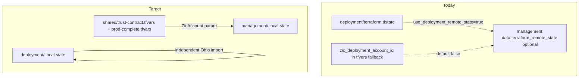

# prod-complete cleanup and simplification

## Goal

Reduce prod-complete to what you actually operate:

- **Two apply roots**, each with **local `terraform.tfstate`** (no TFC, no `terraform_remote_state`)
- **Plain tfvars** for cross-root values (`zic_deployment_account_id`, ExternalId, two `member_account_ids`)
- **Operator workflow:** [`terraform/root/environments/prod/plan.sh`](issue/ca-3081-zerto/questions_jun_24/bundle-a-zic/terraform/root/environments/prod/plan.sh) runs **deployment** (Ohio no-touch check) then **management** (StackSet order 4)

You confirmed member targets: **`552801105987`** + **`960682159332`**.

---

## Current vs target



**Already true today:** both roots default to local backend ([`deployment/backend.tf.example`](issue/ca-3081-zerto/questions_jun_24/bundle-a-zic/terraform/deployment/backend.tf.example), [`management/backend.tf.example`](issue/ca-3081-zerto/questions_jun_24/bundle-a-zic/terraform/management/backend.tf.example)); `use_deployment_remote_state = false` already uses [`var.zic_deployment_account_id`](issue/ca-3081-zerto/questions_jun_24/bundle-a-zic/terraform/management/locals.tf). The simplification is **delete the unused remote-state path** and **rewrite docs** so tfvars + local state are the only documented contract.

---

## 1. Terraform — management apply root

**Remove remote-state consumer wiring**

| File | Change |
|---|---|
| [`terraform/management/data.tf`](issue/ca-3081-zerto/questions_jun_24/bundle-a-zic/terraform/management/data.tf) | Delete `terraform_remote_state` data sources (local + remote/TFC). Keep SSM parameter lookup if you still want profile/tfvars cross-check (recommended — not a state lookup). |
| [`terraform/management/locals.tf`](issue/ca-3081-zerto/questions_jun_24/bundle-a-zic/terraform/management/locals.tf) | `zic_account_id = var.zic_deployment_account_id`; `zic_aws_region = var.aws_region`; drop remote-state branches and `inter_account_data_source` logic (or hardcode audit string `"var.zic_deployment_account_id"`). |
| [`terraform/management/variables.tf`](issue/ca-3081-zerto/questions_jun_24/bundle-a-zic/terraform/management/variables.tf) | Remove: `use_deployment_remote_state`, `deployment_remote_state_backend`, `deployment_local_state_path`, `tfc_organization`, `deployment_tfc_workspace`, and any vars only used by remote/TFC paths. |
| [`terraform/management/terraform.tfvars`](issue/ca-3081-zerto/questions_jun_24/bundle-a-zic/terraform/management/terraform.tfvars) | Remove remote-state keys. |
| [`terraform/management/inter-account.tf`](issue/ca-3081-zerto/questions_jun_24/bundle-a-zic/terraform/management/inter-account.tf) | Update output descriptions (tfvars-only). |
| [`terraform/management/README.md`](issue/ca-3081-zerto/questions_jun_24/bundle-a-zic/terraform/management/README.md) | Document tfvars contract; remove remote-state paragraph. |
| [`terraform/management/backend.tf.example`](issue/ca-3081-zerto/questions_jun_24/bundle-a-zic/terraform/management/backend.tf.example) | Strip consumer-state comments; keep “local state default” only. |

**Scenario tfvars — single StackSet contract**

Update [`terraform/management/prod-complete.tfvars`](issue/ca-3081-zerto/questions_jun_24/bundle-a-zic/terraform/management/prod-complete.tfvars):

```hcl
enable_stackset_delivery = false   # lift when operator approves apply

member_account_ids = [
  "552801105987",  # enterpriseintegration-sandbox
  "960682159332",  # AwsInfrastructure-sandbox
]
```

Keep account IDs in [`terraform/shared/trust-contract.tfvars`](issue/ca-3081-zerto/questions_jun_24/bundle-a-zic/terraform/shared/trust-contract.tfvars) as SSOT for `zic_deployment_account_id` + ExternalId (already `533462777803` + `zerto-primary-zic-trust-v1`).

**Verify:** `terraform validate` in `management/` and `deployment/` after edits.

---

## 2. Docs — rewrite prod-complete scenario (primary SSOT)

Replace the long/milestone-heavy [`reference/deployment_units_and_env_discussion/prod-complete/deployment-scenario.md`](issue/ca-3081-zerto/questions_jun_24/bundle-a-zic/reference/deployment_units_and_env_discussion/prod-complete/deployment-scenario.md) with a short structure:

1. **Intent** — orders **1 + 4** only; service-managed StackSet
2. **Apply roots** — table: `deployment/` + `management/`, each **local state file in-directory**
3. **Values contract (no state lookups)** — table of tfvars files and what they set
4. **Member targeting** — pilot pair only (remove StackSet-first cohort / Phase 1 pilot-stack deferral prose)
5. **Commands** — match [`reference/terraform/environments/prod.md`](issue/ca-3081-zerto/questions_jun_24/bundle-a-zic/reference/terraform/environments/prod.md) and `plan.sh`
6. **Gates** — `enable_stackset_delivery`, no apply without approval
7. **Checklist** — remove “remote state or tfvars” row; say tfvars-only

Remove or shorten:
- “Shared with milestone” state language
- Remote state / TFC references
- Merge verification row about `terraform_remote_state`

---

## 3. Docs — simplify TRANSITION.md

Update [`reference/deployment_units_and_env_discussion/TRANSITION.md`](issue/ca-3081-zerto/questions_jun_24/bundle-a-zic/reference/deployment_units_and_env_discussion/TRANSITION.md):

**Replace Phase 2 step 1** — remove:

> `1. **Same** deployment/state — plan still no-touch on Ohio.`

**With** something like:

> `1. deployment/plan` — optional Ohio drift check (import adopt-only; no destroy/recreate). Independent local state; not a prerequisite for management apply.

**Broader trim (same pass):**

- State map: drop `member-stacks/` row; two roots only
- Remove Phase 0/1 milestone command rows (parked path)
- Account cohorts: collapse to deployment + two pilot members (drop “StackSet-first enroll” / “keep stack-delivered” split — you are StackSet-targeting the pilot pair)
- Flags section: replace `member-stacks/` example with `prod-complete.tfvars` member list
- Mermaid: `deployment/state` → `management/state` only (no Phase 1 subgraph)

---

## 4. Supporting doc touch-ups (minimal)

| File | Change |
|---|---|
| [`reference/terraform/contracts/inter-account-data.md`](issue/ca-3081-zerto/questions_jun_24/bundle-a-zic/reference/terraform/contracts/inter-account-data.md) | Priority 1 = **tfvars** (`zic_deployment_account_id`); remote state marked removed / parked for future TFC |
| [`terraform/deployment/README.md`](issue/ca-3081-zerto/questions_jun_24/bundle-a-zic/terraform/deployment/README.md) | Remove “publishes outputs for management via TFC remote state” |
| [`northstar/GOAL.md`](issue/ca-3081-zerto/questions_jun_24/bundle-a-zic/northstar/GOAL.md) | Note tfvars-only inter-account contract |
| [`northstar/plan-execution.md`](issue/ca-3081-zerto/questions_jun_24/bundle-a-zic/northstar/plan-execution.md) | Mark T7 remote-state bridge **superseded** |
| [`diagrams/zic-role-policy-artifacts-and-member-account-path.md`](issue/ca-3081-zerto/questions_jun_24/bundle-a-zic/diagrams/zic-role-policy-artifacts-and-member-account-path.md) | Change `remote state · ZicAccount param` edge to `trust-contract.tfvars · ZicAccount` (small diagram fix) |

**Not in scope unless you ask:** deleting `terraform/deployment/` or Ohio import HCL (Ohio import stays; deployment plan remains step 1 in `plan.sh`).

---

## 5. Operator scripts (keep both roots)

[`terraform/root/environments/prod/plan.sh`](issue/ca-3081-zerto/questions_jun_24/bundle-a-zic/terraform/root/environments/prod/plan.sh) — keep two-step flow; tweak banner text:

- Step 1: “Ohio adopt-only drift check”
- Step 2: “StackSet order 4 (tfvars: trust-contract + prod-complete)”

[`validate.sh`](issue/ca-3081-zerto/questions_jun_24/bundle-a-zic/terraform/root/environments/prod/validate.sh) — unchanged.

---

## Apply / Verify / Undo / Change class

| | |
|---|---|
| **Apply** | Edit management HCL + tfvars + scenario docs; run `terraform validate` both roots; run `./plan.sh` when credentials available |
| **Verify** | Management plan shows StackSet targeting 2 members; `ZicAccount = 533462777803` from tfvars; deployment plan shows no Ohio destroy/recreate |
| **Undo** | Git revert; remote-state code recoverable from git history if TFC needed later |
| **Class** | Idempotent doc + tfvars simplification; no AWS mutation until `enable_stackset_delivery = true` and operator apply |

---

## Diagram gate receipt

- Architecture diagram included above (local state + tfvars contract)
- Capability routing: N/A (doc/tfvars simplification only)
- Naming/modeling: N/A

## Diagram Inventory

- **Included:** local state + tfvars simplification flow
- **Available on request:** updated full ZIC trust diagram after tfvars edge change
