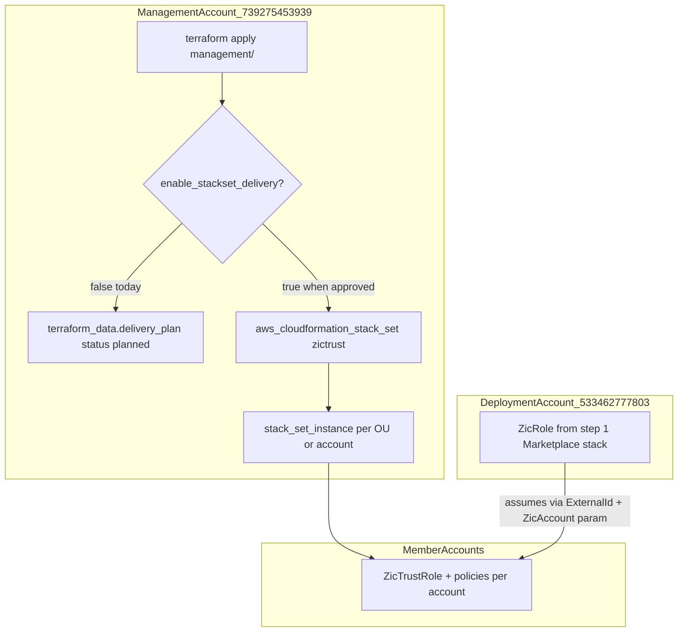

# What `stackset-zictrust/main.tf` Is and When It Deploys

## Plain-language answer

This Terraform module is **not** the ZIC application itself. It is the **org-scale delivery mechanism** for **step 4** of ZIC member onboarding: creating **`ZicTrustRole`** (plus three managed policies) in **each member AWS account** so the ZIC deployment account can assume into those accounts for replication/recovery work.

- **Run from:** management account `739275453939` (StackSet API credentials)
- **Lands in:** each targeted member account (one stack instance per account)
- **Trust target:** deployment account `533462777803` where `ZicRole` lives (passed as StackSet param `ZicAccount`)

Right now it is **designed to plan, not deploy**. Every active tfvars file sets `enable_stackset_delivery = false`, so `terraform apply` from [`terraform/management/`](oneoffs/issue/ca-3081-zerto/questions_jun_24/bundle-a-zic/terraform/management/) does **not** create StackSets in AWS.

---

## What the module contains

| Resource | When created | Purpose |
|---|---|---|
| `aws_cloudformation_stack_set.zictrust` | `delivery_enabled = true` | Registers the StackSet with template body from [`zic-member-account-cloud-formation-template.json`](oneoffs/issue/ca-3081-zerto/questions_jun_24/bundle-a-zic/terraform/management/modules/stackset-zictrust/resources/stacks/zic-member-account-cloud-formation-template.json) |
| `aws_cloudformation_stack_set_instance.service_managed` | delivery on + `SERVICE_MANAGED` + OU IDs set | Targets OUs (optionally filtered to specific account IDs) |
| `aws_cloudformation_stack_set_instance.self_managed` | delivery on + `SELF_MANAGED` | One instance per account ID in `member_account_ids` |
| `terraform_data.delivery_plan` | `delivery_enabled = false` | **Plan-only placeholder** — records what *would* be deployed (`status = "planned"`) |

The CloudFormation template creates per member account:

- `ZicTrustRole` — IAM role trusted by the ZIC deployment account (with `ExternalId`)
- `ZicPolicy`, `ZicDynamodbPolicy`, `ZicEc2Policy` — permissions Zerto needs in member accounts

Parameters passed into every stack instance:

- `ZicAccount` → deployment account ID (where Marketplace ZIC / `ZicRole` was installed in step 1)
- `ExternalId` → shared STS external ID for trust pairing (from [`zictrust_external_id`](oneoffs/issue/ca-3081-zerto/questions_jun_24/bundle-a-zic/terraform/management/variables.tf))

---

## How deployment works (the gate pattern)



Wiring from parent root [`terraform/management/main.tf`](oneoffs/issue/ca-3081-zerto/questions_jun_24/bundle-a-zic/terraform/management/main.tf):

```hcl
module "stackset_zictrust" {
  delivery_enabled               = var.enable_stackset_delivery  # false today
  stackset_permission_model      = "SERVICE_MANAGED"             # org path
  zic_account_id                 = local.zic_account_id
  member_account_ids             = var.member_account_ids       # empty today
  member_organizational_unit_ids = var.member_organizational_unit_ids
}
```

**Current state across tfvars:**

- [`terraform/management/terraform.tfvars`](oneoffs/issue/ca-3081-zerto/questions_jun_24/bundle-a-zic/terraform/management/terraform.tfvars): `enable_stackset_delivery = false`
- [`terraform/management/prod-complete.tfvars`](oneoffs/issue/ca-3081-zerto/questions_jun_24/bundle-a-zic/terraform/management/prod-complete.tfvars): `enable_stackset_delivery = false`, `member_account_ids = []`

So if you ran `terraform plan` recently, you would see **no** `aws_cloudformation_stack_set` resources — only the `terraform_data.delivery_plan` output describing the intended step 4 delivery.

---

## Why this step exists (and when it would actually deploy)

### Why

ZIC runs in the **deployment account** but must operate **inside member accounts** (EC2 recovery, DynamoDB metadata, KMS, etc.). Each member needs a local **`ZicTrustRole`** that trusts the deployment account. At org scale (many accounts), AWS Organizations **service-managed StackSets** from the **management account** is the standard delivery path — that is what this module implements.

### Dependency order ([orderofoperations.md](oneoffs/issue/ca-3081-zerto/questions_jun_24/bundle-a-zic/reference/terraform/operations/orderofoperations.md))

| Step | Deploy? | What |
|---|---|---|
| 1 | Yes (deployment account) | Marketplace ZIC stack → `ZicRole` |
| 2–3 | No (service-managed path) | StackSet admin/execution roles — AWS org handles this |
| **4** | **Yes, when gate lifted** | **This module** → `ZicTrustRole` StackSet |

Step 4 must succeed in a member before ZIC can assume `ZicTrustRole` there.

### When it would start deploying real AWS resources

All of these must be true:

1. **`enable_stackset_delivery = true`** in the tfvars used for apply (e.g. `prod-complete.tfvars`)
2. **Member targets populated** — `member_organizational_unit_ids` and/or `member_account_ids` (for service-managed pilots: OU + optional `INTERSECTION` account filter)
3. **`terraform apply` from management account** with profile `bfh_mgmt_739275453939_admin`
4. **Step 1 already applied** in deployment account (ZIC Marketplace stack / `ZicRole` exists)
5. **Org prerequisites** for service-managed StackSets (trusted access enabled; no manual steps 2–3 on this path)

Documented lift sequence from [`northstar/plan-execution.md`](oneoffs/issue/ca-3081-zerto/questions_jun_24/bundle-a-zic/northstar/plan-execution.md): Phase 2 approval → set gate + member list → management apply.

---

## How to tell plan-only vs live delivery

Check module output `plan` ([`outputs.tf`](oneoffs/issue/ca-3081-zerto/questions_jun_24/bundle-a-zic/terraform/management/modules/stackset-zictrust/outputs.tf)):

- **`status = "planned"`** → gate off; no StackSet in AWS
- **`status = "delivery_enabled"`** → gate on; StackSet name and targets are live Terraform-managed resources

After `terraform plan` with gate off, expect output like:

```json
{
  "bootstrap_step": 4,
  "resource_name": "ZicTrustRole",
  "run_from": "management",
  "lands_in": "member_accounts",
  "mechanism": "AWS::CloudFormation::StackSet",
  "status": "planned"
}
```

---

## Common confusion points

1. **Management account does not get ZicTrustRole** — it only *orchestrates* StackSet delivery. The role is created **inside each member account**.
2. **`ZicAccount` is not the management account** — it must be the deployment account where `ZicRole` lives ([`variables.tf` validation intent](oneoffs/issue/ca-3081-zerto/questions_jun_24/bundle-a-zic/terraform/management/modules/stackset-zictrust/variables.tf)).
3. **Duplicate module under `terraform/deployment/modules/stackset-zictrust/`** — that is the Zerto **self-managed StackSet path** (run from deployment account, requires steps 2–3). The file you opened is the **canonical management-account path** for prod-complete / org service-managed delivery.
4. **Why it "has been" deploying nothing** — by design. The repo explicitly keeps order 4 in **plan-only** mode until Phase 2 approval and member targeting are ready.

---

## Diagram gate receipt

- Architecture/Structure: included above (run-from / lands-in / gate / step order)
- Capability Routing: included (delivery_enabled branch)
- Naming/Modeling: N/A (no new naming surfaces in this explanation)
- Diagram Inventory: Architecture diagram included; Deployment Flow and State Transition available on request
