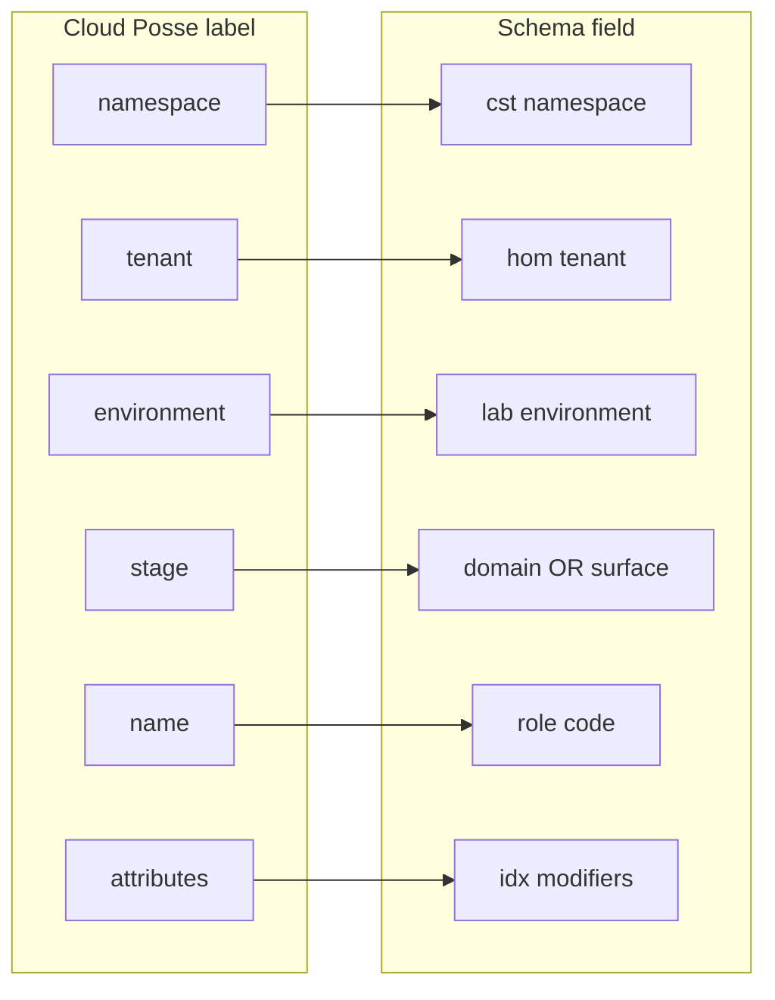

# Data Protection Naming Layers

**Canonical ID:** `cst-hom-lab-ctl-dia-data-protection-naming-01`

Schema-backed naming for data protection and Terraform stack layout. Authority:
`docs/reference/naming-standards/render-patterns.yml`, `context.yml`,
`resource-roles.yml`, `azure-ai.yml`.

**Status:** candidate extensions (`zrt`, surface domain codes `mgmt`/`wrk`/`dr`)
are brainstorm-only until promoted to the active registry.

---

## Baseline pattern (on-prem control plane)

```text
<tenant>-<environment>-<domain>-<role>-<idx>
```

| Field | Code | Example segment |
|-------|------|-----------------|
| tenant | `hom` | home |
| environment | `lab` | homelab site |
| domain | `ctl` | control-plane |
| role | `hvh`, `dkr`, `k3s`, `zrt` | resource-roles.yml |
| idx | `01`, `02` | two-digit ordinal |

**Live examples** (`live-object-registry.yml`):

- `HOM-LAB-HVH-01`, `HOM-LAB-HVH-02`
- `hom-lab-ctl-dkr-01`, `hom-lab-ctl-k3s-02`

---

## Scaled pattern (multi-surface)

When resources live in **AWS accounts** or **Azure workload domains**, the
**third segment (domain)** carries the **surface code** instead of `ctl`:

```text
<tenant>-<environment>-<surface>-<role>-<idx>
```

| Surface code | Meaning | Example rendered ID | Terraform stack path |
|--------------|---------|---------------------|----------------------|
| `ctl` | On-prem control plane + Hyper-V lanes | `hom-lab-ctl-zrt-01` | `stacks/on-prem/hom/lab/ctl/` |
| `mgmt` | Management / org / state (candidate) | `hom-lab-mgmt-bkp-01` | `stacks/management/aws/hom/lab/mgmt/` |
| `wrk` | AWS primary workload (candidate) | `hom-lab-wrk-ec2-01` | `stacks/aws/hom/lab/wrk/` |
| `dr` | AWS DR / vault copy (candidate) | `hom-lab-dr-bkp-01` | `stacks/aws/hom/lab/dr/` |
| `sbx` | Sandbox (candidate) | `hom-lab-sbx-ec2-01` | `stacks/aws/hom/lab/sbx/` |
| `aix` | Azure AI domain (integrated in azure-ai.yml) | `oai-hom-lab-aix-api-01` | `stacks/azure/hom/lab/aix/` |

**Rule:** lane placement (`hyperv_lane_storage`, `hyperv_lane_gpu`) stays in
**inventory groups and stack directories** — not encoded into the hostname.

---

## Service identity layers (L1–L6)

| Layer | Pattern ref | Zerto / backup example |
|-------|-------------|------------------------|
| **L1** | NetBox service slug | `zerto-manager` (stack slug — not hostname) |
| **L2** | `virtual_machine` | `hom-lab-ctl-zrt-01` (ZVM parent VM) |
| **L3** | primary access point | ZVM UI URL / AWS console (operational, not a name) |
| **L4** | `service` | `hom-lab-ctl-zrt-01` (logical service hostname) |
| **L5** | FQDN | unset until internal DNS zone chosen |
| **L6** | `canonical_id` | `cst-hom-lab-ctl-service-zerto-01` |

Azure OpenAI example (integrated): L4-style resource
`oai-hom-lab-aix-api-01` in `rg-hom-lab-aix-01`.

---

## Cloud Posse label ↔ schema (Terraform tags)



| Cloud Posse | Schema | On-prem ZVM | AWS EC2 in wrk | AWS vault in dr |
|-------------|--------|-------------|----------------|-----------------|
| `namespace` | namespace | `cst` | `cst` | `cst` |
| `tenant` | tenant | `hom` | `hom` | `hom` |
| `environment` | environment | `lab` | `lab` | `lab` |
| `stage` | domain / surface | `ctl` | `wrk` | `dr` |
| `name` | role | `zrt` | `ec2` | `bkp` |
| `attributes` | idx + modifiers | `["01"]` | `["01"]` | `["vault","01"]` |
| **Rendered `id`** | baseline | `hom-lab-ctl-zrt-01` | `hom-lab-wrk-ec2-01` | `hom-lab-dr-bkp-vault-01` |
| **L6 canonical** | documentation | `cst-hom-lab-ctl-service-zerto-01` | `cst-hom-lab-wrk-artifact-ec2-01` | `cst-hom-lab-dr-artifact-bkp-vault-01` |

---

## Inventory vs Terraform vs tags

| Surface | `inventory_hostname` (L2) | Terragrunt unit dir | AWS/Azure tag anchor |
|---------|----------------------------|---------------------|----------------------|
| On-prem VM | `hom-lab-ctl-k3s-02` | `.../protection-group-k3s-02/` | N/A |
| ZVM | `hom-lab-ctl-zrt-01` | `.../zvm-01/` | N/A |
| AWS EC2 | — (tag only unless modeled in NetBox) | `.../compute/ec2-01/` | `hom-lab-wrk-ec2-01` |
| AWS Backup vault | — | `.../vault-replica-01/` | `hom-lab-dr-bkp-01` |
| Azure OAI | — | `.../oai-api-01/` | `oai-hom-lab-aix-api-01` |

---

## Ansible groups (placement, not hostnames)

| Group | Schema anchor hosts | Data-protection scope |
|-------|---------------------|------------------------|
| `hyperv_lane_storage` | `HOM-LAB-HVH-01`, guests `.138.x` | VRA, PGs, journal |
| `hyperv_lane_gpu` | `HOM-LAB-HVH-02`, guests `.137.x` | VRA, PGs |

See [cst-hom-lab-ctl-dia-zerto-homelab-topology-01.md](./cst-hom-lab-ctl-dia-zerto-homelab-topology-01.md).
