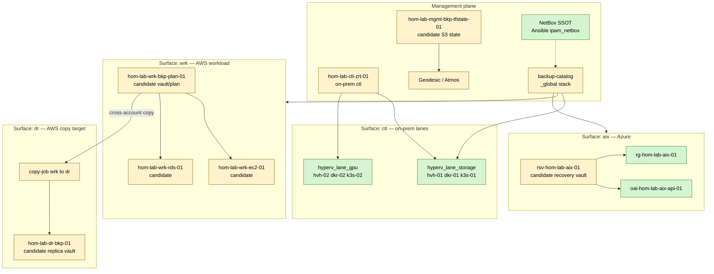

# Multi-Surface Data Protection (T2)

**Canonical ID:** `cst-hom-lab-ctl-dia-data-protection-surfaces-01`

Management plane vs protected workload surfaces. Companion:
[terraform-multi-surface-data-protection-scaled-out-plan.md](../terraform-multi-surface-data-protection-scaled-out-plan.md).

---

## Maturity tiers

| Tier | Management (domain) | Protected surfaces |
|------|---------------------|-------------------|
| **T0** | `hom-lab-ctl-zrt-01` on-prem | `hyperv_lane_storage`, `hyperv_lane_gpu` |
| **T1** | On-prem ZVM + `hom-lab-mgmt-*` AWS state | T0 + `hom-lab-wrk-*` |
| **T2** | `management/` stack (on-prem + AWS org) | T1 + `hom-lab-dr-*`, `rg-hom-lab-aix-01` |

---

## Diagram

---

## Surface registry (candidate)

| Surface | Domain segment | Example IDs | Backup product |
|---------|----------------|-------------|----------------|
| On-prem control | `ctl` | `hom-lab-ctl-k3s-02` | Zerto PG |
| AWS management | `mgmt` | `hom-lab-mgmt-bkp-tfstate-01` | S3 versioning |
| AWS workload | `wrk` | `hom-lab-wrk-ec2-01` | AWS Backup |
| AWS DR | `dr` | `hom-lab-dr-bkp-01` | cross-account copy |
| Azure AI | `aix` | `oai-hom-lab-aix-api-01` | Recovery Services vault |

Naming detail: [cst-hom-lab-ctl-dia-data-protection-naming-01.md](./cst-hom-lab-ctl-dia-data-protection-naming-01.md).
