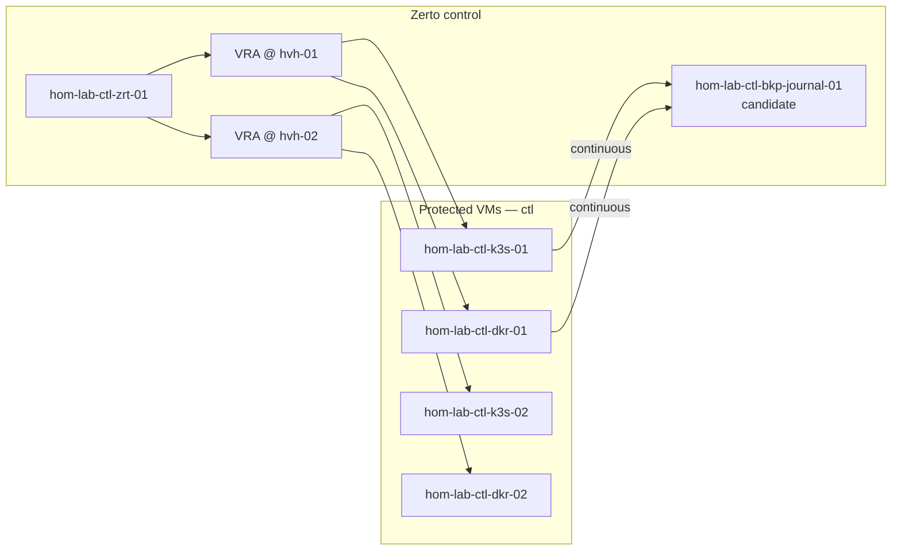
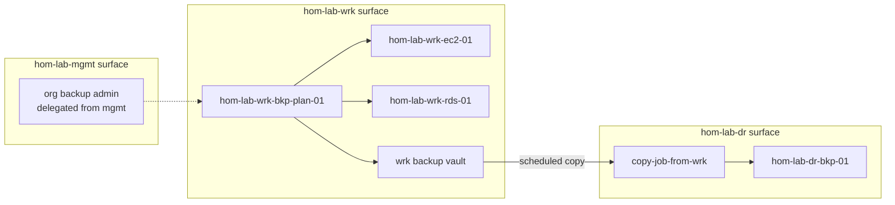

# Protection and Copy Flows

**Canonical ID:** `cst-hom-lab-ctl-dia-protection-flow-01`

How protected objects relate to journals, vaults, and copy targets across
surfaces. All names use schema notation from
[cst-hom-lab-ctl-dia-data-protection-naming-01.md](./cst-hom-lab-ctl-dia-data-protection-naming-01.md).

---

## On-prem Zerto flow (T0)

---

## AWS workload → DR copy (T2)

---

## Protection matrix (T2)

| Protected resource | Pattern | Surface | Mechanism | Copy / journal target |
|--------------------|---------|---------|-----------|------------------------|
| `hom-lab-ctl-k3s-02` | `hom-lab-ctl-k3s-02` | `ctl` / `lane-gpu` | Zerto PG | `hom-lab-ctl-bkp-journal-01` |
| `hom-lab-ctl-dkr-01` | `hom-lab-ctl-dkr-01` | `ctl` / `lane-storage` | Zerto PG | same journal candidate |
| `hom-lab-wrk-ec2-01` | `hom-lab-wrk-ec2-01` | `wrk` | AWS Backup plan | `hom-lab-dr-bkp-01` |
| `hom-lab-wrk-rds-01` | `hom-lab-wrk-rds-01` | `wrk` | AWS Backup + snapshots | `hom-lab-dr-bkp-01` |
| `oai-hom-lab-aix-api-01` | azure-ai.yml | `aix` | Recovery vault | geo-redundant / paired vault |
| Terraform state | `hom-lab-mgmt-bkp-tfstate-01` | `mgmt` | S3 versioning | DR bucket in `dr` |
| Catalog metadata | `cst-hom-lab-ctl-artifact-backup-catalog-01` | L6 canonical | git + `_global/backup-catalog` | repo clone |

---

## SSOT by concern

| Concern | Authority | Rendered anchor |
|---------|-----------|-----------------|
| On-prem hostnames | NetBox + `live-object-registry.yml` | `hom-lab-ctl-*` |
| Cloud resource tags | Terraform `label` module | `hom-lab-<surface>-<role>-<idx>` |
| Documentation IDs | L6 `canonical_id` | `cst-hom-lab-<surface>-artifact-*` |
| Backup membership | `_global/backup-catalog` stack | matrix rows above |
