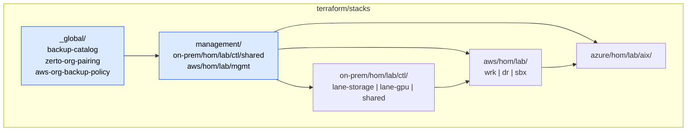
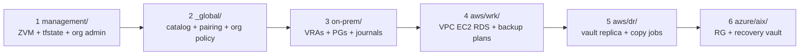

# Terraform Stack Layout and Deploy Order

**Canonical ID:** `cst-hom-lab-ctl-dia-terraform-stacks-01`

Directory roots under `terraform/stacks/` for T0–T2. Path encodes placement;
rendered IDs use schema baseline (see naming diagram).

---

## Stack roots



---

## Deploy order



---

## Path ↔ schema quick reference

| Stack path segment | Schema domain / surface | Example unit | Rendered ID |
|--------------------|-------------------------|--------------|-------------|
| `on-prem/hom/lab/ctl/lane-storage/.../zvm-01` | `ctl` | ZVM | `hom-lab-ctl-zrt-01` |
| `on-prem/.../protection-group-k3s-02` | `ctl` | PG | protects `hom-lab-ctl-k3s-02` |
| `management/aws/hom/lab/mgmt/.../terraform-state` | `mgmt` | state bucket | `hom-lab-mgmt-bkp-tfstate-01` |
| `aws/hom/lab/wrk/.../ec2-01` | `wrk` | EC2 | `hom-lab-wrk-ec2-01` |
| `aws/hom/lab/dr/.../vault-replica-01` | `dr` | vault | `hom-lab-dr-bkp-01` |
| `azure/hom/lab/aix/.../recovery-vault-01` | `aix` | RSV | `rsv-hom-lab-aix-01` |

**Terragrunt unit dirs:** kebab-case, ordinal in dirname (`zvm-01`, `ec2-01`) —
not a second hostname vocabulary.

---

## Module families (reusable)

```text
terraform/modules/
├── data-protection/zerto/     # T0 on-prem
├── data-protection/aws-backup/
├── data-protection/aws-dr/
├── data-protection/azure-recovery/
├── aws/{organization,vpc,ec2,rds}/
└── azure/resource-group/
```

Components (optional Atmos): `terraform/components/terraform/zerto-*`,
`aws-backup-plan`, `aws-backup-copy`.
