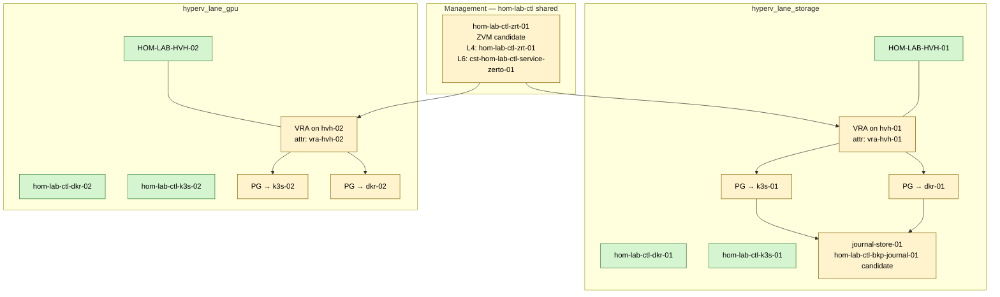

# Zerto Homelab Topology (T0)

**Canonical ID:** `cst-hom-lab-ctl-dia-zerto-homelab-topology-01`

T0 layout from
[terraform-cloudposse-zerto-layout-plan.md](../terraform-cloudposse-zerto-layout-plan.md).
All hostnames use baseline pattern `hom-lab-ctl-<role>-<idx>`.

**Status:** `hom-lab-ctl-zrt-01` and role code `zrt` are **candidate** — not in
`live-object-registry.yml` yet.

---

## Live anchors (integrated)

| inventory_hostname | role | lane_group | guest / LAN |
|--------------------|------|------------|-------------|
| `HOM-LAB-HVH-01` | `hvh` | `hyperv_lane_storage` | LAN `192.168.50.234`, guests `192.168.138.0/24` |
| `HOM-LAB-HVH-02` | `hvh` | `hyperv_lane_gpu` | LAN `192.168.50.158`, guests `192.168.137.0/24` |
| `hom-lab-ctl-dkr-01` | `dkr` | `hyperv_lane_storage` | `192.168.138.10` |
| `hom-lab-ctl-dkr-02` | `dkr` | `hyperv_lane_gpu` | `192.168.137.10` |
| `hom-lab-ctl-k3s-01` | `k3s` | `hyperv_lane_storage` | `192.168.138.11` |
| `hom-lab-ctl-k3s-02` | `k3s` | `hyperv_lane_gpu` | `192.168.137.11` |

---

## Diagram

---

## Terraform unit map (T0)

| Terragrunt unit | Protects (inventory_hostname) | Module |
|-----------------|----------------------------|--------|
| `shared/.../zvm-01` | — (creates ZVM) | `modules/data-protection/zerto/zvm` |
| `lane-storage/.../vra-hvh-01` | `HOM-LAB-HVH-01` | `zerto/vra` |
| `lane-storage/.../protection-group-dkr-01` | `hom-lab-ctl-dkr-01` | `zerto/protection-group` |
| `lane-storage/.../protection-group-k3s-01` | `hom-lab-ctl-k3s-01` | `zerto/protection-group` |
| `lane-storage/.../journal-store-01` | journal path on storage lane | `zerto/journal` |
| `lane-gpu/.../vra-hvh-02` | `HOM-LAB-HVH-02` | `zerto/vra` |
| `lane-gpu/.../protection-group-dkr-02` | `hom-lab-ctl-dkr-02` | `zerto/protection-group` |
| `lane-gpu/.../protection-group-k3s-02` | `hom-lab-ctl-k3s-02` | `zerto/protection-group` |

Stack root: `terraform/stacks/on-prem/hom/lab/ctl/`.
