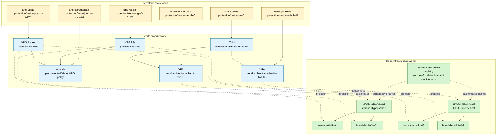

# Zerto Infrastructure World Map

**Canonical ID:** `cst-hom-lab-ctl-dia-zerto-infra-world-map-01`

One-page map for how the repo infrastructure world, Terraform stack world, and
Zerto product world line up. Companion plan:
[zerto-infrastructure-world-mapping-plan.md](../zerto-infrastructure-world-mapping-plan.md).

**Status:** brainstorm-only. Zerto codes and object names are candidate
extensions until promoted through the active naming registry.

---

## Diagram

---

## Naming Legend

| Shape | Example | Meaning |
|-------|---------|---------|
| `HOM-LAB-HVH-02` | live infrastructure name | NetBox/inventory host or VM identity |
| `vra-hvh-02` | Terraform unit | Zerto VRA attached to the `hvh-02` host |
| `vpg-k3s-02` | Terraform unit / policy object | VPG protecting K3s workload in a lane |
| `hom-lab-ctl-zrt-01` | candidate L4 service or VM | Zerto manager identity if promoted |
| `hom-lab-ctl-bkp-journal-01` | candidate storage purpose | journal storage target, not Zerto manager |

## Guardrail

Do not render placement, product, object type, host, and ordinal into one giant
hostname. Keep placement in the path, product object type in the module/unit,
and durable infrastructure identity in NetBox/inventory.
