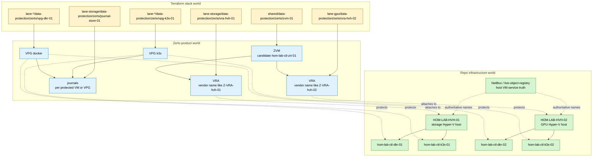

# Zerto Infrastructure World Mapping Plan

> Plan-like brainstorm - not an approved `docs/plans/` packet or repo authority.
> This extends the T0 Zerto homelab plan by mapping Zerto object vocabulary to
> the repo's infrastructure, naming, NetBox, and Terraform surfaces.
>
> Parent packet: [README.md](./README.md)

---

## Purpose

This file answers the scaling question:

> How do Zerto objects such as ZVM, VRA, VPG, journals, and sites line up with
> `dotfile-vnext` infrastructure objects such as `hvh`, `dkr`, `k3s`, Hyper-V
> lanes, NetBox rows, and Terraform stack paths?

The short version:

- **ZVM** is the management/control service. In this brainstorm it maps to
  candidate L4 service/VM identity `hom-lab-ctl-zrt-01`.
- **VRA** is the host-attached replication appliance. It maps to a Terraform
  unit such as `vra-hvh-01`, but it should not become a normal repo hostname
  unless the VM is explicitly modeled later.
- **VPG** is the protection grouping boundary. It maps to a protection policy
  unit such as `vpg-k3s-control-01` or `vpg-docker-runtime-01`.
- **Journal** is recovery point storage. It maps to backup/journal storage
  identity such as candidate `hom-lab-ctl-bkp-journal-01`.
- **Site pairing** is cross-surface relationship metadata. It belongs in
  `_global/` or `management/` Terraform, not inside a single host name.

Zerto uses product object names; this repo uses compact infrastructure names.
The scalable move is to map them in fields, tags, Terraform units, and diagrams.

---

## Zerto Terms To Use

| User wording | Zerto term | What it means here |
|--------------|------------|--------------------|
| `vru??` | `VRA` | Virtual Replication Appliance on or for a hypervisor host |
| Zerto manager | `ZVM` | Zerto Virtual Manager, the management/control service |
| protected app group | `VPG` | Virtual Protection Group, one or more VMs recovered together |
| journal | journal | Point-in-time recovery storage managed by Zerto/VRA |
| site | site / paired site | Protection/recovery boundary managed by ZVM |

Do not promote `vru` as a repo code. It is a voice-to-text miss for **VRA**.

---

## Current Facts

```yaml
current:
  naming_baseline:
    pattern: "<tenant>-<environment>-<domain>-<role>-<idx>"
    example: "HOM-LAB-HVH-01"
    canonical_diagram_pattern: "cst-hom-lab-ctl-dia-<topic>-<idx>"
  live_on_prem_hosts:
    hyperv_lane_storage:
      host: "HOM-LAB-HVH-01"
      guests:
        - "hom-lab-ctl-dkr-01"
        - "hom-lab-ctl-k3s-01"
    hyperv_lane_gpu:
      host: "HOM-LAB-HVH-02"
      guests:
        - "hom-lab-ctl-dkr-02"
        - "hom-lab-ctl-k3s-02"
  active_role_codes:
    integrated:
      hvh: "hyperv-host"
      dkr: "docker-engine"
      k3s: "k3s-node"
    candidate:
      bkp: "backup-server"
  candidate_needed:
    zrt: "zerto-manager or zerto-service"
    vpg: "zerto virtual protection group artifact, not a host role"
    vra: "zerto appliance artifact or Terraform unit, not a host role by default"
  live_netbox:
    checked_this_turn: false
    reason: "brainstorm packet only; no live apply or NetBox mutation requested"
```

---

## Problem Classification

| Proposed segment | Classification | Treatment |
|------------------|----------------|-----------|
| `zrt` | project-specific candidate | OK as candidate service/product code after registry review |
| `vra` | product object type | Use as Terraform unit/module name or artifact class, not baseline host role |
| `vpg` | product policy object | Use as Terraform unit/module name or policy object, not host role |
| `journal` | functional storage purpose | Use as storage purpose or attribute under `bkp`; avoid making it a host role |
| `lane-storage` / `lane-gpu` | placement metadata | Keep in stack path/inventory groups, not rendered hostnames |
| `Z-VRA-hostname` | vendor-generated object name | Preserve as vendor/UI name; map back to repo anchor in metadata |

The main naming risk is over-rendering:

```text
hom-lab-ctl-lane-storage-zerto-vra-hvh-01
```

That is not scalable. It mixes site, lane, product, object type, host, and
ordinal into one string. Use folder path and tags for that detail.

---

## Recommended Naming Model

### Infrastructure world

These names are already schema-shaped and should remain stable:

| Repo object | Type | Name |
|-------------|------|------|
| Storage Hyper-V host | physical device / cluster anchor | `HOM-LAB-HVH-01` |
| GPU Hyper-V host | physical device / cluster anchor | `HOM-LAB-HVH-02` |
| Storage Docker VM | virtual machine | `hom-lab-ctl-dkr-01` |
| GPU Docker VM | virtual machine | `hom-lab-ctl-dkr-02` |
| Storage K3s VM | virtual machine | `hom-lab-ctl-k3s-01` |
| GPU K3s VM | virtual machine | `hom-lab-ctl-k3s-02` |

### Zerto world

These are product/control objects. They should map to repo objects but not
replace the repo object identity.

| Zerto object | Product meaning | Repo mapping |
|--------------|-----------------|--------------|
| ZVM | management service | candidate `hom-lab-ctl-zrt-01` |
| VRA on storage host | host-attached replication appliance | Terraform unit `vra-hvh-01`, attached to `HOM-LAB-HVH-01` |
| VRA on GPU host | host-attached replication appliance | Terraform unit `vra-hvh-02`, attached to `HOM-LAB-HVH-02` |
| VPG for K3s lane | recovery group for related VMs | Terraform unit `vpg-k3s-01` or `vpg-k3s-control-01` |
| VPG for Docker lane | recovery group for related VMs | Terraform unit `vpg-dkr-01` or `vpg-docker-runtime-01` |
| Journal storage | recovery history target | candidate `hom-lab-ctl-bkp-journal-01` or storage-purpose metadata |

### Candidate schema entries

Do not treat these as integrated until promoted through the naming registry.

```yaml
candidate_schema:
  resource_roles:
    services:
      zrt:
        full: zerto
        status: candidate
        logical_hostname_example: hom-lab-ctl-zrt-01
    artifacts_or_policy_objects:
      vra:
        full: zerto-virtual-replication-appliance
        status: candidate
        rendered_as: terraform_unit_or_netbox_vm_component
      vpg:
        full: zerto-virtual-protection-group
        status: candidate
        rendered_as: terraform_unit_or_policy_object
  storage_purpose:
    journal:
      full: zerto-journal-storage
      status: candidate
      preferred_render: hom-lab-ctl-bkp-journal-01
```

---

## Diagram: Infrastructure World And Zerto World

Canonical companion diagram:
[cst-hom-lab-ctl-dia-zerto-infra-world-map-01.md](./diagrams/cst-hom-lab-ctl-dia-zerto-infra-world-map-01.md)



---

## Terraform Shape For Zerto Infra

Keep Zerto product objects under `data-protection/zerto`, with lanes and host
anchors in the path.

```text
terraform/
├── modules/
│   └── data-protection/
│       └── zerto/
│           ├── zvm/
│           ├── vra/
│           ├── vpg/
│           ├── journal/
│           └── site-pairing/
└── stacks/
    ├── _global/
    │   └── data-protection/
    │       └── zerto/
    │           └── site-pairing-01/
    └── on-prem/
        └── hom/
            └── lab/
                └── ctl/
                    ├── shared/
                    │   └── data-protection/
                    │       └── zerto/
                    │           └── zvm-01/
                    ├── lane-storage/
                    │   └── data-protection/
                    │       └── zerto/
                    │           ├── vra-hvh-01/
                    │           ├── vpg-k3s-01/
                    │           ├── vpg-dkr-01/
                    │           └── journal-store-01/
                    └── lane-gpu/
                        └── data-protection/
                            └── zerto/
                                ├── vra-hvh-02/
                                ├── vpg-k3s-02/
                                └── vpg-dkr-02/
```

### Why this scales

| Question | Answer |
|----------|--------|
| Where is this deployed? | Stack path: `on-prem/hom/lab/ctl/lane-gpu/...` |
| What product owns it? | Module path: `data-protection/zerto/...` |
| What host is attached? | Unit name and input: `vra-hvh-02`, `hyperv_host = HOM-LAB-HVH-02` |
| What is protected? | VPG inputs: protected inventory hosts |
| What gets a repo hostname? | Only durable host/service surfaces such as ZVM |
| What remains product object naming? | VRA, VPG, journal policy names |

---

## Example Unit Inputs

### VRA unit

```hcl
# stacks/on-prem/hom/lab/ctl/lane-gpu/data-protection/zerto/vra-hvh-02/terragrunt.hcl

terraform {
  source = "${get_repo_root()}/terraform/modules/data-protection/zerto/vra"
}

inputs = {
  namespace   = "cst"
  tenant      = "hom"
  environment = "lab"
  stage       = "ctl"
  name        = "zrt"
  attributes  = ["vra", "hvh", "02"]

  hyperv_host_inventory_hostname = "HOM-LAB-HVH-02"
  lane_group                     = "hyperv_lane_gpu"
  product_object_type            = "vra"
  vendor_display_name_policy     = "z-vra-hostname"
}
```

### VPG unit

```hcl
# stacks/on-prem/hom/lab/ctl/lane-gpu/data-protection/zerto/vpg-k3s-02/terragrunt.hcl

terraform {
  source = "${get_repo_root()}/terraform/modules/data-protection/zerto/vpg"
}

inputs = {
  namespace   = "cst"
  tenant      = "hom"
  environment = "lab"
  stage       = "ctl"
  name        = "zrt"
  attributes  = ["vpg", "k3s", "02"]

  vpg_name = "hom-lab-ctl-vpg-k3s-02" # candidate policy/artifact name
  protected_inventory_hosts = [
    "hom-lab-ctl-k3s-02"
  ]
  recovery_target = {
    surface = "ctl"
    lane_group = "hyperv_lane_storage"
    journal_storage_ref = "hom-lab-ctl-bkp-journal-01"
  }
}
```

---

## Mapping Table

| Repo layer | Repo object | Zerto object | Terraform unit | Naming decision |
|------------|-------------|--------------|----------------|-----------------|
| L2 VM / L4 service | `hom-lab-ctl-zrt-01` | ZVM | `shared/.../zvm-01` | Candidate real host/service identity |
| Hyper-V host | `HOM-LAB-HVH-01` | VRA attachment target | `lane-storage/.../vra-hvh-01` | VRA maps to host, not new baseline hostname |
| Hyper-V host | `HOM-LAB-HVH-02` | VRA attachment target | `lane-gpu/.../vra-hvh-02` | Same pattern |
| Protected VM | `hom-lab-ctl-k3s-02` | VM in VPG | `lane-gpu/.../vpg-k3s-02` | VPG policy references inventory hostname |
| Protected VM | `hom-lab-ctl-dkr-01` | VM in VPG | `lane-storage/.../vpg-dkr-01` | VPG policy references inventory hostname |
| Storage | candidate `hom-lab-ctl-bkp-journal-01` | journal target | `lane-storage/.../journal-store-01` | Use `bkp` + purpose, not `zrt` host role |

---

## Promotion Path

Before this becomes active repo work:

1. Add a `terraform.yml` naming-standard file for module, component, and stack
   path conventions.
2. Add candidate Zerto artifact vocabulary to `resource-roles.yml` or a new
   Terraform artifact schema.
3. Decide whether `hom-lab-ctl-zrt-01` is a VM, L4 service identity, or both.
4. Verify live Hyper-V placement and storage/journal candidates before choosing
   IPs, disk paths, or journal sizes.
5. Add NetBox declaration rows only after the repo schema and source-of-truth
   model decide which Zerto objects should be NetBox VMs, services, tags, or
   external/product records.

---

## Apply / Verify / Undo / Change Class

| | |
|--|--|
| **Apply** | Future Terraform/Atmos/Terragrunt stack chain: ZVM, site pairing, VRAs, VPGs, journals |
| **Verify** | Zerto UI/API shows ZVM, VRAs on intended hosts, VPGs protecting expected `inventory_hostname` values, journal targets healthy |
| **Undo** | Remove VPGs first, then VRAs, then site pairing, then ZVM; preserve journal/export evidence until reviewed |
| **Change class** | Brainstorm only now; future Zerto product objects are idempotent config if provider/API supports it; ZVM VM/bootstrap may be semi-manual first slice |

---

## Sources Checked

- Repo naming baseline: `docs/reference/naming-standards/README.md`
- Context fields: `docs/reference/naming-standards/context.yml`
- Role codes and service boundaries: `docs/reference/naming-standards/resource-roles.yml`
- Rendered patterns: `docs/reference/naming-standards/render-patterns.yml`
- Existing packet base plan: `terraform-cloudposse-zerto-layout-plan.md`
- Existing packet scaled plan: `terraform-multi-surface-data-protection-scaled-out-plan.md`
- Existing packet diagrams under `diagrams/`
- Zerto docs: VPG overview and journal behavior,
  <https://s3.amazonaws.com/zertodownload_docs/7.5_Latest/Zerto%20Virtual%20Replication%20Zerto%20Virtual%20Manager%20%28ZVM%29%20-%20AWS%20Online%20Help/content/adminhv/vpg_overview_hyperv.htm>
- Zerto docs: VRA installation on a host,
  <https://s3.amazonaws.com/zertodownload_docs/8.0_Latest/Zerto%20Virtual%20Replication%20Zerto%20Virtual%20Manager%20%28ZVM%29%20-%20vSphere%20Online%20Help/Content/Install_ZVM-Hyper-V/Installing_a_Zerto_Virtual_Replication_A.htm>
- Zerto docs: architecture components for ZVM, VRA, and VBA,
  <https://s3.amazonaws.com/zertodownload_docs/5.0U2/Zerto%20Virtual%20Replication%20Zerto%20Virtual%20Manager%20%28ZVM%29%20-%20SCVMM%20Online%20Help/AdministratorforZertoVirtualManager/Intro_HyperV.01.3.html>
