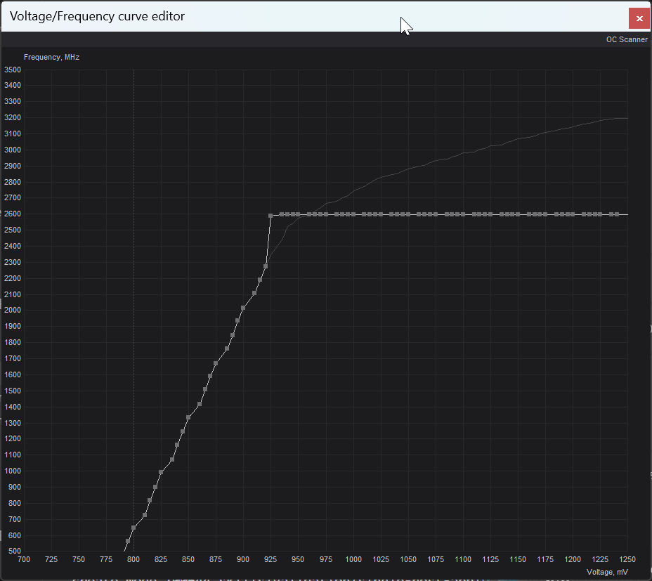

# GPU Afterburner Power Efficiency Plan

> Plan-like brainstorm - not an approved `docs/plans/` packet or repo authority.
> Parent packet: [README.md](./README.md)

---

## Goal

Reduce GPU power draw (make the card consume less watts under the same work)
**without a noticeable performance impact**.

In operator terms:

- Prefer lower board power for the same game / inference / render workload.
- Accept only tiny FPS / throughput loss that the user would not feel day to day.
- Prefer thermals and noise to stay the same or improve as a side effect of
  lower voltage at a capped frequency.

This is **efficiency / undervolt**, not a “max FPS overclock” effort.

---

## Current Live Artifact: VF Curve Screenshot

Source screenshot (copied into this packet):

### Text breakdown of the screenshot

Window:

- Title: **Voltage/Frequency curve editor** (MSI Afterburner)
- Axes:
  - **X-axis:** Core Voltage in millivolts (`mV`), roughly `700` → `1250`
  - **Y-axis:** Core Frequency in megahertz (`MHz`), roughly `500` → `3500`

Two curves are visible:

1. **Thin/stock-looking background curve**  
   Rises continuously with voltage and keeps climbing toward roughly
   `~3100–3200 MHz` at the high-voltage end. This is the reference / stock
   style curve shape.

2. **Thick editable curve with square points (operator curve)**  
   This is the intentional undervolt / frequency-cap shape:
   - Starts near the left of the chart around **~790–800 mV / ~550–600 MHz**
   - Climbs steeply with voltage
   - Reaches a **knee / lock point** near **~925 mV and ~2600 MHz**
   - From that knee through the rest of the voltage range (**~925 mV → ~1250 mV**),
     frequency is held as a **flat horizontal line at ~2600 MHz**

What that shape means:

- The GPU is told not to chase higher clocks by taking more voltage past the
  knee.
- Holding ~2600 MHz while refusing higher voltage is a classic **undervolt +
  frequency plateau** pattern aimed at **lower power** for a still-high
  sustained clock.
- Compared with stock, the right side of the graph no longer rises toward
  ~3100+ MHz; that is where power savings usually come from.

---

## Where This Lives On Disk Today

Observed on the Windows GPU host (session evidence, not repo-managed yet):

- Profile folder: `C:\Program Files (x86)\MSI Afterburner\Profiles\`
- Real curve data is in the GPU-specific file, not the tiny stub `ProfileN.cfg`
  files:
  - `VEN_10DE&DEV_2B85&SUBSYS_53031462&REV_A1&BUS_11&DEV_0&FN_0.cfg`
- In that file, **`[Startup]` matches `[Profile1]`** for `VFCurve`,
  `PowerLimit`, and `CoreClkBoost`
- `Profile2` and `Profile5` have different curves / limits

Working conclusion from that check:

- The screenshot curve is associated with **Profile 1 / Startup**
- It is **not** the same curve as Profile 2 or Profile 5

Related MSI Afterburner app settings observed earlier:

- `StartWithWindows=1`
- Startup apply of the OC/VF profile is still required for reboot persistence
  in normal Afterburner operation

---

## Why Idle `nvidia-smi` Alone Did Not Prove The Goal

During the same session, idle probes (`P8`) showed fluctuating graphics clocks
and unchanged power limit (`575 W` reported), with or without Afterburner
toggles. Idle samples are weak evidence for this goal because:

- The efficiency effect appears mainly **under load**
- VF undervolt changes voltage/frequency relationship more than the reported
  absolute power-limit number
- Proving “less watts, similar performance” needs paired load tests

Validation needed later:

1. Same workload under stock / comparison profile
2. Same workload under Profile 1 undervolt
3. Compare average power draw, FPS/throughput, and stability

Success heuristic (candidate, not locked):

- Power draw clearly lower under the same scene
- Performance drop small enough that it is not noticeable in normal use
- No crashes, driver resets, or artifacting

---

## What “Adding This To The Project” Could Mean

This packet is specifically about bringing the **Afterburner undervolt intent**
into `dotfile-vnext`, not only documenting a desktop tweak.

Candidate project surfaces (brainstorm only):

| Option | Idea | Notes |
|--------|------|-------|
| A. Docs-only | Keep curve screenshot + profile notes as operator runbook | Lowest risk; no automation |
| B. Inventory facts | Record desired GPU efficiency profile on the Windows GPU host in inventory/docs | Makes intent discoverable |
| C. Artifact backup | Back up Afterburner profile / GPU `.cfg` into a controlled repo path or host backup role | Preserves recoverability |
| D. Capability role | Future Windows role that installs/configures Afterburner and ensures Profile 1 + startup apply | Highest value, highest research need |
| E. Alternate control plane | Research NVIDIA-native equivalents (driver/API tooling) instead of Afterburner | May be cleaner for servers if viable |

Default brainstorm preference until researched:

1. Capture truth (this packet)
2. Prove power/perf under load
3. Decide docs/backup vs full present|absent automation
4. Only then invent Ansible

Ansible-first reminder for later promotion: if this becomes install/configure
work on a managed host, enter via the repo’s Ansible entry path rather than ad
hoc scripts.

---

## Open Questions Before Implementation

- Is the target host a daily desktop, a headless GPU server, or both?
- Must Afterburner remain the control tool, or is a headless NVIDIA path preferred?
- Should Profile 1 be the only commissioned profile?
- What benchmark/workload is the acceptance test for “not noticeable”?
- How should reboot persistence be verified in automation (AB startup vs alternate)?

---

## Apply / Verify / Undo / Change Class

| | |
|--|--|
| **Apply** | Today: operator applies MSI Afterburner Profile 1 VF curve. Future: possible docs/backup/role once promoted |
| **Verify** | Load test: lower average watts vs baseline with no noticeable FPS/throughput loss; reboot re-apply check |
| **Undo** | Revert to stock/default VF curve / stock profile; disable Afterburner startup apply; reboot |
| **Change class** | Brainstorm now; future change may be bootstrap/semi-manual (Afterburner) or idempotent config if a supported API path is found |

---

## Session Evidence Snapshot

Captured during the 2026-07-28 Afterburner investigation:

- GPU: NVIDIA GeForce RTX 5090
- Idle samples around 20–40 W, `P8`, fan often `0%`
- Power limit reported by `nvidia-smi` stayed `575.00 W` across AB on/off and Profile 1 apply
- Profile 1 is the undervolt curve owner on disk; Profile 2/5 differ
- AB must start (and apply OC at startup) for the curve to reliably return after reboot
