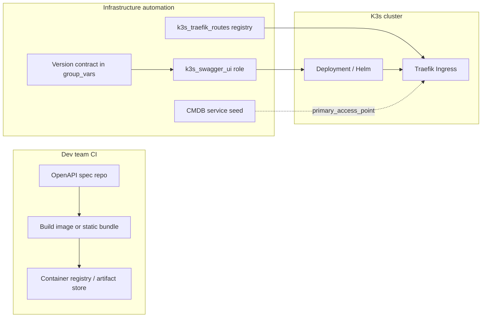

# Swagger / OpenAPI publication — brainstorming only

> **Status: brainstorming / design exploration — NOT repo work**
>
> This note captures a **curiosity discussion** (tested in Cursor against homelab
> patterns). It is **not** an approved capability, plan, intake item, or implementation
> commitment for `dotfile-vnext`. Do **not** treat filenames, role names, service codes,
> or hostnames below as SSOT or as work queued in this repository unless promoted
> through the normal plan/intake path.
>
> **Created:** 2026-05-30 (exported from agent conversation)

---

## Question (paraphrased)

How might one deploy Swagger (or similar API docs) that a development team updates on a
typical cloud lifecycle, and tie that process to infrastructure in an automatable,
scalable way—with clear ownership boundaries?

The discussion below uses **this homelab’s patterns as illustrative examples only**.
The ideas apply generically; nothing here requires implementation in this repo.

---

## Planner/Steward view (illustrative)

How a Swagger/OpenAPI docs surface could fit a **registry-driven homelab** model if you
wanted it automatable, scalable, and clearly owned—not a one-off URL on a VM.

### The split that scales

A useful separation is **platform** vs **product**:

| Owner | Owns | Does not own |
|-------|------|----------------|
| **Infra (automation repo)** | Host, cluster, ingress hostname, CMDB/service row, portproxy fallback, DNS/hosts publication, secrets placement, pinned deploy contract | Day-to-day edits to API paths in the OpenAPI file |
| **Dev team** | OpenAPI spec, Swagger UI image/build, release tags, CI that publishes artifacts | Traefik rules, hypervisor networking, CMDB hierarchy |

Swagger is typically a **publication-layer** capability: it exposes something the team
ships; it is not substrate or gateway.

That aligns with a **four-layer exposure** model (illustrative):

- App role deploys workload + Service
- Shared ingress role applies Ingress from a **registry row**
- CMDB / live-object registry records stable identity
- Operator DNS / hosts file derived from registry

### Tie it to infrastructure in four registrations

One new service can get **four linked registrations** (same *shape* as existing K3s web
apps in a registry-driven estate):

1. **Schema / pattern** — naming-standards files (ansible + netbox patterns)  
   - New `service_code` (e.g. `swg` or `api` — pick via naming checklist, not ad hoc).  
   - Pattern for `route_key`, portproxy name, logical hostname (e.g. `hom-lab-ctl-swg-01`).

2. **Reference instance** — live-object registry  
   - One `ingress_routes` row: `route_key`, `deployed_by_role`, `operator_hostname`
     (e.g. `swagger.hom.lab`), namespace, service/port, netbox slug, fallback NodePort
     if that pattern is kept.

3. **Runtime desired state** — inventory group_vars  
   - Mirror the registry row in traefik route entries (do not invent names only in
     inventory).

4. **CMDB service object** — seed tasks  
   - Native fields: VM/cluster, IP on interface, tags (`ansible-managed`,
     `service-endpoint`, `web-ui`).  
   - Custom fields: `deployed_by_role`, `stack_name`, compose/Helm release name.  
   - `primary_access_point`: canonical URL derived from registry hostname.

Consistency gates (repo script + apply tags) keep **declared ↔ applied ↔ verified**
aligned when that discipline exists.

### Ansible shape (one capability, one lifecycle knob)

Follow a capability introduction checklist and a typical K3s app pattern:

```text
playbooks/deploy_<something>.yaml
  └── role: k3s_swagger_ui          # Helm or k8s manifest; present|absent
  └── (separate play or tag) role: k3s_traefik_routes   # registry row only
```

- **`k3s_swagger_ui_state: present|absent`** — workload, ConfigMap/spec mount or image
  env (`SWAGGER_JSON_URL` / bundled `openapi.yaml`), version from a **version contract**
  in group_vars, not `state: latest`.
- **No Ingress tasks inside the app role** — only the shared Traefik role reads the
  registry (avoids per-app Ingress snowflakes).
- **Tags** — e.g. `swagger`, `k3s_swagger_ui`, `k3s_traefik_routes` so operators can
  refresh routes or redeploy UI independently.

**Apply / Verify / Undo (illustrative)**

- **Apply:** playbook with host gate on the chosen K3s node (e.g. GPU-lane cluster).  
- **Verify:** HTTP 200 on `/` or `/openapi.json`, Ingress backend check, optional smoke
  that spec version matches contract variable.  
- **Undo:** `absent` on workload and route row (or route-only if you want UI down but
  cluster clean).

### Dev team “cloud lifecycle” without breaking SSOT

Typical cloud flow maps cleanly if you treat **the artifact** as the moving part and
**the registry row** as stable:



Practical contracts:

| Dev delivers | Infra pins | Promotion |
|--------------|------------|-----------|
| OCI image `myorg/swagger-ui:2.4.1` | `swagger_ui_image: "...@{{ contract }}"` | Bump contract + automation apply (deliberate, auditable) |
| Static `openapi.yaml` in their repo | CI uploads to ConfigMap/GitOps ref; infra only wires URL/mount path | Same: version or git ref in contract |
| Multiple APIs | Multiple registry rows or one UI with `urls` config | One route per product API if URLs differ |

Environments (dev/stage/prod) often mean **inventory groups or host_vars**, not duplicate
roles: same role, different `operator_hostname`, namespace, or image tag per group—still
one pattern row in the schema.

### Where to run it (placement options)

| Placement | When it fits |
|-----------|----------------|
| **K3s on a dedicated cluster VM** (illustrative default) | Same as other operator-facing web apps: Traefik ingress, registry-driven routes, operator DNS. |
| **Docker on a compose VM** | If the team already ships Compose; use portproxy catalog, not K3s ingress. |
| **Not on the automation controller** | Publication is cluster-published; Mac/desktop stays operator/IDE only. |

For “Swagger updated by dev team,” K3s + pinned image **or** ConfigMap from CI artifact
is the path that matches a traefik/CMDB investment.

### What not to do (anti-patterns)

- Manual Ingress YAML in the app role while other apps use a central registry.  
- Hostname only in `/etc/hosts` with no CMDB service or registry row.  
- `state: latest` on the Swagger image.  
- Embedding environment or owner in the VM name instead of tags + role / service custom fields.  
- Letting the dev team edit Traefik or portproxy by hand—they should only trigger
  **platform** pipeline (or narrow GitOps that only changes image tag / spec ref).

### Minimal “clear tie to platform work” checklist

If this were promoted from brainstorming to real work, a reviewer might expect:

1. Pattern ID in ansible/netbox schema files  
2. Instance in live-object registry (`ingress_routes` + optional portproxy catalog)  
3. Traefik route entries mirror in inventory  
4. Role `k3s_swagger_ui` (or equivalent) + playbook tag  
5. CMDB seed with `primary_access_point` and `deployed_by_role`  
6. Plan packet with architecture diagram (registry → role → Traefik → operator hostname)  
7. Version contract variable documenting **which OpenAPI release** is live  

That gives traceability similar to other operator hostnames: automation, inventory,
CMDB, and operator DNS all point at one `route_key`.

---

## Follow-ups (brainstorm only)

- Concrete registry row sketch (hostname, `service_code`, namespace) against a naming schema.  
- Compare **Swagger UI container** vs **Redoc/static site** vs **portal that only serves `openapi.json`** for team update cadence.

---

## Provenance

Exported from a Cursor conversation on 2026-05-30. Illustrative references in the
original reply pointed at homelab docs (`ai-homelab-layer-model`, capability introduction
checklist, naming standards, traefik blueprint, `live-object-registry.yml`). Those links
are **context for the brainstorm**, not instructions to implement Swagger in this repo.
