# Instruction Scope Registry

Capability family: `framework`
Manifest: [capabilities/instruction-scope-registry.yml](capabilities/instruction-scope-registry.yml)

## The Problem This Owns

An MCP server and the habit of using it are two separate things that must both
be installed, and both have a scope.

- **Access layer** — the client config that makes a tool callable:
  `~/.codex/config.toml`, project `.codex/config.toml`, `.cursor/mcp.json`.
- **Habit layer** — the standing instruction that tells the model *when* to
  reach for the tool instead of answering from training memory:
  `~/.codex/AGENTS.md`, project `AGENTS.md`, `.cursor/rules/*.mdc`,
  `developer_instructions` in `.codex/config.toml`.

A model with access but no routing instruction still answers from memory,
because that is the cheaper path. A routing instruction without access is a
dead reference. The framework failure mode this registry prevents is the
**scope mismatch**: a tool wired at machine scope while its habit exists only
at project scope (the `openaiDeveloperDocs` gap that motivated this
capability), or the reverse.

## The Rule

> When adding a knowledge-shaped MCP server (docs MCP, Context7, Firecrawl,
> NetBox), declare where the routing instruction lives and at what scope —
> and make it match the scope of the access entry.

| Scope | Access surface (tool wiring) | Habit surface (routing instruction) | Applies to |
|---|---|---|---|
| Machine | `~/.codex/config.toml` | `~/.codex/AGENTS.md` | Every Codex session, any repo |
| Machine (Cursor) | Cursor global MCP settings | Cursor User Rules (GUI-managed, manual surface) | Every Cursor session |
| Project | `.codex/config.toml` managed blocks | Repo `AGENTS.md`, `developer_instructions`, `.cursor/rules/*.mdc` | Sessions inside this repo |
| Project (Cursor) | `.cursor/mcp.json` | `.cursorrules`, `.cursor/rules/*.mdc` | Cursor sessions in this workspace |

Scope placement test: *would the instruction be wrong in another repo?*

- "Prefer `openaiDeveloperDocs` for OpenAI/Codex/MCP questions" — correct
  everywhere the server is wired, and the server is in the user-level config.
  → **machine scope**.
- "Use `ansible-mcp.inventory_find_host` before writing tasks" — meaningless
  outside this repo's inventory. → **project scope**.

## Scope Diagram

```mermaid
graph TB
    subgraph machine_scope [Machine scope — every Codex session, any repo]
        codex_user_config["~/.codex/config.toml<br/>ACCESS: mcp_servers.openaiDeveloperDocs"]
        codex_user_agents["~/.codex/AGENTS.md<br/>HABIT: routing_openaiDeveloperDocs<br/>(Ansible-managed block)"]
        codex_user_config ---|"same-scope pair"| codex_user_agents
    end

    subgraph project_scope [Project scope — dotfile-vnext sessions only]
        codex_proj_config[".codex/config.toml<br/>ACCESS: managed mcp_server_* blocks"]
        codex_proj_agents["AGENTS.md + .cursor/rules/*.mdc<br/>HABIT: repo-specific routing<br/>(git-owned, edited in repo)"]
        cursor_mcp_json[".cursor/mcp.json<br/>ACCESS: Cursor workspace servers"]
        codex_proj_config ---|"same-scope pair"| codex_proj_agents
        cursor_mcp_json ---|"same-scope pair"| codex_proj_agents
    end

    subgraph ansible_owner [Framework owner — roles/mcp_servers/*]
        role_present["role state: present"]
        role_absent["role state: absent"]
    end

    role_present -->|"writes ACCESS block"| codex_proj_config
    role_present -->|"writes HABIT block"| codex_user_agents
    role_absent -.->|"removes both blocks"| codex_proj_config
    role_absent -.->|"removes both blocks"| codex_user_agents

    style machine_scope fill:#1e3a5f
    style project_scope fill:#2a2a2a
    style ansible_owner fill:#2d4a2d
```



Layering behavior (per the
[Codex config reference](https://developers.openai.com/codex/config-reference)):
project-scoped `.codex/config.toml` overlays the user-level file when the
project is trusted. Instruction surfaces stack the same way — machine-scope
habits are always in context; project-scope habits add repo-specific routing
on top.

## Registry

Current routing instructions with a scope component. One row per pair. This
table is the human-readable registry; the manifest carries the
machine-readable ownership.

| Key | Access entry (scope) | Habit entry (scope) | Owner | Status |
|---|---|---|---|---|
| `openaiDeveloperDocs` | `~/.codex/config.toml` + project block (machine + project) | `~/.codex/AGENTS.md` managed block (machine) | `roles/mcp_servers/openai_docs` | habit block pending Ansible slice |
| `ansible` / `ansible-mcp` MCP checkpoints | project `.codex/config.toml`, `.cursor/mcp.json` (project) | `AGENTS.md` Researcher checkpoints, `framework-mcp-and-tool-usage.mdc` (project) | repo rules layer | active |
| Research collection stack (context7, firecrawl, playwright, fetch) | project config blocks (project) | `framework-mcp-and-tool-usage.mdc` router anchor + `mcp-research-collection-stack.md` (project) | `mcp-research-collection-stack` packet | active |
| `netbox` | project config blocks (project) | `netbox-knowledge-gate.mdc` (project) | netbox gate rules | active |

When a new knowledge-shaped server is added, add its row here in the same
change that wires the server. A server row without a habit entry is an open
gap, not a finished install.

## Managed-Block Pattern For `~/.codex/AGENTS.md`

`~/.codex/AGENTS.md` is a machine-scope file outside the repo, so git cannot
own it. The framework owns it the same way it owns `.codex/config.toml`
server entries: **Ansible managed blocks with per-key markers**, written and
removed by the owning MCP server role.

```text
# BEGIN ANSIBLE MANAGED BLOCK: instruction_scope_registry_header
<provenance header: this file is partially managed by dotfile-vnext;
 see docs/codex_framework/instruction-scope-registry.md>
# END ANSIBLE MANAGED BLOCK: instruction_scope_registry_header

# BEGIN ANSIBLE MANAGED BLOCK: routing_openaiDeveloperDocs
For OpenAI API, Codex, ChatGPT Apps SDK, or MCP questions, use the
openaiDeveloperDocs MCP server before answering from memory.
# END ANSIBLE MANAGED BLOCK: routing_openaiDeveloperDocs
```

Properties this buys:

- **Self-describing provenance** — any agent or human reading the file sees
  it is framework-deployed, which repo owns it, and where the registry doc
  lives. Not a snowflake line someone once typed.
- **Coupled lifecycle** — the routing block is written by the same role task
  path that writes the server's config block. `*_mcp_state: absent` removes
  the tool *and* the habit. No orphaned instructions pointing at removed
  servers, no removed instructions for servers still wired.
- **Idempotent convergence** — rerunning the play repairs drift, same as
  every other managed block in this repo.
- **Type membership** — the next machine-scope routing need (say, a future
  machine-wide docs server) follows the identical pattern: declare a
  `*_routing_entries` row in the role defaults, add a registry row here,
  converge. The marker namespace `routing_<server_key>` makes siblings
  discoverable with one grep.

Hand edits to managed blocks are drift and will be overwritten. Personal,
non-framework content in `~/.codex/AGENTS.md` outside the markers is
untouched — same contract as unmanaged tables in `.codex/config.toml`.

## Anti-Patterns

- Wiring a knowledge server without deciding where its routing instruction
  lives (access without habit — the original `openaiDeveloperDocs` gap).
- Putting repo-specific routing in `~/.codex/AGENTS.md` (habit outscoping
  access — breaks in every other repo).
- Hand-editing a machine-scope instruction the framework should own
  (snowflake — invisible to update/removal paths).
- Duplicating the same instruction at both scopes (project layer already
  inherits the machine layer; duplication creates two divergent copies).

## Integration Anchors

- `docs/codex_framework/README.md` — capability listed under framework docs
- `roles/mcp_servers/README.md` — target model section points here for
  routing-instruction targets
- `.cursor/rules/framework-mcp-and-tool-usage.mdc` — router anchor for
  scope decisions when adding MCP servers
