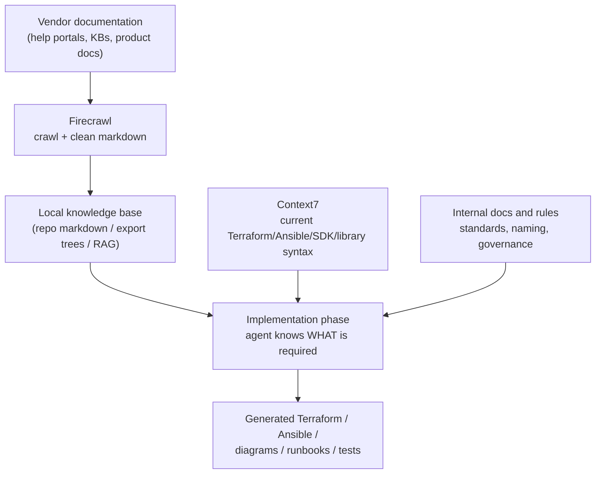
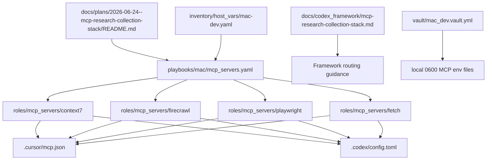
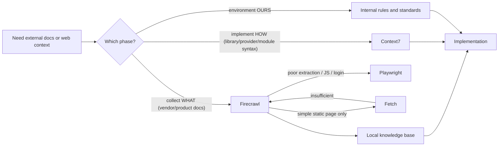
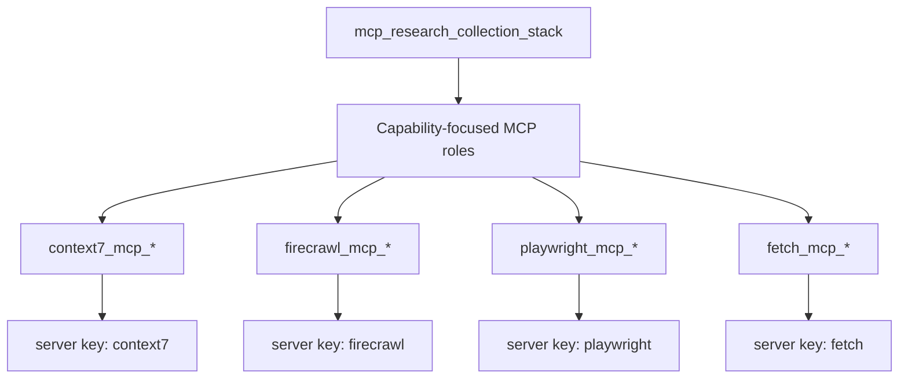

# MCP Research Collection Stack

The **MCP Research Collection Stack** is the controller-local capability for
external documentation, web, and rendered-browser context collection.

The durable capability identifier is `mcp_research_collection_stack`. The name
describes the job, not a vendor, and the role surfaces remain independently
removable:

- `roles/mcp_servers/context7`
- `roles/mcp_servers/firecrawl`
- `roles/mcp_servers/playwright`
- `roles/mcp_servers/fetch`

Machine-readable ownership lives in:

```text
docs/codex_framework/capabilities/mcp-research-collection-stack.yml
```

Treat that manifest as the install/update/remove inventory for this capability.
Do not add new stack-specific rules as scattered global instructions unless the
manifest and this document are updated in the same slice.

## Modularity Boundary

Owned capability files:

- `docs/codex_framework/capabilities/mcp-research-collection-stack.yml`
- `docs/codex_framework/mcp-research-collection-stack.md`
- `docs/plans/2026-06-24--mcp-research-collection-stack/README.md`
- `docs/reports/mcp_server_validations/research_collection_stack/README.md`
- `roles/mcp_servers/context7`
- `roles/mcp_servers/firecrawl`
- `roles/mcp_servers/playwright`
- `roles/mcp_servers/fetch`
- `roles/mcp_servers/_shared/tasks/render_env_file.yml`
- `bin/mcp-server-env-wrapper`

Integration anchors:

- `.cursor/rules/framework-mcp-and-tool-usage.mdc`
- `docs/codex_framework/README.md`
- `roles/mcp_servers/README.md`
- `roles/mcp_servers/ai.mcp_servers.instructions.md`
- `playbooks/mac/mcp_servers.yaml`
- `inventory/host_vars/mac-dev.yaml`
- `.cursor/mcp.json`
- `.codex/config.toml`

The rule file should stay a router, not the owner of the capability details.
The role docs own MCP-server implementation details. This document owns the
framework routing model. The manifest owns cleanup boundaries.

## Commissioned Client Scope

On `mac-dev`, the MCP Research Collection Stack is commissioned for Cursor and
Codex:

```yaml
context7_mcp_targets:
  - cursor
  - codex
firecrawl_mcp_targets:
  - cursor
  - codex
playwright_mcp_targets:
  - cursor
  - codex
fetch_mcp_targets:
  - cursor
  - codex
```

The roles support VS Code, but `.vscode/mcp.json` is not part of the
commissioned target set unless `vscode` is added to the relevant target lists or
a focused run includes `mcp_target_vscode`.

After MCP client config changes, reload the client. Cursor Settings and
already-running chat sessions can reflect stale MCP availability until the
window/session restarts or the MCP server list is refreshed. Configured servers
also do not become tools inside a chat session that was started before the MCP
configuration was applied.

## Removal Path

1. Run the commissioned roles absent before deleting files:

   ```bash
   ansible-playbook playbooks/mac/mcp_servers.yaml --limit mac-dev --tags context7,firecrawl,playwright,fetch \
     -e context7_mcp_state=absent \
     -e firecrawl_mcp_state=absent \
     -e playwright_mcp_state=absent \
     -e fetch_mcp_state=absent
   ```

2. Remove owned files listed in the manifest.
3. Remove integration anchors from the playbook, host vars, global MCP rule,
   MCP role docs, Cursor config, and Codex config.
4. Rerun syntax/lint and verify the removed server keys are absent.

## Composition Model — WHAT / HOW / OURS

These tools are not competing alternatives. They answer different questions in
one workflow, and most real tasks use more than one of them. Route by phase,
not by picking a single winner:

| Question | Source | Tool |
|---|---|---|
| "What does the vendor/product require?" | Vendor docs, help portals, KBs | **Firecrawl** (ingestion) |
| "How do I correctly use this library/provider/module to implement it?" | Library/SDK/provider docs | **Context7** (implementation syntax) |
| "How do we implement this in our environment?" | Repo rules, standards, registries | **Internal docs** |



A tool that is wrong for the current phase is not "benched" for the task — it
is staged for its phase. Saying "Firecrawl, not Context7" about a vendor-doc
ingestion step is correct routing; concluding Context7 is out of the workflow
is a framing error. The confident default is: **Firecrawl now, Context7 at
implementation.**

### Default triggers — act without asking

- Collecting vendor/product documentation into the repo: use Firecrawl. Do not
  ask permission for read-only collection within the task's stated scope.
- Generating or editing Terraform, Ansible, SDK, or library code derived from
  collected vendor docs: call Context7 for the exact resources, modules, or
  APIs involved by default. No permission-seeking, no answering provider/module
  syntax from memory when Context7 can confirm it.
- Calibration: skip Context7 where syntax churn is low and model knowledge is
  stable (for example, core Mermaid syntax). Use it when versions, arguments,
  deprecations, or provider/collection specifics matter.

## Phase Routing

Within the collection phase, use the stack in this order:

1. **Firecrawl** for documentation ingestion, crawl/search/extraction, or
   collecting pages from multiple sources.
2. **Playwright** when extraction quality is poor, login is required,
   JavaScript rendering is required, screenshots help, or browser state matters.
3. **Fetch** only as a lightweight fallback for simple pages.

Within the implementation phase:

1. **Context7** for known products, libraries, APIs, SDKs, Terraform providers,
   Kubernetes docs, AWS docs — current, version-specific syntax and examples.

| Purpose | Best Choice |
|---|---|
| General webpage fetching | Fetch |
| Documentation extraction | Firecrawl |
| Browser-rendered sites | Playwright |
| Technical docs / APIs during implementation | Context7 |

## General Usage Model

This stack is not limited to `dotfile-vnext` implementation work. It is the
general research and fetching path for coding agents when they need external
technical context.

Think of the tools by source type:

| Source type | First tool | Why |
|---|---|---|
| Known library, SDK, framework, API, Terraform provider, Kubernetes resource, Helm chart, Python package | Context7 | It resolves known documentation sources and injects current/version-specific docs and code examples into the agent context. |
| Vendor/product docs, arbitrary URLs, product KBs, blog posts, unknown docs sites, multi-page doc collection | Firecrawl | It is built for live web content collection through search, scrape, map, crawl, batch scrape, and extraction workflows. |
| Login-required, JavaScript-rendered, click/navigation-dependent, screenshot-needed pages | Playwright | It acts as the browser-backed fallback when page state or rendering matters. |
| Simple static HTML or one-off lightweight page reads | Fetch | It is the low-cost fallback when full extraction/crawling is unnecessary. |

Bottom line:

- **Context7 helps agents write correct code from known docs.**
- **Firecrawl helps agents collect messy web/vendor docs.**
- **Playwright helps agents inspect pages like a user/browser.**
- **Fetch helps agents cheaply read simple static pages.**

## Agent Prompt Patterns

Use explicit tool-routing language when the task benefits from it:

```text
Use Context7. Show me the current Terraform AWS provider syntax for aws_kms_key.
```

```text
Use Context7 for the Kubernetes API syntax, then use Firecrawl for the vendor
installation docs that are not in Context7.
```

```text
Use Firecrawl to collect the product docs under this vendor documentation
section. If extraction is incomplete or navigation depends on JavaScript, use
Playwright.
```

```text
Use Fetch only if this is a simple static page and we do not need crawl,
structured extraction, screenshots, or browser state.
```

```text
Use Firecrawl to collect the vendor's CMK configuration pages into the export
tree, then use Context7 for the current aws_kms_key and amazon.aws.iam_role
syntax when implementing what those pages require.
```

For known Context7 libraries, include the exact product/library and version when
you know them. For Firecrawl, include the URL scope and whether you need a
single page, multiple known URLs, URL discovery, site-section coverage, or
structured fields.

## Vendor Documentation Example

For product documentation such as:

```text
Zerto installation docs
Zerto member account setup docs
```

Context7 is not the collection tool — Zerto-style docs are vendor help pages,
not common package/library/API docs. But Context7 is a co-equal stage of the
same workflow, not out of scope for the task. The full sequence is:

**Stage 1 — Collect WHAT (Firecrawl):**

1. Use Firecrawl `search` when the right URLs are not known.
2. Use Firecrawl `map` when the docs site or section is known but the page list
   is not.
3. Use Firecrawl `scrape` for one known page.
4. Use Firecrawl `batch_scrape` for multiple known pages.
5. Use Firecrawl `crawl` only when broad section coverage is needed and limits
   are explicit.
6. Escalate to Playwright when the site needs login, JavaScript rendering,
   clicking, or screenshots.

**Stage 2 — Implement HOW (Context7, by default):**

7. When turning the collected requirements into automation, call Context7 for
   the exact implementation surfaces involved — for example `aws_kms_key`,
   `aws_iam_role`, `aws_cloudformation_stack_set` in the Terraform AWS
   provider, or `amazon.aws` collection modules in Ansible. Current resource
   names, arguments, deprecations, and version-specific syntax come from
   Context7, not from model memory.
8. Pair Context7 output with internal repo standards (naming, governance,
   patterns) to produce the environment-correct implementation.

Concrete example: Firecrawl collects "create an IAM role that trusts the Zerto
deployment account with these permissions"; Context7 supplies the current
`aws_iam_role` and `aws_iam_policy` syntax to implement it; repo rules supply
the tagging and naming standards it must follow.

## Firecrawl Collection Shape

When using Firecrawl, choose the smallest collection mode that fits:

| Need | Firecrawl mode |
|---|---|
| One known URL | `scrape` |
| Multiple known URLs | `batch_scrape` |
| Discover URLs in a known docs site/section | `map`, then `scrape` or `batch_scrape` |
| Search across the web for unknown sources | `search` |
| Broad multi-page section coverage | `crawl` with explicit limits |
| Structured fields from pages | `extract` or JSON scrape format |

Prefer structured/JSON extraction when you only need specific fields. Use full
markdown when the task genuinely needs page-level reading, summarization, or
doc-structure analysis.

For durable `ai-resource-library` additions, start with the `ai-library-entry`
capability at `.cursor/skills/ai-library-entry/SKILL.md`.

When that capability routes the work into a structured vendor-doc export tree
(localized images, AI image descriptions, any scope from one page to a full
nav branch), use the narrower `vendor-doc-collection` helper at
`.cursor/skills/vendor-doc-collection/SKILL.md`.

## Multi-Agent Use

This stack supports the repo's single-agent-first workflow and future
multi-agent split:

| Role | Default use |
|---|---|
| Planner / Steward | Select the routing path, preserve the user target, and require source-backed evidence. |
| Researcher | Use Context7, Firecrawl, Playwright, then Fetch according to the routing model. |
| Executor | Install/update the MCP server roles and render Cursor/Codex config through Ansible. |
| Independent Validator | Check that docs, roles, inventory, config, secrets, and receipts agree before completion. |

For parallel research, assign different sources or domains to workers, but keep
tool order stable inside each worker. Do not let one worker's Fetch result
override a better Context7 or Firecrawl source without a reason recorded in the
receipt.

## Secret Model

Tracked config must not contain vault-backed API keys. Secret-backed servers
render local env files:

```text
~/.config/dotfile-vnext/mcp/env.d/context7.env
~/.config/dotfile-vnext/mcp/env.d/firecrawl.env
```

Those files are mode `0600`. `.cursor/mcp.json` and `.codex/config.toml` point
at `bin/mcp-server-env-wrapper`, which sources the env file at runtime and then
execs the upstream MCP server command.

## Apply / Verify / Undo / Change Class

| Item | Contract |
|---|---|
| Apply | `ansible-playbook playbooks/mac/mcp_servers.yaml --limit mac-dev --tags context7,firecrawl,playwright,fetch` |
| Verify | Syntax/lint, task preview, apply, idempotence rerun, npm binaries, Cursor/Codex server keys, no plaintext secrets, env file mode `0600` |
| Undo | Run the same playbook with `-e '<role>_mcp_state=absent'` for the role being removed |
| Change class | Idempotent controller-local configuration management |

## Architecture/Structure Diagram



## Capability Routing Diagram



## Naming/Modeling Diagram


