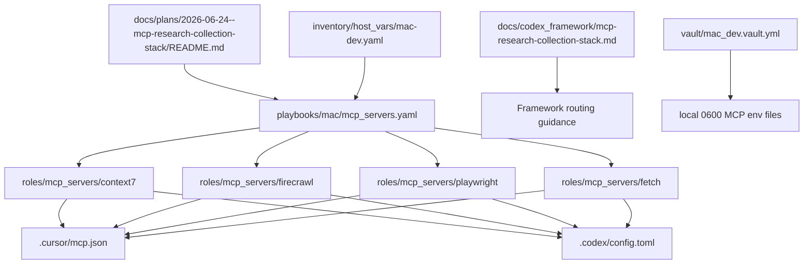
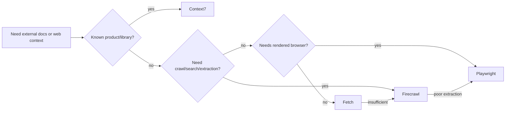
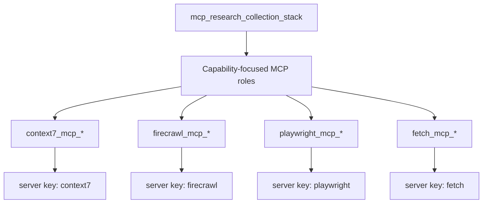

# MCP Research Collection Stack

The **MCP Research Collection Stack** is the controller-local capability for
external documentation, web, and rendered-browser context collection.

The durable capability identifier is `mcp_research_collection_stack`. The name
describes the job, not a vendor, and the role surfaces remain independently
removable:

- `roles/mcp_servers/context7`
- `roles/mcp_servers/firecrawl`
- `roles/mcp_servers/playwright`
- `roles/mcp_servers/fetch`

## Routing Model

Use the stack in this order:

1. **Context7** for known products, libraries, APIs, SDKs, Terraform providers,
   Kubernetes docs, AWS docs, and vendor docs.
2. **Firecrawl** for documentation ingestion, crawl/search/extraction, or
   collecting pages from multiple sources.
3. **Playwright** when extraction quality is poor, login is required,
   JavaScript rendering is required, screenshots help, or browser state matters.
4. **Fetch** only as a lightweight fallback for simple pages.

| Purpose | Best Choice |
|---|---|
| General webpage fetching | Fetch |
| Documentation extraction | Firecrawl |
| Browser-rendered sites | Playwright |
| Technical docs / APIs | Context7 |

## Multi-Agent Use

This stack supports the repo's single-agent-first workflow and future
multi-agent split:

| Role | Default use |
|---|---|
| Planner / Steward | Select the routing path, preserve the user target, and require source-backed evidence. |
| Researcher | Use Context7, Firecrawl, Playwright, then Fetch according to the routing model. |
| Executor | Install/update the MCP server roles and render Cursor/Codex config through Ansible. |
| Independent Validator | Check that docs, roles, inventory, config, secrets, and receipts agree before completion. |

For parallel research, assign different sources or domains to workers, but keep
tool order stable inside each worker. Do not let one worker's Fetch result
override a better Context7 or Firecrawl source without a reason recorded in the
receipt.

## Secret Model

Tracked config must not contain vault-backed API keys. Secret-backed servers
render local env files:

```text
~/.config/dotfile-vnext/mcp/env.d/context7.env
~/.config/dotfile-vnext/mcp/env.d/firecrawl.env
```

Those files are mode `0600`. `.cursor/mcp.json` and `.codex/config.toml` point
at `bin/mcp-server-env-wrapper`, which sources the env file at runtime and then
execs the upstream MCP server command.

## Apply / Verify / Undo / Change Class

| Item | Contract |
|---|---|
| Apply | `ansible-playbook playbooks/mac/mcp_servers.yaml --limit mac-dev --tags context7,firecrawl,playwright,fetch` |
| Verify | Syntax/lint, task preview, apply, idempotence rerun, npm binaries, Cursor/Codex server keys, no plaintext secrets, env file mode `0600` |
| Undo | Run the same playbook with `-e '<role>_mcp_state=absent'` for the role being removed |
| Change class | Idempotent controller-local configuration management |

## Architecture/Structure Diagram



## Capability Routing Diagram



## Naming/Modeling Diagram



