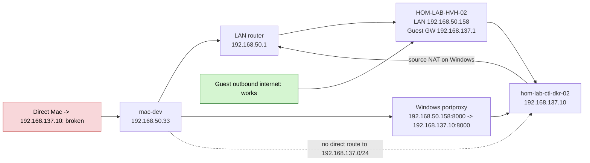
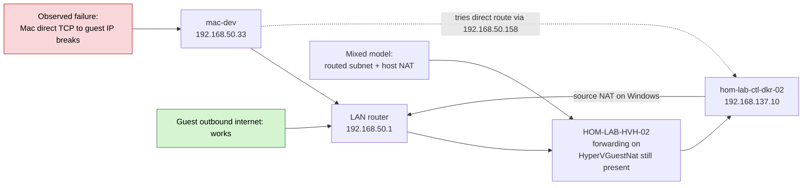
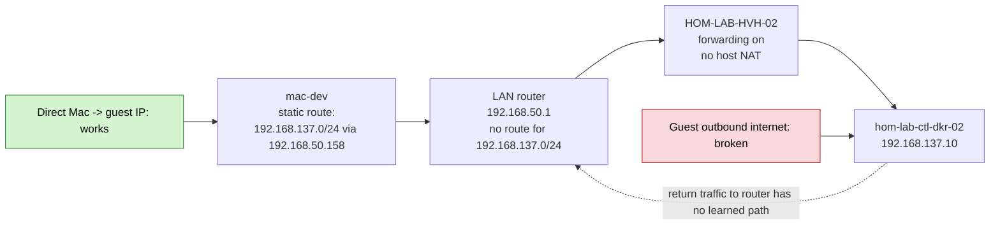
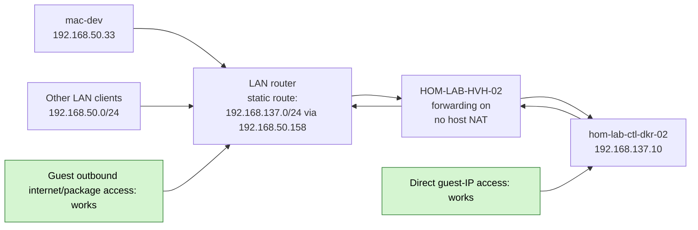

# Hyper-V Routed Guest Subnet Router Static Route Guide

## Purpose

This guide explains the missing upstream-router change needed when a Hyper-V
guest subnet is operated in true routed mode instead of Windows host NAT mode.

Use this guide when:

- `guest_network_mode: "routed_private_subnet"` is already in use
- direct guest IPs like `192.168.137.10` should be reachable from more than
  just `mac-dev`
- guest VMs should keep outbound internet/package access without relying on
  Windows `HyperVGuestNat`

## Repo-specific values

Current lane already switched to direct routed mode:

| Lane | Windows host | Host LAN IP | Guest subnet | Guest gateway | NAT setting |
|---|---|---|---|---|---|
| GPU lane | `HOM-LAB-HVH-02` | `192.168.50.158` | `192.168.137.0/24` | `192.168.137.1` | `false` |
| Storage lane | `HOM-LAB-HVH-01` | `192.168.50.234` | `192.168.138.0/24` | `192.168.138.1` | `false` |

Both lanes require upstream GT6 static routes (operator-applied; see
[`inventory/group_vars/all/homelab_router_gt6.yml`](../../inventory/group_vars/all/homelab_router_gt6.yml)):

| Destination | Next hop |
|---|---|
| `192.168.137.0/24` | `192.168.50.158` |
| `192.168.138.0/24` | `192.168.50.234` |

## What Was Missing

The missing piece was not inside the guest and not inside NetBox.

The missing piece was:

- the upstream LAN router did not know that `192.168.137.0/24` lives behind
  `192.168.50.158`

That matters because once Windows host NAT is disabled, the router has to know
how to send return traffic back to the guest subnet.

## Topology 1: ICS/NAT Style Access



### Meaning

- easy guest internet access
- LAN-published ports can still work
- direct guest-IP access from the controller is not the primary path

## Topology 2: Routed Mode Plus Windows `HyperVGuestNat`

This is the drifted mixed state we proved live on `HOM-LAB-HVH-02`.



### Meaning

- this preserves guest outbound internet/package access
- but it is not clean routed-subnet behavior
- for this lane, it was the state that blocked direct Mac-to-guest TCP

## Topology 3: Routed Mode With Only a Mac Static Route

This is the current host-side fix we applied.



### Meaning

- direct `mac-dev -> 192.168.137.10` works
- guest can talk back to `mac-dev`
- guest cannot reliably reach the wider LAN or internet through the router

In practice this blocks things like:

- `apt` and package downloads
- Docker image pulls
- internet API calls from the guest
- reaching LAN clients that do not have their own explicit route

## Topology 4: Final Routed Design With Router Static Route

This is the target design for clean direct guest-IP access and guest egress.



### Meaning

- direct guest-IP access works
- portproxy-published LAN access can still work
- guest outbound internet works
- whole-LAN reachability to the guest subnet works

## Exact Router Change

On the upstream ASUS GT6 (`LAN → Route`), enable static routes with these values.
**Both rows are operator-applied** (verified 2026-08-31). SSOT:
[`inventory/group_vars/all/homelab_router_gt6.yml`](../../inventory/group_vars/all/homelab_router_gt6.yml).

### GPU lane (`192.168.137.0/24`)

| Field | Value |
|---|---|
| Destination network | `192.168.137.0` |
| Netmask / prefix | `255.255.255.0` or `/24` |
| Gateway / next hop | `192.168.50.158` |
| Interface | LAN / main home network |

### Storage lane (`192.168.138.0/24`)

| Field | Value |
|---|---|
| Destination network | `192.168.138.0` |
| Netmask / prefix | `255.255.255.0` or `/24` |
| Gateway / next hop | `192.168.50.234` |
| Interface | LAN / main home network |

Current operator status and verification notes:
[asus-gt6-gpu-lane-router-current-state.md](asus-gt6-gpu-lane-router-current-state.md).

## Generic Router UI Steps

Exact labels vary by vendor, but the path is usually one of:

- `LAN`
- `Routing`
- `Static Routes`
- `Advanced Routing`

Add the route entry above, save, and apply the config. Some routers require:

- clicking `Add`
- then `Save`
- then `Apply`
- and sometimes a router reboot or network-service reload

## How To Verify After The Router Change

### From `mac-dev`

Direct guest IP should still work:

```bash
nc -G 5 -vz 192.168.137.10 22
curl -sS -m 5 -w '\nhttp:%{http_code}\n' http://192.168.137.10:8000/api/status/
```

### From the guest VM

Wider LAN and internet egress should work again:

```bash
ping -c 1 192.168.50.1
nc -zvw3 1.1.1.1 443
curl -sS -m 5 https://example.com >/dev/null && echo ok
```

### From another LAN client

If the router route is correct, other LAN machines should be able to reach the
guest subnet without needing their own host-local static route.

## Repo Ownership Boundaries

The repo manages these parts:

- Windows host forwarding and guest gateway:
  - `roles/hyperv_networking`
- Windows guest published LAN ports:
  - `guest_published_tcp_ports`
- Mac-only static routes:
  - `roles/hyperv_guest_route_mac`

The repo does **not** currently manage:

- the upstream home router static route

So the router change is an operator-owned dependency outside the current
playbook scope.

## Decision Rule

Use this rule for each Hyper-V guest lane:

- if you want simple guest internet access without changing the router, keep
  host NAT enabled
- if you want true direct guest-IP reachability, whole-LAN routing, and cleaner
  subnet semantics, disable host NAT and add the router static route

## Related

- [hyperv-network-layout--windows--routed-private-subnet.md](/Users/joshc/develop/dotfile-vnext/docs/diagnostics/hyperv-network-layout--windows--routed-private-subnet.md)
- [roles/hyperv_networking/README.md](/Users/joshc/develop/dotfile-vnext/roles/hyperv_networking/README.md)
- [roles/hyperv_guest_route_mac/README.md](/Users/joshc/develop/dotfile-vnext/roles/hyperv_guest_route_mac/README.md)
- [asus-gt6-gpu-lane-router-current-state.md](asus-gt6-gpu-lane-router-current-state.md) — Job 1 applied on GT6
- [asus-gt6-stock-local-dns-option-c.md](asus-gt6-stock-local-dns-option-c.md) — optional Job 2 hostnames (separate from routing)
