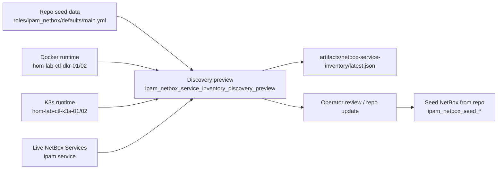

# NetBox Service Inventory Hybrid Preview

This repo now uses a hybrid service-inventory workflow for NetBox:

1. discover live Docker and K3s runtime endpoints
2. normalize them against the repo-curated NetBox service model
3. compare that runtime view to live NetBox Service objects
4. update repo seed data first
5. apply NetBox seed second

The NetBox mutation authority stays in `roles/ipam_netbox/defaults/main.yml` and
the `seed_*` task files. Runtime discovery is review-only.

## Current workflow



## Operator commands

Preview storage-lane service seed without mutating NetBox:

```bash
ansible-playbook playbooks/deploy_ipam_netbox.yaml --ask-vault-pass \
  --tags ipam_netbox_seed_hom_lab_ctl_hvh_01_vm_model_preview
```

Run the read-only hybrid discovery preview:

```bash
ansible-playbook playbooks/deploy_ipam_netbox.yaml --ask-vault-pass \
  --tags ipam_netbox_service_inventory_discovery_preview
```

Apply curated seed after review:

```bash
ansible-playbook playbooks/deploy_ipam_netbox.yaml --ask-vault-pass \
  --tags ipam_netbox_seed_hom_lab_ctl_hvh_01_vm_model
```

The preview writes:

- `artifacts/netbox-service-inventory/latest.json`

## What the preview compares

The report contains four useful surfaces:

- `curated_repo_services`: the intended NetBox Service objects from repo seed data
- `runtime_discovered_endpoints`: live Docker published ports and K3s NodePort/LoadBalancer endpoints
- `live_netbox_services`: current NetBox `ipam.service` objects
- `normalized_service_review`: per-service comparison showing whether runtime and NetBox match the curated repo model

It also flags:

- `runtime_unmodeled_exposures`: live externally meaningful endpoints that are not yet modeled in repo seed data
- `netbox_unmodeled_services`: live NetBox Service objects that are not represented in repo seed data

## Alternate approaches and why they were not chosen

### 1. Curated manual seed only

This means the repo is the only source and there is no live discovery step.

Difference from the implemented path:

- simpler than hybrid preview
- safest mutation boundary
- weaker drift visibility
- more operator effort to notice missing or broken runtime endpoints

Good fit when:

- services are few
- stacks are very stable
- runtime drift is unlikely

### 2. Hybrid preview plus repo reconciliation

This is the implemented path.

Properties:

- repo seed remains the only NetBox write path
- runtime discovery is read-only
- drift is visible before mutation
- recovery remains reproducible from repo seed data

Good fit when:

- services are durable enough to deserve documentation
- runtime can drift from intent
- operators want reviewable changes

### 3. Direct auto-write from runtime discovery

This means the runtime becomes the mutation source for NetBox.

Difference from the implemented path:

- lower review friction
- much higher drift and accidental-churn risk
- weaker comments/tags/custom-field quality
- weaker recovery because live runtime shape becomes the authority

Not chosen here because this repo values code-first recovery and deliberate
metadata quality more than maximum automation.

## Storage-lane parity

The storage lane now uses the same NetBox service-model shape as the GPU lane.

Current curated storage-lane services on `hom-lab-ctl-dkr-01`:

- `postgres-fuzlang`
- `redis-fuzlang`
- `clickhouse-http`
- `clickhouse-native`
- `minio-api`
- `minio-console`
- `langfuse-web`

`hom-lab-ctl-k3s-01` remains modeled as a K3s VM/control-plane stub, not as a
parallel service inventory source of truth. Live K3s discovery still inspects
it so unmodeled NodePorts or ingress endpoints can be surfaced in preview.

## Reconciliation rule

When the preview shows drift, the intended flow is:

1. decide whether the runtime state or repo seed is correct
2. update repo seed data if the desired service inventory changed
3. run `scripts/validate_netbox_repo_consistency.sh` when identity/modeling changed
4. re-run the preview if needed
5. apply the NetBox seed from repo state

Do not write the live runtime view straight into NetBox.
