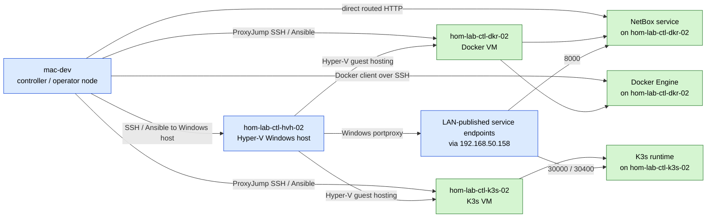

# GPU Lane Control Paths

This diagram shows how the main operator and automation paths relate to the GPU
Hyper-V lane resources.

## Diagram

## What this clarifies

- `mac-dev` is the controller and operator node.
- `hom-lab-ctl-hvh-02` is the Windows host and port publication surface.
- `hom-lab-ctl-dkr-02` is both the Docker engine endpoint and the NetBox host.
- `hom-lab-ctl-k3s-02` is the K3s service lane.
- Direct routed guest-IP access and LAN-published Windows access are parallel
  access patterns, not the same thing.
