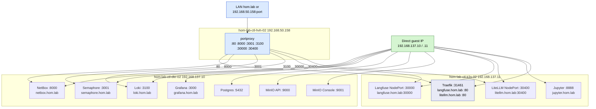

# GPU Lane Service Exposure

This diagram shows where the current GPU-lane services actually run and how
they are exposed after the router-side routed-subnet fix.

**SSOT for hom.lab URLs:** `inventory/group_vars/all/homelab_hosts_file.yml`

---

## Operator URLs — use these now (mac-dev)

On **mac-dev**, **hom-lab-ctl-dkr-02**, and **hom-lab-ctl-k3s-02**, interim DNS is
applied (`homelab_hosts_file_mac` / `homelab_hosts_file_linux`). From the Mac
controller, open these in a browser or curl:

| Service | URL (recommended) | Alternate (same host, IP:port) |
|---------|-------------------|--------------------------------|
| **NetBox** | [http://netbox.hom.lab:8000/](http://netbox.hom.lab:8000/) | [http://192.168.50.158:8000/](http://192.168.50.158:8000/) · [http://192.168.137.10:8000/](http://192.168.137.10:8000/) |
| **Semaphore** | [http://semaphore.hom.lab:3001/](http://semaphore.hom.lab:3001/) | [http://192.168.50.158:3001/](http://192.168.50.158:3001/) · [http://192.168.137.10:3001/](http://192.168.137.10:3001/) |
| **Loki** (ready probe) | [http://loki.hom.lab:3100/ready](http://loki.hom.lab:3100/ready) | [http://192.168.50.158:3100/ready](http://192.168.50.158:3100/ready) · [http://192.168.137.10:3100/ready](http://192.168.137.10:3100/ready) |
| **Grafana** | [http://grafana.hom.lab:3000/](http://grafana.hom.lab:3000/) | [http://192.168.137.10:3000/](http://192.168.137.10:3000/) only (not portproxied to LAN) |
| **Langfuse** (NodePort) | [http://langfuse.hom.lab:30000/](http://langfuse.hom.lab:30000/) | [http://192.168.50.158:30000/](http://192.168.50.158:30000/) · [http://192.168.137.11:30000/](http://192.168.137.11:30000/) |
| **Langfuse** (Traefik :80) | [http://langfuse.hom.lab/](http://langfuse.hom.lab/) | [http://192.168.50.158/](http://192.168.50.158/) with `Host: langfuse.hom.lab` |
| **LiteLLM** (NodePort) | [http://litellm.hom.lab:30400/](http://litellm.hom.lab:30400/) | [http://192.168.50.158:30400/](http://192.168.50.158:30400/) · [http://192.168.137.11:30400/](http://192.168.137.11:30400/) |
| **LiteLLM** (Traefik :80) | [http://litellm.hom.lab/](http://litellm.hom.lab/) | [http://192.168.50.158/](http://192.168.50.158/) with `Host: litellm.hom.lab` |
| **JupyterLab** | [http://jupyter.hom.lab:8888/lab](http://jupyter.hom.lab:8888/lab) | [http://192.168.137.11:8888/lab](http://192.168.137.11:8888/lab) |

**Infrastructure (no hom.lab web UI in catalog)**

| Service | URL |
|---------|-----|
| **Postgres** (fuzlang) | `postgresql://192.168.137.10:5432/` (apps on k3s use `192.168.137.10` per host_vars) |
| **MinIO API** | [http://192.168.137.10:9000/](http://192.168.137.10:9000/) |
| **MinIO Console** | [http://192.168.137.10:9001/](http://192.168.137.10:9001/) |

**Without hosts file:** use the **Alternate** column (raw IP + port). LAN clients
need the GT6 static route `192.168.137.0/24 → 192.168.50.158` for guest IPs.

---

## Diagram

---

## Direct guest-IP endpoints

| Service | Direct path |
|---|---|
| NetBox | `http://192.168.137.10:8000/` |
| Semaphore | `http://192.168.137.10:3001/` |
| Loki | `http://192.168.137.10:3100/` · ready: `http://192.168.137.10:3100/ready` |
| Grafana | `http://192.168.137.10:3000/` |
| Postgres | `postgresql://192.168.137.10:5432/` |
| MinIO API | `http://192.168.137.10:9000/` |
| MinIO Console | `http://192.168.137.10:9001/` |
| Langfuse | `http://192.168.137.11:30000/` |
| LiteLLM | `http://192.168.137.11:30400/` |
| JupyterLab | `http://192.168.137.11:8888/lab` |
| Langfuse (Traefik) | `http://192.168.137.11:31461/` (NodePort; normally use :80 via portproxy) |
| LiteLLM (Traefik) | same Traefik listener — use ingress host on :80 from LAN |

## Windows LAN-published endpoints

| Service | LAN-published path |
|---|---|
| NetBox | `http://192.168.50.158:8000/` |
| Semaphore | `http://192.168.50.158:3001/` |
| Loki | `http://192.168.50.158:3100/` |
| Langfuse (NodePort) | `http://192.168.50.158:30000/` |
| LiteLLM (NodePort) | `http://192.168.50.158:30400/` |
| Langfuse / LiteLLM (Traefik) | `http://192.168.50.158/` with `Host: langfuse.hom.lab` or `litellm.hom.lab` |

## hom.lab endpoints (interim hosts file)

Requires `homelab_hosts_file_*` on the client (enabled on mac-dev and both GPU
guests). Names resolve per `homelab_hosts_file_web_catalog`:

| Service | hom.lab URL |
|---|---|
| NetBox | `http://netbox.hom.lab:8000/` |
| Semaphore | `http://semaphore.hom.lab:3001/` |
| Loki | `http://loki.hom.lab:3100/ready` |
| Grafana | `http://grafana.hom.lab:3000/` → guest IP `192.168.137.10` |
| Langfuse | `http://langfuse.hom.lab:30000/` or `http://langfuse.hom.lab/` via Traefik :80 |
| LiteLLM | `http://litellm.hom.lab:30400/` or `http://litellm.hom.lab/` via Traefik :80 |
| JupyterLab | `http://jupyter.hom.lab:8888/lab` → guest IP `192.168.137.11` |

## Notes

- **Grafana** is direct guest-IP / hom.lab-to-`.137.10` only; it is not published
  through the Windows LAN portproxy surface.
- **Postgres** and **MinIO** are direct guest-IP paths only (no hom.lab catalog row).
- **Traefik :80** on `192.168.50.158` forwards to K3s NodePort `31461`; use
  `http://langfuse.hom.lab/` and `http://litellm.hom.lab/` when hosts file maps
  those names to `192.168.50.158`.
- Authoritative LAN DNS (AdGuard) is future work; until then hom.lab names depend
  on the hosts-file roles or manual `/etc/hosts` entries.
