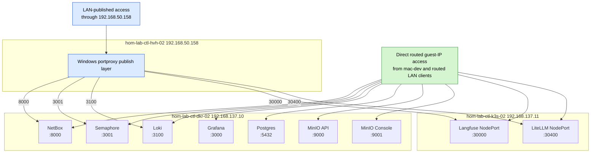

# GPU Lane Service Exposure

This diagram shows where the current GPU-lane services actually run and how
they are exposed after the router-side routed-subnet fix.

## Diagram

## Direct guest-IP endpoints

| Service | Direct path |
|---|---|
| NetBox | `http://192.168.137.10:8000/` |
| Semaphore | `http://192.168.137.10:3001/` |
| Loki | `http://192.168.137.10:3100/` |
| Grafana | `http://192.168.137.10:3000/` |
| Postgres | `postgresql://192.168.137.10:5432/` |
| MinIO API | `http://192.168.137.10:9000/` |
| MinIO Console | `http://192.168.137.10:9001/` |
| Langfuse | `http://192.168.137.11:30000/` |
| LiteLLM | `http://192.168.137.11:30400/` |

## Windows LAN-published endpoints

| Service | LAN-published path |
|---|---|
| NetBox | `http://192.168.50.158:8000/` |
| Semaphore | `http://192.168.50.158:3001/` |
| Loki | `http://192.168.50.158:3100/` |
| Langfuse | `http://192.168.50.158:30000/` |
| LiteLLM | `http://192.168.50.158:30400/` |

## Notes

- Grafana is direct guest-IP only right now; it is not currently published
  through the Windows LAN portproxy surface.
- Postgres and MinIO are also direct guest-IP paths in the current repo state.
