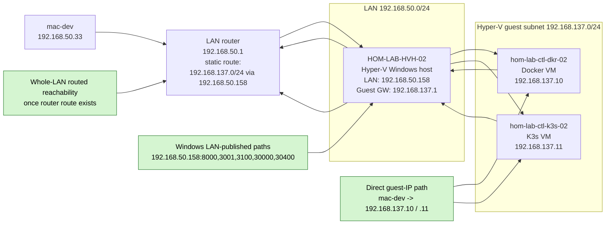

# GPU Lane Topology

This diagram shows the intended post-router-fix topology for the GPU Hyper-V
lane on `HOM-LAB-HVH-02`.

## Scope

- `mac-dev`
- LAN router
- `HOM-LAB-HVH-02`
- `hom-lab-ctl-dkr-02`
- `hom-lab-ctl-k3s-02`
- direct guest-IP paths
- Windows LAN-published service paths

## Diagram

## Key points

- `HOM-LAB-HVH-02` is the forwarding point between the LAN and the guest
  subnet.
- `hom-lab-ctl-dkr-02` and `hom-lab-ctl-k3s-02` keep their private guest IPs.
- The upstream router route is what turns this from a Mac-only direct-route
  setup into a whole-LAN routed-subnet design.
