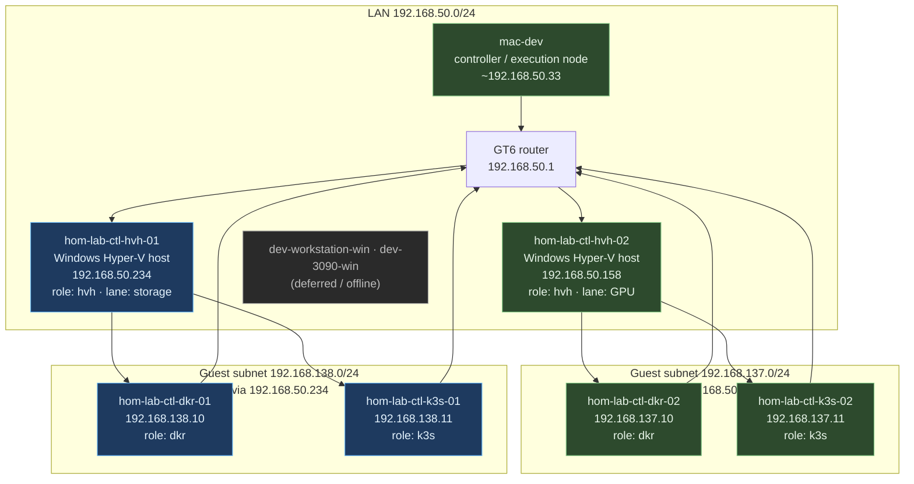
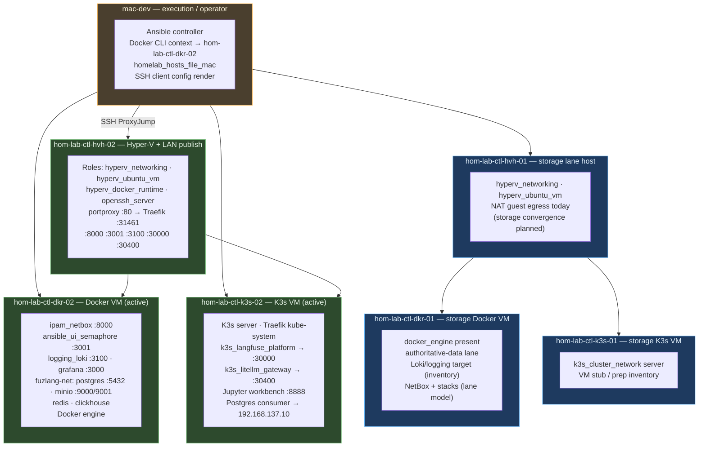
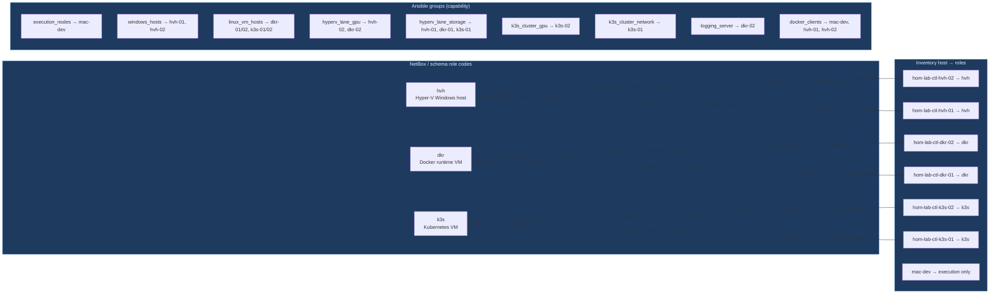
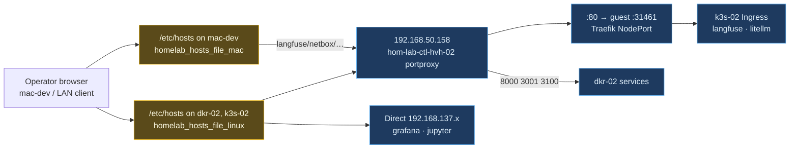
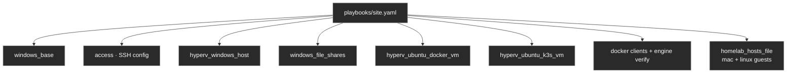

# Homelab Estate — Topology, Deployments, and Roles

Durable overview of the **hom.lab** control-plane estate: what runs where, how
lanes connect, and which NetBox/Ansible role codes apply. Complements the
GPU-focused slices in `cst-hom-lab-ctl-dia-gpu-*` and DNS-3 in
`cst-hom-lab-ctl-dia-homelab-hosts-file-01.md`.

**Sources:** `inventory/inventory.yaml`, `inventory/group_vars/all/homelab_hosts_file.yml`,
`roles/ipam_netbox/defaults/main.yml`, `inventory/group_vars/k3s_cluster.yaml`,
`docs/reference/naming-standards/live-object-registry.yml` (2026-05-27).

**Legend**

| Marker | Meaning |
|--------|---------|
| **Active** | In `windows_hosts` / `linux_vm_hosts` and observed or intended steady-state |
| **Inventory** | Modeled in inventory/NetBox; reachability or full stack may still be converging |
| **Deferred** | Known host; not in routine Ansible execution groups |

---

## 1 — Full estate topology (both Hyper-V lanes)

---

## 2 — What is deployed on each node (services and stacks)

### Service placement table (operator-facing)

| hom.lab hostname | Resolves to (interim hosts file) | Workload | Host / path |
|------------------|-----------------------------------|----------|-------------|
| `langfuse.hom.lab` | `192.168.50.158` | Langfuse web (K3s) | k3s-02 → portproxy `:30000` or Traefik `:80` |
| `litellm.hom.lab` | `192.168.50.158` | LiteLLM gateway (K3s) | k3s-02 → portproxy `:30400` |
| `jupyter.hom.lab` | `192.168.137.11` | JupyterLab | k3s-02 guest direct |
| `netbox.hom.lab` | `192.168.50.158` | NetBox UI | dkr-02 → portproxy `:8000` |
| `semaphore.hom.lab` | `192.168.50.158` | Semaphore UI | dkr-02 → portproxy `:3001` |
| `loki.hom.lab` | `192.168.50.158` | Loki | dkr-02 → portproxy `:3100` |
| `grafana.hom.lab` | `192.168.137.10` | Grafana | dkr-02 guest direct only |

---

## 3 — NetBox role codes, runtime planes, and Ansible groups

### Runtime planes (from host_vars — what automation enables)

| Host | `runtime_planes` / `node_classes` (summary) |
|------|---------------------------------------------|
| **hom-lab-ctl-hvh-02** | `hyperv_host`, `hyperv_docker_vm`, `hyperv_k3s_vm`, `docker_client`, `gpu_host` |
| **hom-lab-ctl-dkr-02** | `docker_engine` (via roles), logging/NetBox stacks |
| **hom-lab-ctl-k3s-02** | `k3s_node` · `k3s_runtime`, `ai_worker`, GPU classes |
| **hom-lab-ctl-hvh-01** | `hyperv_host`, `hyperv_docker_vm`, `hyperv_k3s_vm`, `storage_observability` |
| **hom-lab-ctl-dkr-01** | `docker_engine`, `storage_observability`, authoritative-data policy |
| **hom-lab-ctl-k3s-01** | K3s network cluster server (inventory) |
| **mac-dev** | `execution_nodes`, `docker_clients`, `homelab_hosts_file_mac` |

---

## 4 — hom.lab name resolution and Traefik front door (GPU lane)

---

## 5 — site.yaml convergence order (automation layers)

---

## Diagram inventory

### Diagrams included

- **Estate topology** — LAN, router routes, GPU vs storage guest subnets
- **Deployments by node** — services/stacks and operator paths
- **Roles and Ansible groups** — hvh / dkr / k3s and capability groups
- **hom.lab interim DNS** — hosts-file + portproxy + Traefik
- **site.yaml phase order** — automation layering

### Related diagrams in this folder

| File | Focus |
|------|--------|
| [cst-hom-lab-ctl-dia-gpu-topology-01.md](cst-hom-lab-ctl-dia-gpu-topology-01.md) | GPU lane routing detail |
| [cst-hom-lab-ctl-dia-gpu-services-01.md](cst-hom-lab-ctl-dia-gpu-services-01.md) | GPU service ports and portproxy |
| [cst-hom-lab-ctl-dia-gpu-control-01.md](cst-hom-lab-ctl-dia-gpu-control-01.md) | Operator SSH and Docker client paths |
| [cst-hom-lab-ctl-dia-homelab-hosts-file-01.md](cst-hom-lab-ctl-dia-homelab-hosts-file-01.md) | DNS-3 hosts-file data flow |

### Additional diagrams available on request

- Storage-lane steady-state only (`138.x` authoritative stack)
- NetBox object hierarchy (site → cluster → VM → services)
- Future AdGuard authoritative DNS replacement for interim hosts file
