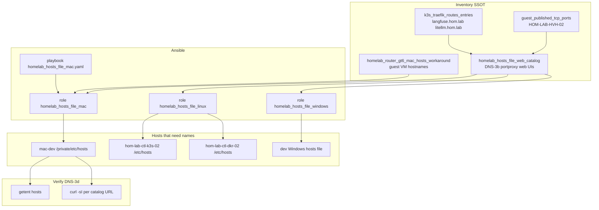

# Homelab hosts file bridge (DNS-3)

Durable diagram for interim name resolution without GT6 router DNS rows.
Ansible resources: `roles/homelab_hosts_file_mac`, planned `homelab_hosts_file_linux` /
`homelab_hosts_file_windows`, playbooks `homelab_hosts_file_mac.yaml`, inventory SSOT
`homelab_router_gt6_mac_hosts_workaround`, `k3s_traefik_routes_entries`,
`guest_published_tcp_ports` on `HOM-LAB-HVH-02`.

Plan: [2026-05-27--k3s-hyperv-traefik-homelab-hosts-file-implemented](../plans/2026-05-27--k3s-hyperv-traefik-homelab-hosts-file-implemented/README.md)

## Diagram

## Name → IP mapping rules

| Entry class | IP target | Example hostname | Browser URL notes |
|-------------|-----------|------------------|-------------------|
| Traefik ingress | `192.168.50.158` | `langfuse.hom.lab` | Interim `:30000`; target `:80` after port80 plan |
| Portproxy web UI | `192.168.50.158` | `netbox.hom.lab` | Always include port `:8000` |
| Guest VM SSH | Guest `.137.x` | `hom-lab-ctl-k3s-02` | No HTTP port in hosts |
| Guest-only HTTP | Guest IP | `grafana.hom.lab` | `:3000` — no LAN portproxy today |
| vLLM | TBD | TBD | Add when `k3s_vllm_runtime` deploys |

## Related diagrams

| File | Relationship |
|------|----------------|
| [cst-hom-lab-ctl-dia-gpu-services-01.md](cst-hom-lab-ctl-dia-gpu-services-01.md) | Which services exist and published ports |
| [cst-hom-lab-ctl-dia-gpu-control-01.md](cst-hom-lab-ctl-dia-gpu-control-01.md) | Operator access paths |
