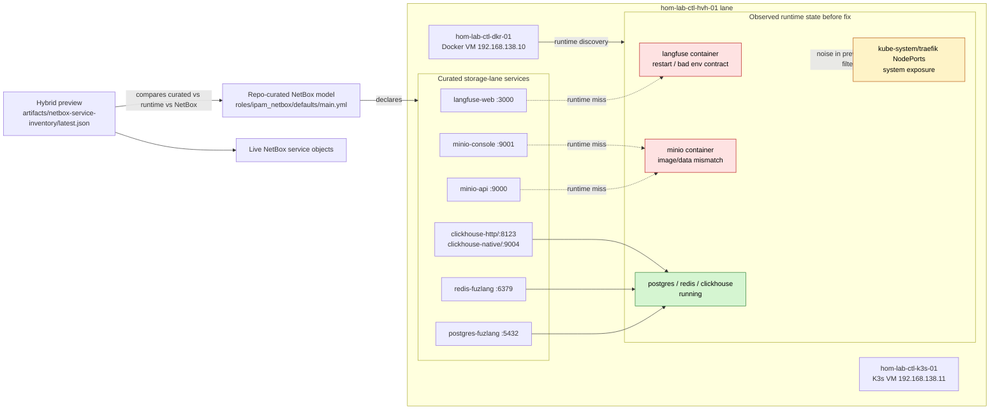

# Service Inventory Drift

This diagram captures the service-inventory mismatch that existed before the
storage-lane recovery work was completed.

## Diagram

## What this shows

- The repo and NetBox both expected `langfuse-web`, `minio-api`, and
  `minio-console` on `hom-lab-ctl-dkr-01`.
- Runtime discovery proved those storage-lane endpoints were not actually
  healthy or published yet.
- The preview also surfaced intentional-but-noisy exposures:
  loopback-only Docker ports and `kube-system` K3s NodePorts.
