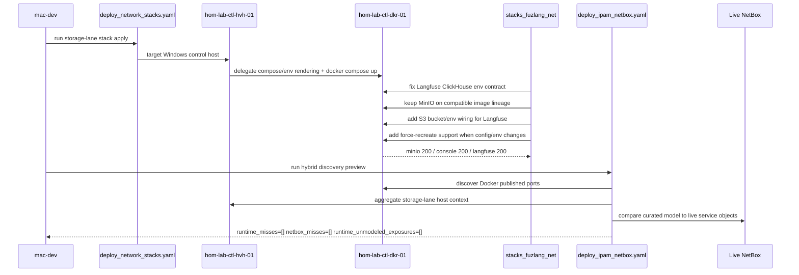

# Service Inventory Remediation Flow

This diagram shows the actual recovery flow used to repair the storage-lane
stack and clean up the hybrid service-inventory preview.

## Diagram

## Main repo changes reflected here

- `stacks_fuzlang_net` became the real recovery surface for storage-lane
  service health.
- The stack now supports forced recreation when env or compose changes matter.
- The NetBox hybrid preview now filters non-actionable loopback-only Docker
  binds and `kube-system` K3s exposures.
