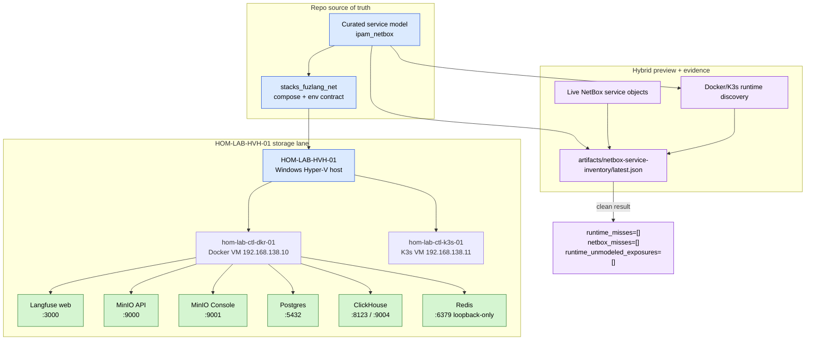

# Service Inventory Steady State

This diagram shows the final steady-state after the storage-lane runtime and
the NetBox hybrid preview were brought back into agreement.

## Diagram

## Storage-lane service state

| Service | Expected state after fix |
|---|---|
| `langfuse-web` | Published on `hom-lab-ctl-dkr-01:3000` and discovered by preview |
| `minio-api` | Published on `hom-lab-ctl-dkr-01:9000` and healthy |
| `minio-console` | Published on `hom-lab-ctl-dkr-01:9001` and healthy |
| `postgres-fuzlang` | Published on `hom-lab-ctl-dkr-01:5432` |
| `clickhouse-*` and `redis-fuzlang` | Intentionally internal-only or loopback-oriented where modeled |
