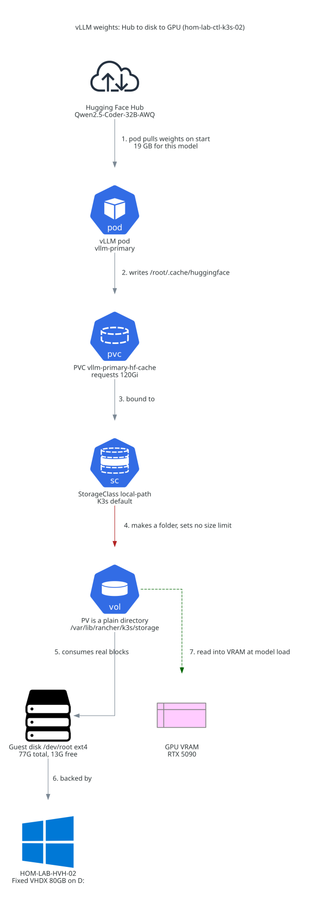

# vLLM model weights: Hub to disk to GPU

Where Hugging Face weights land on real storage before vLLM reads them into GPU
VRAM on `hom-lab-ctl-k3s-02`.

Companion: [`cst-hom-lab-ctl-dia-vllmcache-overcommit-02.md`](cst-hom-lab-ctl-dia-vllmcache-overcommit-02.md)
(why the 120Gi PVC claim is not a real limit).

## The path

| Step | What happens | Where |
| --- | --- | --- |
| 1 | vLLM pod pulls weights from the Hub on start, using `HF_TOKEN` when set | `vllm-runtime` namespace |
| 2 | Writes into the default HF cache dir | `/root/.cache/huggingface` in the container |
| 3 | That mount is PVC `vllm-primary-hf-cache` | requests 120Gi |
| 4 | StorageClass `local-path` satisfies it by creating a folder — no size limit | K3s default SC |
| 5 | The folder consumes real blocks on the guest root filesystem | `/dev/root` ext4, 77 G total, 13 G free |
| 6 | Which is a Fixed 80 GB VHDX on the hypervisor | `D:` on `HOM-LAB-HVH-02` |
| 7 | At model load, weights are read from that folder into VRAM | RTX 5090 |

## Notes that matter for sizing

- The disk copy and the VRAM copy are **separate budgets**. Disk holds the full
  repo (weights, tokenizer, config); VRAM holds the loaded weights plus KV
  cache.
- `Qwen2.5-Coder-32B-Instruct-AWQ` costs **19 G on disk**. With 13 G free, a
  second model of that class does not fit.
- Weights persist across pod restarts because the PVC directory survives. There
  is no pre-stage from the HVH-01 SMB catalog — the first pull for any new model
  comes from the Hub.
- The host-side path for inspection is
  `/var/lib/rancher/k3s/storage/pvc-11cf2794-..._vllm-runtime_vllm-primary-hf-cache/`.

## Authority

`roles/k3s_vllm_runtime/defaults/main.yml` (model, `k3s_vllm_runtime_hf_cache_size`),
`roles/k3s_vllm_runtime/tasks/present.yml` (PVC and `/root/.cache/huggingface`
mount), `playbooks/deploy_vllm_runtime.yaml`,
`inventory/host_vars/hom-lab-ctl-k3s-02.yaml`.
