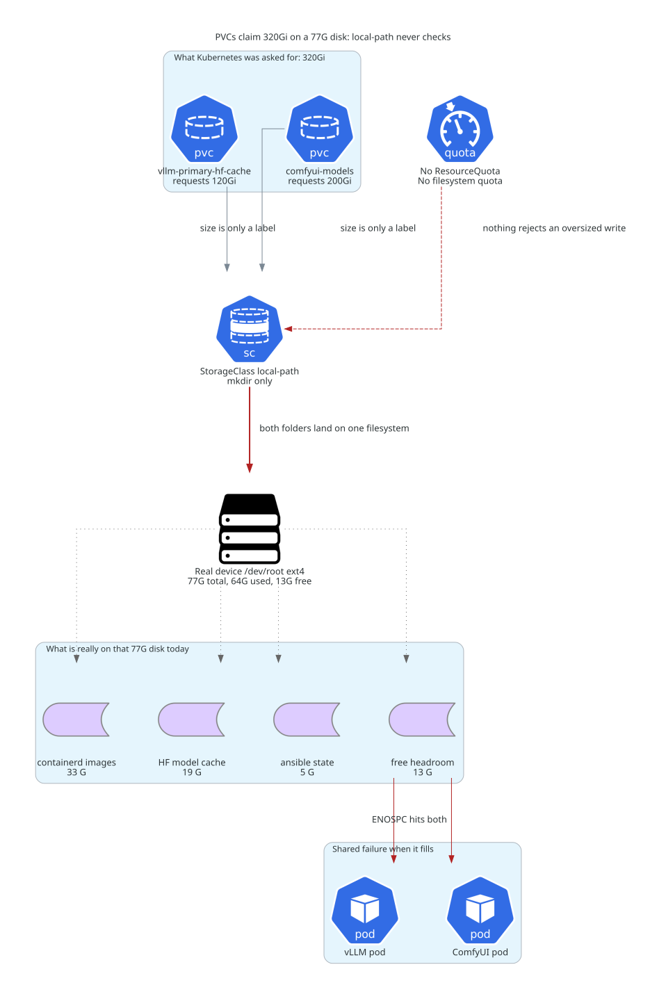

# PVC claims vs real disk on `hom-lab-ctl-k3s-02`

Why `vllm-primary-hf-cache` says **120Gi** while the model cache actually has
**13 GB** of room left, and what "K3s `local-path` does not enforce the claim"
means in practice.



Companion: [`cst-hom-lab-ctl-dia-vllmcache-flow-01.md`](cst-hom-lab-ctl-dia-vllmcache-flow-01.md)
(download path from Hugging Face Hub to GPU VRAM).

## What "does not enforce" means

A PVC's `spec.resources.requests.storage` is a **request**. Whether it becomes a
real boundary is entirely up to the provisioner behind the StorageClass.

| Provisioner style | What the size does |
| --- | --- |
| Real block backend (EBS, Ceph RBD, iSCSI, LVM) | Carves a volume of exactly that size. Writing past it returns `ENOSPC` **on that volume only**. The number is a hard wall. |
| K3s `local-path` (this cluster) | Creates a **directory** on the node root filesystem and points a PV at it. The size is stored in the API objects and never translated into anything the kernel checks. |

So on this node the 120Gi is bookkeeping. The pod writes into a folder on the
same 77 GB ext4 filesystem that holds containerd images, kubelet state, and the
OS.

## Evidence

The PV is a plain path, not a device:

```text
pvc-11cf2794-...-vllm-runtime_vllm-primary-hf-cache  cap=120Gi
  kind=/var/lib/rancher/k3s/storage/pvc-11cf2794-..._vllm-runtime_vllm-primary-hf-cache
```

Kubernetes reports the claim as satisfied:

```text
NAME                    REQUEST   CAPACITY
vllm-primary-hf-cache   120Gi     120Gi
```

But `df` **inside the running vLLM pod**, at the mount point itself, reports the
node's root filesystem:

```text
$ kubectl exec -n vllm-runtime vllm-primary-... -- df -h /root/.cache/huggingface
Filesystem      Size  Used Avail Use% Mounted on
/dev/root        77G   64G   13G  84% /root/.cache/huggingface
```

The filesystem cannot enforce a per-directory limit even in principle — ext4
project quota is not among its enabled features:

```text
Filesystem features: has_journal ext_attr resize_inode dir_index filetype
  needs_recovery extent 64bit flex_bg sparse_super large_file huge_file
  dir_nlink extra_isize metadata_csum
```

No `project` and no `quota` feature, and no `prjquota` mount option.

## Consequences

1. **No admission check.** `vllm-primary-hf-cache` (120Gi) and `comfyui-models`
   (200Gi) both went `Bound` immediately on an 80 GB disk. Nothing compares the
   request against free space.
2. **No write barrier.** A pod can fill the entire node root filesystem.
3. **Blast radius is the node, not the volume.** `ENOSPC` reaches kubelet,
   containerd, other pods, and system logs — not just the greedy workload.
4. **`kubectl get pvc` capacity is cosmetic here.** Use `df` on the node or in
   the pod for real numbers.

## Current numbers

| Item | Value |
| --- | --- |
| Root filesystem `/dev/root` (ext4) | 77 G total, 64 G used, 13 G free |
| `containerd` images | 33 G |
| HF model cache (the vLLM PVC directory) | 19 G |
| `/var/lib/ansible` | 5 G |
| Qwen2.5-Coder-32B-Instruct-AWQ on disk | 19 G |
| `comfyui-models` PVC directory | empty — 0 files |
| Guest VHDX | **Fixed** 80 GB, `D:\ProgramData\Ansible\hyperv_ubuntu_vm\...` on `HOM-LAB-HVH-02` |
| `D:` on HVH-02 | 931 GB total, 69 GB free |
| `F:` on HVH-02 | 1130 GB total, 876 GB free |

The **live** `comfyui-models` claim is still 200Gi as drawn. The role default
`k3s_comfyui_runtime_models_pvc_size` was since reduced to `60Gi`, but
`local-path` PVCs are not resizeable, so the live object keeps 200Gi until it is
deleted and recreated by a `present` run.

Node conditions were `DiskPressure=False` at capture time. The failed
`vllm-primary` pods in that namespace failed on `nvidia.com/gpu` device
allocation, **not** on disk — do not read them as storage symptoms.

## Options if this needs headroom

- **Reclaim first.** `containerd` images are the largest consumer at 33 G.
- **Right-size the claims.** They are cosmetic today, but leaving 320Gi of
  fiction in the API makes future capacity review misleading.
- **Grow the disk.** The VHDX is Fixed on `D:`, which has only 69 GB free, so
  in-place expansion caps out near 145 GB. `F:` has 876 GB free.
- **Mount the storage lane instead.** `\\HOM-LAB-HVH-01\public\models\huggingface`
  is already the catalog SSOT, but the `k3s_vllm_runtime` role does not mount it
  into the pod today, so every model is a fresh Hub pull into local disk.

## Sources

Live probes on `hom-lab-ctl-k3s-02` (`df`, `lsblk`, `tune2fs -l`,
`kubectl get pvc/pv/pod/node`, `kubectl exec ... df`) and on `HOM-LAB-HVH-02`
(`Get-Volume`, `Get-VHD`) captured 2026-09-10. Repo authority:
`roles/k3s_vllm_runtime/defaults/main.yml` and
`roles/k3s_vllm_runtime/tasks/present.yml`.
