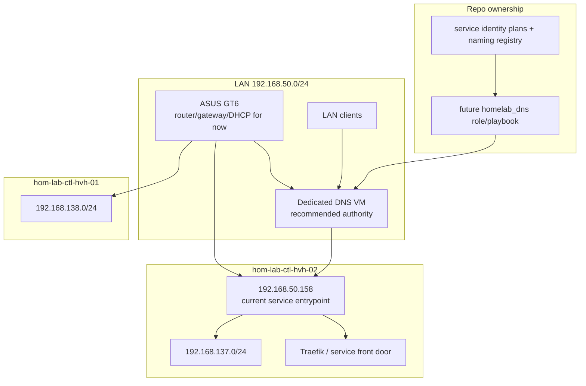
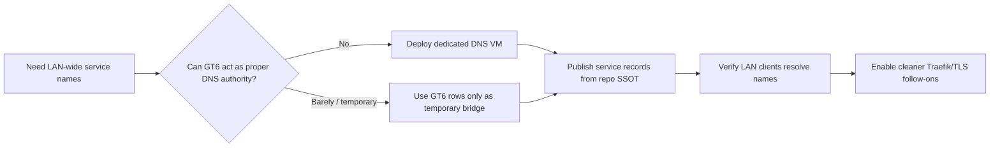
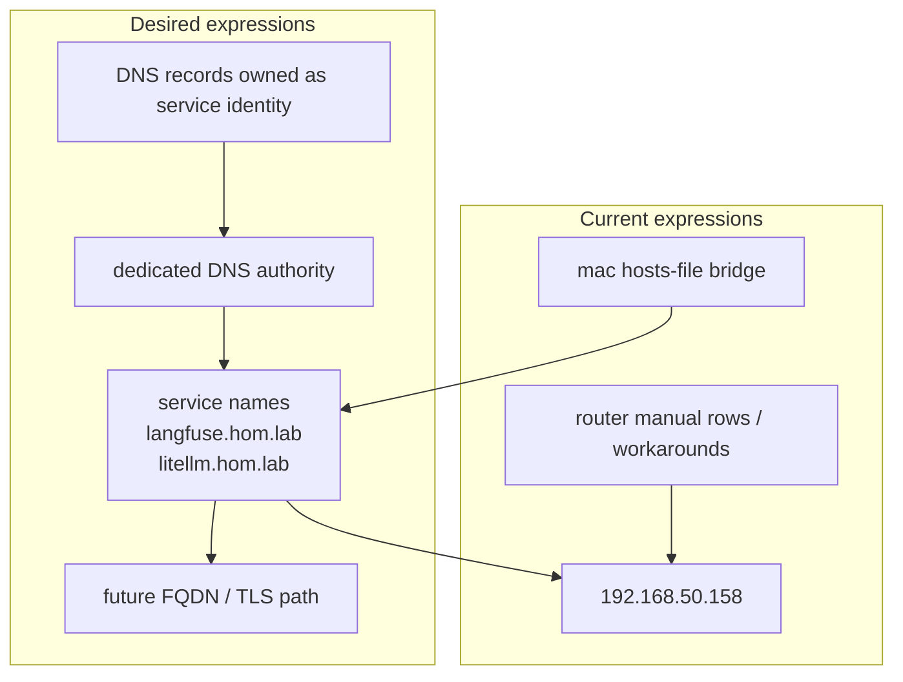

# Intake: Future-State DNS Authority and Service Entry Architecture

**Status:** future-leaning intake / pseudo-plan  
**Direction:** treat naming and DNS as the main unresolved architecture problem
after GT6 route parity, and prefer a proper LAN DNS authority over long-term
router-table hacks

**Apply:** choose and deploy a real DNS authority on a LAN-attached server/VM,
then publish service records from repo SSOT  
**Verify:** LAN clients resolve service names consistently and Traefik/front-door
services use stable hostnames  
**Undo:** remove or change DNS authority records; revert clients to temporary
hosts-file bridge if needed  
**Change class:** future infrastructure design and follow-on implementation

---

## Summary

The GT6 route layer is now in place for both Hyper-V guest subnets:

- `192.168.137.0/24 -> 192.168.50.158`
- `192.168.138.0/24 -> 192.168.50.234`

That means the main unresolved problem is no longer basic routing. It is
service naming and DNS ownership:

- GT6 manual assignment is limited and not a proper long-term DNS authority
- service names such as `langfuse.hom.lab` and `litellm.hom.lab` need a cleaner
  home than placeholder-MAC router rows
- better DNS design will directly improve Traefik accessibility, future
  service-entry consistency, and later TLS

## Recommended end state

### Recommendation

Deploy a dedicated LAN-attached DNS authority on a server or VM you control.

Default recommendation:

- **AdGuard Home on a small Ubuntu VM**
- hosted on a LAN-attached Hyper-V guest with a `192.168.50.x` address
- preferred placement: a small utility VM on `hom-lab-ctl-hvh-01` or another
  always-on LAN-reachable host

### Why this is the best fit

- It avoids forcing service aliases into a router DHCP/manual-assignment table
  that was designed for real clients, not many-to-one service names.
- It gives LAN-wide name resolution for current Traefik entrypoints.
- It supports future migration from raw IP/portproxy access toward stable
  service hostnames and TLS.
- It creates a cleaner path for aligning service identity work already underway
  in the repo with actual DNS records.

## Problem statement

### What is already solved

- both routed guest subnets now have upstream GT6 static routes
- the project target is symmetric routed-private-subnet networking on both
  Hyper-V hosts
- `mac-dev` already has a temporary name bridge path through
  `homelab_hosts_file_mac`

### What remains unresolved

- GT6 service rows are not a scalable DNS authority
- guest `.137.x` and `.138.x` addresses cannot be entered into GT6 manual DHCP
  assignment
- service names need a better system than ad hoc `/etc/hosts` and router UI
  experiments
- the repo needs a proper place to express DNS records as service identity, not
  as router-row folklore

## Option matrix

| Option | Fit for repo | Traefik benefit | Main downside | Recommendation |
|---|---|---|---|---|
| Dedicated LAN DNS VM (AdGuard Home) | strong | clean LAN-wide `*.hom.lab` records to current LAN entrypoints | introduces a managed DNS service VM | recommended |
| Windows DNS on an existing Windows host | medium | workable service records and future internal zone | ties DNS authority to Windows-specific operations | valid fallback |
| GT6 router-only naming | weak | can help a few names if the UI allows them | limited UI, poor alias model, not proper DNS architecture | temporary bridge only |
| Dedicated DNS plus dedicated reverse-proxy front door | strongest long-term | best path for hostnames, TLS, and clean ingress | more moving parts than needed for first cleanup step | premium future path |

## Recommended architecture path

### Phase 1 — establish DNS authority

Deploy a LAN-reachable DNS VM and pick the repo-owned authority.

Suggested first implementation:

- Ubuntu VM on a LAN-facing switch
- fixed `192.168.50.x` address
- AdGuard Home host overrides / local DNS rewrites for homelab names

### Phase 2 — publish initial service names

Start with the current Traefik-facing names:

- `langfuse.hom.lab -> 192.168.50.158`
- `litellm.hom.lab -> 192.168.50.158`

Optional follow-on names once the authority is stable:

- `netbox.hom.lab -> 192.168.50.158`
- `semaphore.hom.lab -> 192.168.50.158`
- `grafana.hom.lab -> 192.168.50.158`
- `loki.hom.lab -> 192.168.50.158`

### Phase 3 — align repo SSOT

Move record ownership toward service identity rather than router-entry tables.

Future repo-owned surfaces should likely include:

| Surface | Intended use |
|---|---|
| `playbooks/homelab_dns.yaml` | DNS authority apply/preview/verify |
| `roles/homelab_dns` | lifecycle management for DNS records |
| `inventory/group_vars/all/*dns*.yml` or service registry data | desired record ownership and targets |
| existing service identity plans and naming registry | source of stable hostnames and future FQDNs |

### Phase 4 — leverage DNS for TLS and cleaner access

Once names resolve everywhere:

- Traefik and other front doors can use stable hostnames more cleanly
- internal TLS becomes simpler
- NetBox and service identity metadata can map to real access names

## Design principles

- Keep GT6 routing and DNS as separate concerns.
- Treat GT6 manual assignment as operator bridge behavior, not as the final DNS
  platform.
- Prefer a DNS authority on the LAN-facing `192.168.50.x` side, not on an
  isolated guest-only subnet.
- Express service names as repo-owned service identity, not as one-off router UI
  entries.

## Architecture/Structure Diagram

## Capability Routing Diagram

## Naming/Modeling Diagram

## Open questions

- Should the dedicated DNS VM be the only LAN resolver or an additional local
  authority that GT6 forwards to?
- Do you want to keep GT6 as DHCP while moving only name resolution off-box, or
  eventually move both DHCP and DNS to a dedicated service?
- Should the first DNS authority also become the future reverse-proxy / TLS
  front door, or should those remain separate layers?

## Other Available Diagram Types

Included:
- Architecture/Structure Diagram
- Capability Routing Diagram
- Naming/Modeling Diagram

Additional diagram types that could be created:
- DNS resolution sequence from client to GT6 to dedicated authority
- Service publication map from NetBox/service identity to DNS record to Traefik route
- Migration timeline from temporary `/etc/hosts` bridge to dedicated DNS authority
