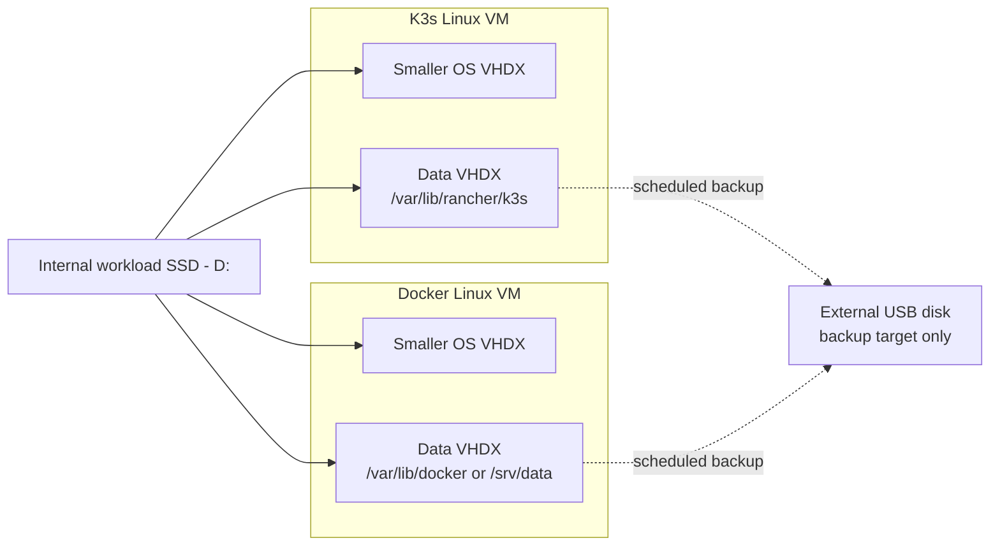

# Hyper-V Guest OS And Data VHDX Separation Intake

**Status:** non-critical, not implemented  
**Current decision:** preserve as intake; do not implement during the immediate
K3s boot-VHDX move.

## Driver

On June 6, 2026, `hom-lab-ctl-k3s-02` experienced a ClickHouse recovery and
merge loop. The guest continuously read its single VHDX at roughly 135 MB/s.
Because that VHDX was on the Windows `C:` system disk, the workload saturated
the host storage path and contributed to a delayed login, a prolonged black
screen, and a stalled Server Manager splash.

The immediate correction moved the entire K3s VHDX from `C:` to the dedicated
internal `D:` SSD. That reduces contention with Windows, but the K3s guest
still keeps its OS, containerd data, and all persistent volumes in one VHDX.

## Candidate Future Design

For each Linux VM:

- use a smaller OS VHDX;
- use a separate data VHDX on the internal workload SSD;
- mount the K3s data VHDX at `/var/lib/rancher/k3s`;
- mount the Docker data VHDX at `/var/lib/docker` or `/srv/data`;
- use external USB disks for backup copies, not active VM workloads.

## Why This Is Deferred

- The immediate whole-VHDX move addresses the active Windows system-disk
  contention with less migration risk.
- Splitting existing guest filesystems requires capacity planning, backup and
  restore verification, mount migration, K3s/Docker service outages, and
  rollback testing.
- `D:` has limited remaining free space after the immediate 80 GB K3s VHDX
  move, so this design needs a storage-capacity decision before implementation.
- External USB backup scheduling is configured against the healthy Toshiba USB
  disk mounted as `E:` with label `backups`, and no active VHDX uses that disk.
  The latest scheduled native-host-recovery backup result is `1` (failed), so
  backup success and restore behavior remain unverified.

## Promotion Gates

- Verify usable internal SSD capacity and growth requirements.
- Verify current backups and perform a restore test.
- Decide whether Docker and K3s data disks remain on `hom-lab-ctl-hvh-02` or
  move toward the storage lane.
- Add idempotent Hyper-V data-disk attachment and guest mount automation.
- Add migration, verification, and rollback procedures.

## Apply / Verify / Undo / Change Class

- Apply: not approved; intake only.
- Verify: future design must prove guest mounts, service health, storage
  latency, and restore behavior.
- Undo: future migration must preserve a tested rollback to the original guest
  disk layout.
- Change class: planned controlled-outage storage migration.
