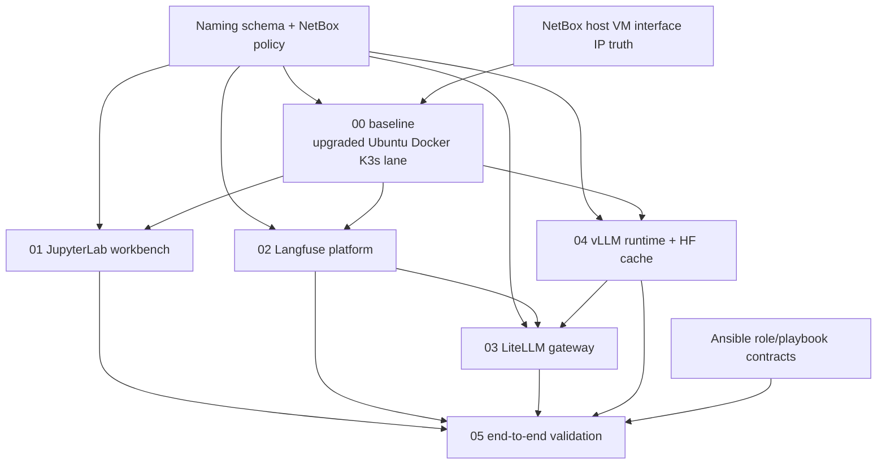

# 220 Phase 2 Final Synthesis

## Finding Topic

Cross-plan synthesis for the Jupyter DevOps implementation plan set.

## Date

2026-05-20

## Plan Slice Or Task

All six Jupyter DevOps plan slices.

## Agent/Model Used

Main Codex fallback coordinator after six real planner agents completed their
findings pass.

## Runtime Context If Known

Read-only synthesis. No mutating Ansible, NetBox changes, or implementation
code creation.

## Input Given To The Agent

Planner outputs plus read-only repo checks of inventory, playbooks, roles, and
naming-schema surfaces.

## Output Artifact Path

This file.

## Cross-Plan Dependency Graph

## Shared Resource/Naming Table

| Capability | Preferred Role Name | Service Code | Notes |
|---|---|---:|---|
| Ubuntu/Docker/K3s baseline | existing base and overlay roles | n/a | Keep Docker and K3s lanes separate. |
| JupyterLab workbench | `dev_jupyterlab_workbench` | `jpy` | Bind locally/tunnel first unless ingress is approved. |
| Langfuse platform | `langfuse_platform` | `lfs` | Capability role; K3s is target context. |
| LiteLLM gateway | `litellm_gateway` | `llm` | Avoid K3s prefix unless role becomes K3s-only plumbing. |
| vLLM runtime | `vllm_runtime` | `vlm` | Needs GPU node/storage decisions. |
| Hugging Face cache | `hf_model_cache` | `hfc` | Decide PVC/host-path/shared-cache scope. |
| K3s GPU operator | `k3s_nvidia_gpu_operator` | gpu | K3s prefix is acceptable for substrate plumbing. |
| Validation | `ai_devops_validation` or playbook-only | val | Prefer read-only Ansible checks plus notebook. |

## Implementation Order

1. Finalize `00` baseline target names, NetBox access, and coexistence versus
   replacement.
2. Implement or finalize the baseline lane and read-only target verification.
3. Implement `01` JupyterLab workbench once target and access model are known.
4. Implement `02` Langfuse after storage, dependency, namespace, and ingress
   decisions.
5. Implement `03` LiteLLM either after Langfuse or as a minimal placeholder
   gateway with explicit provider scope.
6. Implement `04` vLLM and Hugging Face cache after GPU node and cache storage
   decisions.
7. Implement `05` validation last, while creating its skeleton early enough to
   define expected outputs and endpoint contracts.

## Duplicate Or Conflicting Resource Detection

- `roles/langfuse_cli` and `roles/mcp_servers/langfuse_docs` are not Langfuse
  platform roles.
- `k3s_mac_client` and `k8s_cli_tools` overlap in Kubernetes client setup; final
  plans should choose one owner for kubectl/kubeconfig behavior.
- `inventory/group_vars/network_server.yaml` contains older Docker-style
  service exposure variables for Langfuse and related services. These must be
  reconciled before K3s-first platform implementation.
- `inventory/host_vars/hom-lab-ctl-k3s-01.yaml` contains a stale comment saying
  the host is intentionally not in `k3s_cluster`; inventory now places it under
  `k3s_cluster.server`.
- `dev_3090` GPU/LiteLLM variables exist and may be old lane material; do not
  reuse them for the 5090 lane without an explicit schema and NetBox mapping.

## Strengths

- All six planners identified real implementation blockers instead of writing
  premature plan edits.
- The strongest shared pattern is capability-focused roles with K3s limited to
  target context or substrate plumbing.
- The validation slice can become a useful contract for the full stack once the
  earlier slices expose stable endpoint variables.

## Gaps Or Failures

- No seventh coordinator agent was available in this runtime.
- Live NetBox access from subagents was not reliable enough to treat as full
  evidence.
- Several plan slices still depend on service endpoint modeling that the repo
  has not finalized.

## Repo-Rule Violations Found

None were introduced during Phase 2. Future final plan edits must include the
required Mermaid Architecture/Structure Diagram and Diagram Inventory in every
official plan.

## Naming/Schema Issues Found

The main unresolved naming issue is where `aix` applies. Until the schema says
otherwise, keep infrastructure host/VM names in the `hom-lab-ctl-*` lane and
use service codes for workload identities.

## NetBox Or Ansible Assumptions That Needed Correction

NetBox remains required for host, VM, interface, IP, role, site, and platform
truth. Runtime service endpoint records should be deferred unless the service
endpoint model is approved as part of this effort.

## Recommendation For First Implementation

Implement Plan `00` first. It defines the target substrate that every later
slice depends on. Do not start Langfuse, LiteLLM, vLLM, or validation
implementation until the upgraded server naming, NetBox access, and target
grouping are settled.

## Final Reviewer Decision

Phase 2 findings are useful and coherent. Move next to user question resolution,
then final plan edits. Do not implement code or run mutating automation from
these findings alone.
