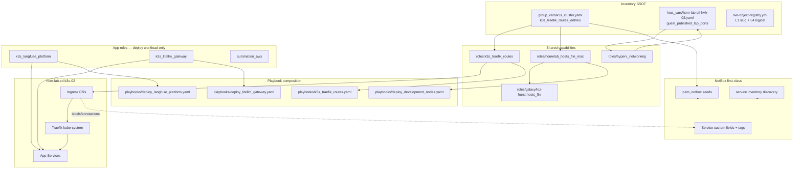
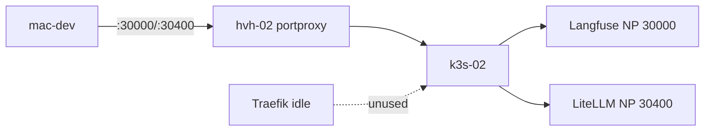
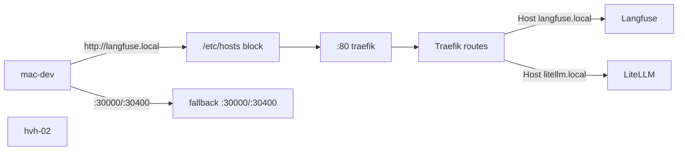
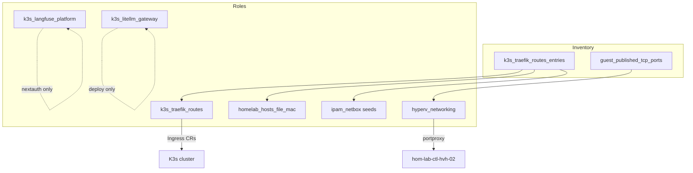

# Traefik Integration Plan for the GPU K3s Lane

**Status:** approved intake — implement as scalable v1 (not per-app ingress shortcuts)

**Promotion target:** `docs/plans/2026-05-27--k3s-hyperv-traefik-implemented/README.md` (implemented 2026-05-28)

## Summary

Implement Traefik as an **additive, data-driven ingress layer** for the GPU K3s lane. Traefik the controller already ships with K3s; this plan adds:

1. **`k3s_traefik_routes`** — shared capability role that applies Ingress objects from a route registry (mirrors `hyperv_networking` + `guest_published_tcp_ports`)
2. **`homelab_hosts_file_mac`** — thin wrapper on **`hosts_file`** (GitHub `loz-hurst/ansible-role-hosts_file` v1.0.0) for mac-dev `/etc/hosts`; data from the same route registry
3. **Windows `:80` portproxy** — one LAN entrypoint for Traefik HTTP on `hom-lab-ctl-hvh-02`
4. **NetBox-first service metadata** — repo registry, seeds, discovery, and labels stay aligned (not “heading towards” integration)

v1 keeps fallback paths (NodePort + per-port portproxy + `kubectl port-forward`) while making hostname-based ingress the **canonical** operator path.

**Apply:** route registry + shared ingress role + portproxy `:80` + mac hosts + app URL fixes + NetBox seed updates  
**Verify:** hostname path works; fallbacks still work; NetBox repo consistency + service-inventory preview reconcile  
**Undo:** `k3s_traefik_routes_state: absent`, remove `:80` portproxy, `homelab_hosts_file_mac_enabled: false` (or remove rows from registry) — fallbacks untouched  
**Change class:** idempotent config, additive overlay

---

## Clarification — nothing to tear down first

The earlier “put Ingress inside `k3s_langfuse_platform` / `k3s_litellm_gateway`” idea was a **conversation-only v0 shortcut**. It was **never implemented**.

| Question | Answer |
|----------|--------|
| Did Langfuse/LiteLLM already enable per-app Ingress? | **No.** Grep shows zero `ingress` references in those roles today. |
| Do we disable something before standalone ingress? | **No teardown.** Current state is NodePort + portproxy only. |
| Can we go straight to the scalable pattern? | **Yes.** Greenfield for Ingress CRs; conform route registration to the shared role from day one. |

Existing NodePort and portproxy are **fallback exposure**, not conflicting ingress implementations.

---

## Locked decisions (no further debate for v1)

| Topic | Decision |
|-------|----------|
| Ingress ownership | **`k3s_traefik_routes`** only — not in app roles |
| Traefik install | **Reuse K3s kube-system Traefik** — no `roles/traefik` |
| Route SSOT | **`k3s_traefik_routes_entries`** in `k3s_cluster.yaml` |
| mac `/etc/hosts` mechanics | **`hosts_file`** (GitHub v1.0.0) via **`homelab_hosts_file_mac`** wrapper |
| mac hosts data source | **Registry rows** with `mac_hosts_enabled` — not live K8s discovery at apply |
| mac hosts feature gate | **`homelab_hosts_file_mac_enabled`** on mac-dev |
| `.local` short names | **`add_short_name: false`** on all `.local` hostnames |
| LAN front door | **Single `:80` portproxy** on hvh-02 → Traefik |
| Fallback coexistence | **Keep** NodePort `:30000` / `:30400` + existing portproxy rows v1 |
| TLS | **Deferred** — HTTP first; TLS still owned by `k3s_traefik_routes` when added |
| DNS beyond mac-dev | **Router static DNS deferred** — document hostname list for manual entry |
| NetBox | **Same slice** — seeds, custom fields, tags, discovery preview, consistency gate |
| v1 hostnames | **`langfuse.local`**, **`litellm.local`** (L4 `hom-lab-ctl-lfs-01` / `llm-01` in NetBox only) |
| Playbook shape | **Thin YAML files + tags** — not tag-only |
| New K3s app process | **One registry row** + app deploy — no new per-app Ingress task file |

**Rejected:** `bertvv.hosts`, hostess, raw blockinfile as primary, per-app `ingress.yml`, `roles/traefik` reinstall, runtime hosts sync from Ingress labels.

---

## Architecture decision — do not duplicate ingress per app role

### Rejected (v0 — do not implement)

- `tasks/ingress.yml` inside each K3s app role
- `roles/traefik` reinstalling the K3s-bundled controller
- Ad hoc `kubectl apply` manifests outside Ansible roles

### Adopted (v1 — this plan)

```text
k3s_traefik_routes_entries (inventory SSOT)
        ↓
k3s_traefik_routes (shared role → Ingress CRs + standard labels)
        ↓
Traefik (kube-system, K3s-owned)
        ↓
App ClusterIP/Service (owned by app role)
```

App roles keep **product-specific** config only (`nextauth_url`, Helm deploy, optional fallback NodePort policy). They do **not** own Ingress CR lifecycle.

This matches the repo’s existing **`guest_published_tcp_ports` → `hyperv_networking`** pattern.

---

## Architecture/Structure Diagram



---

## Current-state audit and grade improvement plan

Target column: **readiness for 10+ K3s apps** (not “works for two apps today”).

| Layer | Grade today | Target | Improvement actions (this plan) |
|-------|-------------|--------|--------------------------------|
| **K3s in-cluster exposure** | D+ (per-app NodePort snowflakes) | A- | Route registry SSOT; app roles default toward ClusterIP over time; supplemental NodePort only when `fallback_exposure: nodeport` in registry |
| **Traefik / Ingress registration** | F (unused) | A- | New `k3s_traefik_routes` role; no per-app Ingress tasks |
| **Windows LAN publish** | B+ (data-driven portproxy) | A | Add single `k3s-traefik-http` entry; document that new K3s apps should prefer `:80` hostname path over new portproxy rows |
| **Client name resolution** | F (manual) | B+ | `homelab_hosts_file_mac` → `loz-hurst.hosts_file` (Galaxy); derived from route registry; per-entry `mac_hosts_enabled` |
| **NetBox alignment** | C (seeds exist; ingress not wired to routes) | A- | Seed `primary_access_point` + custom fields from registry; discovery reconciles runtime Ingress; consistency gate |
| **Playbook composition** | C (app playbooks only) | A- | Keep thin `playbooks/k3s_traefik_routes.yaml` **and** tags; optional `site.yaml` import with tag — file is not replaced by tag |
| **K8s metadata / anti-snowflake** | D (ad hoc labels on litellm-lan only) | A- | Standard label/annotation contract on every managed Ingress (see below) |

**Assurance:** This plan explicitly **stops** heading in the per-app Ingress direction. Any future K3s web app adds **one registry row** + app deploy — not a new `ingress.yml` in another role.

---

## Exposure layer model (four layers, one contract)

| Layer | Owner | Registration mechanism |
|-------|-------|------------------------|
| L-A **Ingress route** | `k3s_traefik_routes` | `k3s_traefik_routes_entries[]` |
| L-B **LAN portproxy (fallback or Traefik front door)** | `hyperv_networking` | `guest_published_tcp_ports[]` |
| L-C **mac-dev name resolution** | `homelab_hosts_file_mac` | derived hostnames from registry |
| L-D **App workload + Service** | app role | Helm / `kubernetes.core.k8s`; **not** Ingress |

### Gap remediation (besides Windows LAN publish)

1. **K3s in-cluster:** implement route registry + shared role (this plan).
2. **Client DNS:** `homelab_hosts_file_mac` on `mac-dev`; router static DNS deferred but document hostname list for manual router entry.
3. **NetBox:** treat registry as authoritative for L1/L4/hostname/access URLs; update seeds and discovery in same slice (below).
4. **App URL drift:** fix Langfuse `nextauth_url` to canonical ingress hostname (port 80, not `:3000`).
5. **Future apps (AWX, etc.):** add registry row + seed row — do not add another NodePort/portproxy pair unless fallback explicitly required.

---

## Route registry SSOT

**File:** `inventory/group_vars/k3s_cluster.yaml`

```yaml
k3s_traefik_routes_state: present
k3s_traefik_routes_class_name: traefik
k3s_traefik_routes_lan_publish_host: "{{ hostvars['hom-lab-ctl-hvh-02'].host_ip | default('192.168.50.158') }}"

k3s_traefik_routes_entries:
  - route_key: langfuse-web
    ingress_name: langfuse-web-ingress
    namespace: langfuse
    hostname: langfuse.local
    service_name: langfuse-web          # verify live Helm Service name at apply
    service_port: 3000
    path: /
    path_type: Prefix
    netbox_service_slug: langfuse-k3s-web
    logical_hostname: hom-lab-ctl-lfs-01
    deployed_by_role: k3s_langfuse_platform
    fallback_exposure: nodeport         # v1: keep NodePort 30000 + portproxy
    fallback_node_port: 30000
    mac_hosts_enabled: true            # include in mac-dev /etc/hosts (omit row to remove)
    tags:
      - web-ui
      - k3s
      - traefik-routed
      - lan-exposed-services

  - route_key: litellm-gateway
    ingress_name: litellm-gateway-ingress
    namespace: litellm
    hostname: litellm.local
    service_name: litellm
    service_port: 4000
    path: /
    path_type: Prefix
    netbox_service_slug: litellm-k3s-gateway
    logical_hostname: hom-lab-ctl-llm-01
    deployed_by_role: k3s_litellm_gateway
    fallback_exposure: nodeport
    fallback_node_port: 30400
    mac_hosts_enabled: true
    tags:
      - web-ui
      - k3s
      - traefik-routed
      - lan-exposed-services
```

**Per-entry mac hosts control:** set `mac_hosts_enabled: false` on a route to stop managing that hostname on mac-dev while keeping the registry row for ingress/NetBox. Remove a hostname from the file by disabling the flag or deleting the route row.

**Operator entry point for new services:** add one dict to `k3s_traefik_routes_entries` — ingress, mac hosts, and NetBox seeds all derive from that row.

**v1 pilots:** `langfuse-web`, `litellm-gateway` only.

**Next registry candidates (not v1 apply — document now, implement when app is live on k3s-02):**

| route_key | netbox_service_slug | Notes |
|-----------|---------------------|-------|
| automation-awx-web | TBD in NetBox seeds | Today `automation_awx` NodePort 30080 — migrate to registry row when AWX on k3s-02 is active |

Docker-lane services (NetBox, Loki, Semaphore) use **portproxy / future Docker ingress class** — out of scope for `k3s_traefik_routes`.

---

## Shared role — `k3s_traefik_routes`

**Does:** apply/remove Ingress CRs from registry; standard labels/annotations; verify backends exist.

**Does not:** install Traefik; deploy Helm releases; manage app secrets.

**Lifecycle:** `k3s_traefik_routes_state: present|absent`

**Tags:** `k3s_traefik_routes`, `k3s_traefik_routes_apply`, `k3s_traefik_routes_verify`

**Kubernetes metadata contract (every managed Ingress):**

```yaml
metadata:
  labels:
    app.kubernetes.io/managed-by: ansible
    app.kubernetes.io/part-of: homelab-k3s-ingress
    homelab.dotfile-vnext/route-key: "<route_key>"
  annotations:
    homelab.dotfile-vnext/netbox-service-slug: "<netbox_service_slug>"
    homelab.dotfile-vnext/logical-hostname: "<logical_hostname>"
    homelab.dotfile-vnext/deployed-by-role: "<deployed_by_role>"
    homelab.dotfile-vnext/fallback-exposure: "<fallback_exposure>"
```

No snowflake Ingress names outside the registry.

---

## App-specific integration (stays in app roles)

| Concern | Role | v1 change |
|---------|------|-----------|
| Helm / workload deploy | `k3s_langfuse_platform`, `k3s_litellm_gateway` | unchanged structure |
| `nextauth_url` / app canonical URL | `k3s_langfuse_platform` | `http://langfuse.local` (ingress hostname, port 80) |
| Fallback NodePort | app role | **keep** v1; driven by registry `fallback_exposure` documentation |
| Supplemental `litellm-lan` Service | `k3s_litellm_gateway` | **keep** v1 |
| **Ingress CR** | **`k3s_traefik_routes`** | **not in app roles** |

---

## What moves out of Langfuse / LiteLLM

| Item | From | To |
|------|------|-----|
| Ingress CR lifecycle | ~~app roles~~ | `k3s_traefik_routes` |
| Hostname route definition | ~~app defaults~~ | `k3s_traefik_routes_entries` |
| mac-dev `/etc/hosts` | manual | `homelab_hosts_file_mac` |
| LAN `:80` publish | n/a | `guest_published_tcp_ports` + `hyperv_networking` |
| NetBox `primary_access_point` canonical URL | per-service ad hoc | derived from registry hostname in `ipam_netbox` seeds |

---

## NetBox — first-class integration (not deferred)

NetBox and Traefik routes are **co-developed** in this slice. Alignment requirements:

### Repo authority chain

```text
live-object-registry.yml (L1 + L4)
        ↔
k3s_traefik_routes_entries (hostname + slug + logical)
        ↔
ipam_netbox defaults service seeds
        ↔
runtime discovery (Ingress host + Service ports)
        ↔
validate_netbox_repo_consistency.sh
```

### Seed updates (`roles/ipam_netbox/defaults/main.yml`)

For each registry entry, update the matching service block:

- **`primary_access_point`:** `http://<hostname>/` (canonical after verify)
- **`comments`:** document fallback URL (`http://<lan_publish_host>:<fallback_node_port>/`) and ingress class `traefik`
- **`custom_fields.deployed_by_role`:** app role (unchanged)
- **Add custom fields** (seed in `seed_custom_fields.yml`):
  - `logical_hostname` (text) — Phase 2 field; populate from registry
  - `ingress_hostname` (text) — v1 operator hostname (`langfuse.local`)
  - `ingress_class` (text) — `traefik`
  - `fallback_access_point` (text) — NodePort URL while coexistence active

### NetBox tags (seed in `seed_tags.yml` if missing)

- `traefik-routed` — service reaches LAN via K3s Traefik ingress
- existing: `k3s`, `lan-exposed-services`, `web-ui`, `ansible-managed`

Apply tags to `langfuse-k3s-web` and `litellm-k3s-gateway` service seed entries.

### Service inventory discovery

Existing `discover_service_inventory_k3s.yml` already collects Ingresses. **Extend reconciliation** (same slice or immediate follow-up):

- Match runtime Ingress annotation `homelab.dotfile-vnext/netbox-service-slug` to curated service
- Flag drift when registry hostname ≠ discovered Ingress host
- Preview-only first: `--tags ipam_netbox_service_inventory_discovery_preview`

### Gates (mandatory before calling slice done)

```bash
scripts/validate_netbox_repo_consistency.sh
# or
ansible-playbook playbooks/deploy_ipam_netbox.yaml --tags ipam_netbox_repo_consistency
```

---

## Misalignments to fix (not “heading towards”)

| Misalignment | Fix in this plan |
|--------------|------------------|
| Langfuse `nextauth_url` uses `langfuse.local:3000` but exposure is NodePort 30000 | Set to `http://langfuse.local` when ingress is canonical |
| No Ingress CRs despite Traefik running | `k3s_traefik_routes` |
| Each new K3s app implies new portproxy port | Registry + `:80` front door; portproxy row only for `fallback_exposure: nodeport` |
| NetBox seeds only document NodePort URLs | Update `primary_access_point` + `fallback_access_point` from registry |
| `logical_hostname` in registry docs but not in NetBox seeds | Seed custom field + values from registry |
| Ingress labels not tied to NetBox slug | Standard annotation contract on all managed Ingresses |
| `automation_awx` NodePort pattern | Document as registry candidate; migrate when AWX on k3s-02 is in scope |

---

## Windows publication

Add to `inventory/host_vars/hom-lab-ctl-hvh-02.yaml`:

```yaml
- name: "k3s-traefik-http"
  listen_address: "192.168.50.158"
  listen_port: 80
  connect_address: "192.168.137.11"
  connect_port: 80   # VERIFY against live Traefik Service before apply
```

**Keep unchanged v1:** `langfuse-k3s` `:30000`, `litellm-k3s` `:30400`, all Docker-lane ports.

---

## Client name resolution — `homelab_hosts_file_mac` + `loz-hurst.hosts_file`

**Decision (locked):** use upstream role **`hosts_file`** ([loz-hurst/ansible-role-hosts_file](https://github.com/loz-hurst/ansible-role-hosts_file) v1.0.0 — not on Ansible Galaxy hub) for file mechanics; repo owns a **thin wrapper** `homelab_hosts_file_mac` for transform + gates only. **Not** blockinfile, hostess, or `bertvv.hosts` (full-file template; poor fit for mac-dev).

### Why this stack

| Layer | Owner |
|-------|--------|
| SSOT | `k3s_traefik_routes_entries` in `k3s_cluster.yaml` |
| Transform + feature gate | `roles/homelab_hosts_file_mac` (~20 lines) |
| `/etc/hosts` line management | `roles/galaxy/loz-hurst.hosts_file` (lineinfile, Darwin-aware) |

Galaxy role defaults on macOS: **`/private/etc/hosts`**. Uses native `ansible.builtin.lineinfile`; removes stale wrong-IP lines for managed hostnames.

### Galaxy install (`requirements.yml`)

```yaml
roles:
  - name: hosts_file
    src: https://github.com/loz-hurst/ansible-role-hosts_file.git
    version: v1.0.0
```

```bash
ansible-galaxy role install -r requirements.yml -p roles/galaxy
```

Install path matches existing repo convention (`roles/galaxy/`).

### Wrapper interface

```yaml
# inventory/host_vars/mac-dev.yaml (optional overrides)
homelab_hosts_file_mac_enabled: true

# roles/homelab_hosts_file_mac/defaults/main.yml
homelab_hosts_file_mac_galaxy_role: loz-hurst.hosts_file
```

**Feature gate:** `homelab_hosts_file_mac_enabled: false` skips all homelab host entries (ingress/NetBox unchanged).

**Per-entry gate:** `mac_hosts_enabled: false` on a route row excludes that hostname from the transform (registry row remains).

### Transform (registry → Galaxy vars)

Wrapper builds `hosts_file_hosts` from enabled routes only:

Wrapper filter: `k3s_traefik_routes_entries | rejectattr('mac_hosts_enabled', 'equalto', false)` — default is include when `mac_hosts_enabled` is omitted.

Each enabled route becomes one Galaxy dict:

```yaml
- hostname: langfuse.local
  add_short_name: false          # REQUIRED for .local — avoids mDNS short-name noise
  ipv4:
    address: "{{ k3s_traefik_routes_lan_publish_host }}"
```

**Removing one hostname:** set `mac_hosts_enabled: false` and re-apply — loz-hurst drops it from the managed set and cleans conflicting lines.

**Removing all homelab host entries:** `homelab_hosts_file_mac_enabled: false` or empty the filtered list.

### Hostname choice (locked for v1, note for Phase 2)

- **v1:** `langfuse.local`, `litellm.local` (blueprint default)
- **`add_short_name: false`** on every `.local` row (Bonjour/mDNS interaction on macOS)
- **Phase 2 optional:** migrate to `.hom.lab` when router local DNS exists — update registry hostnames + NetBox seeds together; not a hosts-role change

### Playbooks and tags

| Playbook | Role(s) | Tags |
|----------|---------|------|
| `playbooks/homelab_hosts_file_mac.yaml` | `homelab_hosts_file_mac` | `homelab_hosts_file_mac` |
| `playbooks/deploy_development_nodes.yaml` | `homelab_hosts_file_mac` | `homelab_hosts_file_mac` |

Keep **both** the standalone playbook file and tags (same pattern as `k3s_traefik_routes.yaml`).

**Requires:** `become: true` on mac-dev; reuse `vault_mac_dev_become_password` from `deploy_development_nodes.yaml` pre_tasks.

### What we do not do

- Runtime discovery from K8s Ingress labels into `/etc/hosts` at apply time (discovery stays preview-only in NetBox)
- `jtyr.etc_hosts` custom module (rejected in favor of loz-hurst native lineinfile)
- `bertvv.hosts` full-file template on mac-dev

---

## Playbook and tag strategy

**Keep the YAML file and use tags** (repo best practice — tags select slices; file documents entrypoint).

| Playbook | Role(s) | Tags |
|----------|---------|------|
| `playbooks/k3s_traefik_routes.yaml` | `k3s_traefik_routes` | `k3s_traefik_routes`, `k3s_traefik_routes_apply`, `k3s_traefik_routes_verify` |
| `playbooks/homelab_hosts_file_mac.yaml` | `homelab_hosts_file_mac` | `homelab_hosts_file_mac` |
| `playbooks/deploy_langfuse_platform.yaml` | `k3s_langfuse_platform` | unchanged + app deploy only |
| `playbooks/deploy_litellm_gateway.yaml` | `k3s_litellm_gateway` | unchanged |
| `playbooks/deploy_development_nodes.yaml` | `homelab_hosts_file_mac` | `homelab_hosts_file_mac` |

**Optional later:** `site.yaml` import of `k3s_traefik_routes.yaml` with `site_k3s_traefik_routes` tag — does **not** remove the standalone playbook.

**Typical apply order:**

1. `--tags k3s_traefik_routes_apply` (or full deploy playbook after apps exist)
2. App deploy playbooks (if not already present)
3. Hyper-V networking apply for `:80` portproxy
4. `--tags homelab_hosts_file_mac --limit mac-dev`
5. NetBox seed tags for service metadata
6. `--tags ipam_netbox_service_inventory_discovery_preview` then consistency gate

---

## V0 debt register — mature in this slice

| V0 pattern | Mature target | This slice |
|------------|---------------|------------|
| Per-app NodePort + dedicated portproxy port | Registry-driven ingress + optional fallback flag | Keep fallback v1; stop adding ports for new apps |
| Ingress logic in app roles (proposed only) | `k3s_traefik_routes` | Adopt shared role |
| `roles/traefik` reinstall controller | Use K3s kube-system Traefik | Do not create |
| Manual `/etc/hosts` | `homelab_hosts_file_mac` + `loz-hurst.hosts_file` | Implement |
| NetBox URLs = NodePort only | Canonical hostname + fallback field | Seed update |
| Ad hoc K8s labels on one supplemental Service | Standard Ingress metadata contract | Implement |
| Langfuse URL/port mismatch | Align to ingress hostname | Fix in app role defaults |
| kubectl in steady-state (node_config drift) | `kubernetes.core` paths | Out of scope here; keep on cleanup list |

---

## File name tree (new + edited)

```text
dotfile-vnext/
├── requirements.yml                                      # EDIT — pin loz-hurst.hosts_file
│
├── docs/
│   └── plans/
│       └── 2026-05-27--k3s-hyperv-traefik/
│           └── README.md
│
├── inventory/
│   ├── group_vars/
│   │   └── k3s_cluster.yaml                              # EDIT — k3s_traefik_routes_entries SSOT
│   └── host_vars/
│       ├── hom-lab-ctl-hvh-02.yaml                       # EDIT — k3s-traefik-http portproxy
│       └── mac-dev.yaml                                  # EDIT — homelab_hosts_file_mac_enabled
│
├── playbooks/
│   ├── k3s_traefik_routes.yaml                           # NEW
│   ├── homelab_hosts_file_mac.yaml                       # NEW — thin orchestrator
│   ├── deploy_langfuse_platform.yaml                     # unchanged; app-only
│   ├── deploy_litellm_gateway.yaml                       # unchanged
│   └── deploy_development_nodes.yaml                     # EDIT — include homelab_hosts_file_mac
│
├── roles/
│   ├── galaxy/
│   │   └── loz-hurst.hosts_file/                         # INSTALLED — do not edit; pin version
│   │
│   ├── k3s_traefik_routes/                               # NEW
│   │   └── ...
│   │
│   ├── homelab_hosts_file_mac/                           # NEW — wrapper only
│   │   ├── README.md
│   │   ├── defaults/main.yml
│   │   ├── meta/argument_specs.yml
│   │   └── tasks/main.yml                                # include_role loz-hurst.hosts_file
│   │
│   ├── k3s_langfuse_platform/                            # EDIT — nextauth_url only
│   ├── k3s_litellm_gateway/
│   └── ipam_netbox/                                      # EDIT — seeds + custom fields + tags
```

**Not created:** `roles/traefik/`, per-app `ingress.yml`, vendored copies of loz-hurst inside `homelab_hosts_file_mac/files/`

---

## Before / after traffic flow

### Before



### After (v1 coexistence)



---

## Repo touchpoint diagram



---

## Public interface

**New canonical paths:**

- `http://langfuse.local`
- `http://litellm.local`

**Preserved fallback paths (v1):**

- `http://192.168.50.158:30000/`
- `http://192.168.50.158:30400/`

**New LAN publish:**

- `192.168.50.158:80` → Traefik on k3s-02

---

## Test plan

### Functional

- Hostname paths return expected app responses
- Fallback NodePort paths still work
- Docker-lane portproxy unchanged
- Traefik `:80` path works from mac-dev after hosts role apply

### NetBox / repo truth

- Registry row count matches applied Ingress count
- Seed `primary_access_point` matches canonical hostname URLs
- `validate_netbox_repo_consistency.sh` passes
- Service inventory preview shows Ingress hosts matching registry

### Troubleshooting paths

- port-forward still reaches app with ingress bypassed
- App healthy when Traefik broken (via fallback)
- Traefik healthy when one fallback port broken

### Repo checks (updated)

- `k3s_traefik_routes` preview shows Ingress from registry — **not** app role tasks
- No `ingress.yml` in app roles
- Hyper-V preview shows `:80` added without removing `:30000`/`:30400`

---

## Implementation phases

### Phase 1 — Platform (this slice)

0. Pin `loz-hurst.hosts_file` in `requirements.yml`; `ansible-galaxy role install -r requirements.yml -p roles/galaxy`
1. Add `k3s_traefik_routes` role + playbook + registry entries (langfuse, litellm) with `mac_hosts_enabled: true`
2. Add `homelab_hosts_file_mac` wrapper + `playbooks/homelab_hosts_file_mac.yaml`; wire into `deploy_development_nodes.yaml`
3. Discover/confirm Traefik Service port on k3s-02; add `:80` portproxy
4. Fix Langfuse `nextauth_url` in app role defaults
5. NetBox custom fields + seed updates + tags
6. Verify + consistency gate

### Phase 2 — Expand registry (follow-on)

- Add AWX and next K3s apps via registry rows only
- Service inventory reconciliation automation
- Optional: migrate apps from `fallback_exposure: nodeport` to ingress-only

### Phase 3 — TLS (deferred)

- Self-signed or cert-manager; still owned by `k3s_traefik_routes` (TLS secret + Ingress tls block)

---

## Assumptions

- Traefik in kube-system is reused; not reinstalled
- HTTP first; no cert-manager in Phase 1
- `.local` hostnames for v1 operator use; `add_short_name: false` on mac-dev (macOS mDNS caveat documented)
- Coexistence fallbacks remain until explicit ingress-first decision
- NetBox updates are part of Phase 1 completion, not a later “documentation pass”
- `loz-hurst.hosts_file` is installed to `roles/galaxy/` and version-pinned in `requirements.yml`
- mac-dev hosts apply requires become (sudo); password from vault via `deploy_development_nodes.yaml` pattern

---

## Diagram inventory

### Included

- Architecture/Structure Diagram
- Exposure layer model (table)
- Before/after traffic flow
- Repo touchpoint diagram
- NetBox authority chain (text)

### Available on request

- Ingress-vs-fallback troubleshooting decision tree
- Staged apply sequence diagram
- NetBox service seed before/after diagram
- Registry entry template for app #3+

---

## GT6 router and DNS (related work — not Traefik-owned)

Traefik v1 does **not** require GT6 local DNS for mac-dev. Operator hostnames use
`homelab_hosts_file_mac` (`.local` → `192.168.50.158` via portproxy `:80`).

| Job | Status | Owner |
|-----|--------|-------|
| **Job 1** — static route `192.168.137.0/24` → `192.168.50.158` | Operator-applied on GT6 | `homelab_router_gt6_static_routes` in [inventory/group_vars/all/homelab_router_gt6.yml](/Users/joshc/develop/dotfile-vnext/inventory/group_vars/all/homelab_router_gt6.yml) |
| **Job 2** — DHCP domain `hom.lab` + manual assignment rows for `192.168.50.x` | Optional; stock GT6 UI only | `roles/router_local_dns/` + [playbooks/router_dns.yaml](/Users/joshc/develop/dotfile-vnext/playbooks/router_dns.yaml) |
| Guest `.137.x` on GT6 DHCP UI | **Rejected** by router pool rules | `homelab_router_gt6_mac_hosts_workaround` → `homelab_hosts_file_mac` |

**`.local` vs `.hom.lab`:** v1 pilot uses `langfuse.local` / `litellm.local` on mac-dev.
LAN cutover to `*.hom.lab` is deferred until Job 2 DNS automation or manual GT6 rows
exist for ingress hostnames pointing at `192.168.50.158`.

Promoted router plan: [docs/plans/2026-05-20--hyper-v-bridge-networking-role/README.md](/Users/joshc/develop/dotfile-vnext/docs/plans/2026-05-20--hyper-v-bridge-networking-role/README.md).

---

## Sources checked

- `docs/intake/k3s-hyperv-traefik-blueprint.md` (this revision — loz-hurst locked)
- Galaxy: `loz-hurst.hosts_file` — lineinfile-based hosts management, Darwin `/private/etc/hosts`
- `roles/k3s_langfuse_platform/`, `roles/k3s_litellm_gateway/` — no ingress implemented
- `inventory/host_vars/hom-lab-ctl-hvh-02.yaml` — portproxy pattern
- `roles/hyperv_networking/README.md` — agnostic infrastructure role model
- `roles/ipam_netbox/tasks/discover_service_inventory_k3s.yml` — Ingress discovery exists
- `roles/ipam_netbox/defaults/main.yml` — service seeds for langfuse-k3s-web, litellm-k3s-gateway
- `docs/reference/naming-standards/live-object-registry.yml` — L1/L4 mapping
- `.cursor/rules/framework-netbox-modeling.mdc` — native fields, tags, code-first seeds
- `.cursor/rules/framework-partner-process.mdc` — compose capability roles, playbook tags
