# Intake Blueprint: K3s On A Hyper-V Ubuntu VM

Date: 2026-05-19

## Purpose

Prepare the repo for a future K3s install on a dedicated Ubuntu VM without
installing K3s yet.

This blueprint is repo-local planning. It is not based on the raw internet
intake notes as an implementation baseline. The raw notes remain reference
material only.

## Current Ground Truth

- Physical Hyper-V host: `home-lab-auth-hvh-01`
- Docker Ubuntu VM lane: `nsrv-dkr-01`
- K3s Ubuntu VM lane: `nsrv-k3s-01`
- VM primitive: `roles/hyperv_ubuntu_vm`
- K3s VM wrapper: `playbooks/hyperv_ubuntu_k3s_vm.yaml`
- K3s readiness stub: `playbooks/k3s_vm_stub.yaml` and
  `roles/k3s_readiness_stub`
- Future real K3s installer entrypoint: `playbooks/k3s_bootstrap.yaml`
- Future K3s install engine: `k3s.orchestration.site` from
  `k3s-io/k3s-ansible`
- NetBox seed lane: `ipam_netbox_seed_network_server_vm_model`

`k3s_cluster` intentionally remains empty during the VM/readiness slice. Real
K3s installation begins only after `nsrv-k3s-01` is intentionally promoted into
`k3s_cluster.children.server`.

## Architecture/Structure Diagram

```mermaid
graph TB
    subgraph repo [dotfile-vnext Repository]
        subgraph inventory_layer [Inventory Layer]
            inv_main[inventory/inventory.yaml<br/>linux_vm_hosts, k3s_vm_stub_hosts, empty k3s_cluster]
            hvh_vars[inventory/host_vars/home-lab-auth-hvh-01.yaml<br/>hyperv_ubuntu_k3s_vm_* inputs]
            k3s_vars[inventory/host_vars/nsrv-k3s-01.yaml<br/>SSH and readiness target vars]
            cluster_vars[inventory/group_vars/k3s_cluster.yaml<br/>future token, api_endpoint, config yaml]
        end

        subgraph vm_layer [VM Baseline Layer]
            vm_role[roles/hyperv_ubuntu_vm<br/>generic Ubuntu VM primitive]
            docker_vm_play[playbooks/hyperv_ubuntu_docker_vm.yaml<br/>Docker VM composition]
            k3s_vm_play[playbooks/hyperv_ubuntu_k3s_vm.yaml<br/>K3s VM composition]
        end

        subgraph k3s_stub_layer [K3s Readiness Layer]
            stub_play[playbooks/k3s_vm_stub.yaml<br/>targets k3s_vm_stub_hosts]
            stub_role[roles/k3s_readiness_stub<br/>Ubuntu facts and K3s absence checks]
        end

        subgraph future_k3s_layer [Future K3s Install Layer]
            k3s_bootstrap[playbooks/k3s_bootstrap.yaml<br/>guarded real install]
            k3s_ansible[k3s.orchestration.site<br/>k3s-io/k3s-ansible]
        end

        subgraph netbox_layer [NetBox Source Of Truth Layer]
            netbox_seed[roles/ipam_netbox<br/>seed_network_server_vm_model]
            repo_gate[scripts/validate_netbox_repo_consistency.sh<br/>repo consistency gate]
        end
    end

    subgraph hyperv_host [Hyper-V Host]
        hvh[home-lab-auth-hvh-01<br/>Windows Server 2025 Hyper-V]
        docker_vm[nsrv-dkr-01<br/>Ubuntu Docker VM<br/>192.168.138.10]
        k3s_vm[nsrv-k3s-01<br/>Ubuntu K3s VM stub<br/>192.168.138.11]
    end

    subgraph external [External Sources]
        ubuntu_image[Ubuntu 24.04 image source]
        k3s_docs[K3s requirements docs<br/>ports, swap, firewall, config]
        k3s_collection[k3s-io/k3s-ansible collection]
    end

    hvh_vars -->|"provides hyperv_ubuntu_k3s_vm_*"| k3s_vm_play
    k3s_vm_play -->|"maps vars into"| vm_role
    docker_vm_play -->|"maps Docker vars into"| vm_role
    vm_role -->|"creates and configures"| k3s_vm
    vm_role -->|"also supports"| docker_vm
    hvh -->|"hosts"| docker_vm
    hvh -->|"hosts"| k3s_vm
    ubuntu_image -->|"source artifact"| vm_role

    inv_main -->|"selects"| stub_play
    k3s_vars -->|"SSH target facts"| stub_play
    stub_play -->|"runs"| stub_role
    stub_role -->|"validates no k3s services"| k3s_vm

    netbox_seed -->|"models VM, role, tag, IP"| k3s_vm
    repo_gate -->|"blocks stale identity drift"| netbox_seed

    cluster_vars -.->|"future install vars"| k3s_bootstrap
    inv_main -.->|"future promotion to k3s_cluster.server"| k3s_bootstrap
    k3s_bootstrap -.->|"imports after guard passes"| k3s_ansible
    k3s_collection -.->|"installed by requirements.yml"| k3s_ansible
    k3s_docs -.->|"defines prerequisites"| stub_role
```



## Capability Routing Diagram

```mermaid
graph TB
    request[Operator Request]
    request --> classify{Which K3s lane?}

    classify -->|"Prepare VM only"| vm_prep[Run hyperv_ubuntu_k3s_vm]
    classify -->|"Validate readiness only"| stub_check[Run k3s_vm_stub]
    classify -->|"Install K3s"| install_guard{Is nsrv-k3s-01 in k3s_cluster.server?}

    vm_prep --> vm_role[roles/hyperv_ubuntu_vm]
    vm_role --> vm_ready[nsrv-k3s-01 exists and is SSH reachable]

    stub_check --> stub_role[roles/k3s_readiness_stub]
    stub_role --> stub_ready[Ubuntu ready, K3s absent]

    install_guard -->|"No"| stop_install[Stop before mutation]
    install_guard -->|"Yes"| real_install[Import k3s.orchestration.site]
    real_install --> cluster_ready[K3s server ready]

    style stop_install fill:#4a3f2e
    style vm_ready fill:#2d4a2d
    style stub_ready fill:#2d4a2d
    style cluster_ready fill:#2d4a2d
```



## Implementation Blueprint

### Current Slice: VM And Readiness Only

1. Keep `roles/hyperv_ubuntu_vm` as the generic Ubuntu VM primitive.
2. Keep Docker-specific behavior in the Docker wrapper and Docker inventory
   variables only.
3. Use `playbooks/hyperv_ubuntu_k3s_vm.yaml` to create or maintain
   `nsrv-k3s-01`.
4. Use `playbooks/k3s_vm_stub.yaml` to prove the VM is reachable and suitable
   for a future single-node K3s server.
5. Keep `nsrv-k3s-01` out of `k3s_cluster` until real K3s installation is
   approved.
6. Seed or preview NetBox with `ipam_netbox_seed_network_server_vm_model` so
   `nsrv-k3s-01` is represented as a VM stub target with role `k3s-node`,
   tag `k3s`, interface `eth0`, and IP `192.168.138.11/24`.

### Expected Baseline VM State

`nsrv-k3s-01` should be considered ready for the next pass when:

- it is an Ubuntu 24.04 or newer VM
- it is reachable over SSH through the repo-managed inventory path
- `joshc` can connect with the controller key
- Ansible can gather facts with Python
- privilege escalation works for readiness checks
- it has at least 7 GB memory and 35 GB root disk available
- `k3s.service` and `k3s-agent.service` are absent

### Future Real K3s Install

The future real K3s implementation starts only after the readiness lane is
clean. That pass should:

1. Move `nsrv-k3s-01` from stub-only targeting into
   `k3s_cluster.children.server`.
2. Keep `nsrv-dkr-01` out of `k3s_cluster`.
3. Use vault-backed `k3s_token`.
4. Use `api_endpoint` from `inventory/group_vars/k3s_cluster.yaml`.
5. Run `playbooks/k3s_bootstrap.yaml`, allowing its guard to pass only when
   `k3s_cluster` has intentional server membership.
6. Let `k3s.orchestration.site` perform the real install.
7. Add node labels, taints, kubeconfig handling, and workload tests after the
   control plane is healthy.

## Apply / Verify / Undo / Change Class

| Field | Current Slice |
|---|---|
| Apply | Run the K3s VM wrapper to create or maintain `nsrv-k3s-01`; run the stub playbook for readiness checks only. |
| Verify | Preview target selection, inventory graph, SSH/fact gathering, K3s service absence, and NetBox seed preview. |
| Undo | Set `hyperv_ubuntu_k3s_vm_state: absent` and remove `nsrv-k3s-01` from active inventory groups if backing out the lane. |
| Change class | Idempotent VM lifecycle plus read-only K3s readiness validation. Real K3s install is out of scope. |
| Lifecycle control | `hyperv_ubuntu_k3s_vm_state: present|absent`; future install is gated by `k3s_cluster` membership. |

## Validation Commands

Use canonical project command forms:

```bash
ansible-inventory -i inventory/inventory.yaml --graph

ansible-playbook playbooks/hyperv_ubuntu_k3s_vm.yaml \
  -i inventory/inventory.yaml --check --tags k3s_vm_preview

ansible-playbook playbooks/k3s_vm_stub.yaml \
  -i inventory/inventory.yaml --check --tags k3s_stub_preview

ansible-playbook playbooks/deploy_ipam_netbox.yaml \
  -i inventory/inventory.yaml --tags ipam_netbox_repo_consistency

ansible-playbook playbooks/deploy_ipam_netbox.yaml \
  -i inventory/inventory.yaml --tags ipam_netbox_seed_network_server_vm_model_preview
```

## Non-Goals

- Do not install K3s in this slice.
- Do not add `nsrv-k3s-01` to `k3s_cluster` yet.
- Do not reuse `nsrv-dkr-01` for K3s.
- Do not use k3d or Docker-nested K3s as the infrastructure cluster.
- Do not turn the raw internet intake files into implementation authority.

## Diagram Inventory

### Diagrams Included

- **Architecture/Structure Diagram**: Shows inventory, playbooks, roles,
  NetBox seed paths, external dependencies, VM placement, naming, variable
  sources, and future K3s installer integration.
- **Capability Routing Diagram**: Shows the decision path between VM prep,
  readiness validation, and guarded future K3s install.

### Additional Diagrams Available On Request

- **Deployment Flow**: Sequential run order from VM creation through future K3s
  install.
- **State Transition Diagram**: `absent -> VM prepared -> stub ready -> K3s
  server installed`.
- **Integration Sequence**: Controller, Hyper-V host, Ubuntu VM, NetBox, and
  `k3s-ansible` interaction timeline.
- **Network Topology**: `home-lab-auth-hvh-01`, routed guest subnet, Docker VM,
  K3s VM, controller route, and future K3s API traffic.
