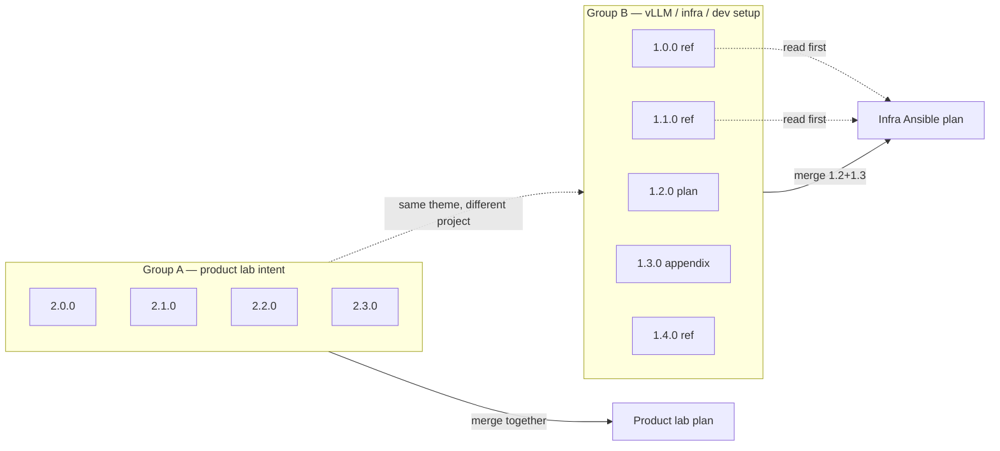

# NetBox AI infra — conversation archive index

ChatGPT exports kept as intake before promotion to `docs/plans/`. Original export titles remain the **H1** in each file.

**Archive IDs (`1.0.0`, `2.1.0`, …) are filing labels only** — not a claim about which conversation “came first” or which is parent to another across projects.

---

## No forced hierarchy

You asked the **same underlying questions** in **different ChatGPT projects** created at different times. Those exports are **parallel peers** and **merge candidates**, not a single family tree.

| Do not assume | Do assume |
|---------------|-----------|
| `2.0.x` branched from `1.0.0` (different projects) | Same *theme* asked again for another perspective |
| One file is the “true parent” of the whole archive | Each project may have its own ChatGPT branches **inside that project only** |
| Numbering `1.x` vs `2.x` means parent/child | `1.x` = one project’s exports; `2.x` = another project’s exports |

Within **`ai-ripi-agent-driven-workflow`** (`1.0.x`–`1.4.x`), ChatGPT may show branch titles (e.g. “Branch · Branch”). That is **local to that project** — it does **not** make the product-lab exports (`2.0.x`) children of `1.0.0`.

---

## Why these conversations exist (author context)

1. **Same question, new project** — Re-ask what lab / dev setup / infra you need because an older project would not remember features you had discussed or this Ansible repo.
2. **Multiple perspectives** — Branches or new chats to compare recommendations (infra vs developer workflow vs product capabilities) before committing.
3. **Merge when planning** — Combine answers that overlap; keep **long context** as linked reference so plan bodies stay slim.
4. **Do not lose narrative** — Files like `1.0.0` and `1.1.0` are valuable **context**; they should not be pasted wholesale into a merged product-lab packet (`2.0.x`).

---

## Merge groups (primary organization)

Organize by **what you would merge into a plan packet**, not by ChatGPT branch depth.

### Group A — Product lab intent (`2.0.x`)

**Question (paraphrased):** What kind of lab / development work should I set up to build **product features** I have been vetting in past conversations (not “train foundation models first”)?

**ChatGPT project:** `ai-ansible-llm-plus-planning`

| ID | File | Role when merging |
|----|------|-------------------|
| 2.0.0 | `2.0.0-product-features-what-lab-work-types-standalone.md` | Peer / standalone export |
| 2.1.0 | `2.1.0-product-features-capability-map-perspective.md` | Peer — capability map |
| 2.2.0 | `2.2.0-product-features-runtime-vs-dashboard-surfaces.md` | Peer — runtime vs dashboard |
| 2.3.0 | `2.3.0-product-features-hd01-governed-domain-blueprint.md` | Peer — HD-01 blueprint |

**Promotion:** Merge **all of Group A** → one slim **product lab intent** plan.  
**Not in that merge body:** Group B reference files (link only).

---

### Group B — vLLM / dev setup / homelab implementation (`1.0.x`–`1.4.x`)

**Question (paraphrased):** What development setup and infra do I need before / alongside vLLM catalog work, multi-GPU lanes, Ansible placement, observability?

**ChatGPT project:** `ai-ripi-agent-driven-workflow`

| ID | File | Role when merging |
|----|------|-------------------|
| 1.0.0 | `1.0.0-parent-conversation-context-and-constraints-REFERENCE.md` | **Reference** — opening context + GPU constraints (do not bloat plans) |
| 1.1.0 | `1.1.0-dev-workflow-arch-layers-operating-mode-REFERENCE.md` | **Reference** — arch / operating mode (large) |
| 1.2.0 | `1.2.0-infra-ansible-deployment-map-PLAN-INPUT.md` | **Plan input** — roles, hosts, implementation order |
| 1.3.0 | `1.3.0-infra-ansible-deployment-map-full-export.md` | **Plan appendix** — full export; merge with `1.2.0` |
| 1.4.0 | `1.4.0-langfuse-cookbook-patterns-REFERENCE.md` | **Reference** — observability patterns (later slice) |

**Promotion:**

- **Infra plan body:** `1.2.0` (+ optional `1.3.0` appendix).
- **Link, do not inline:** `1.0.0`, `1.1.0`, `1.4.0`.
- **No merge** of Group B reference text into Group A product packet.

**Optional within Group B only:** ChatGPT branch lineage (same project) — see file `branched_from` in frontmatter. Treat as notes, not cross-group hierarchy.

---

## Relationship between groups (thematic, not hierarchical)

Groups **inform** each other (product intent defines what infra must support) but are **not** parent/child in the archive.

---

## Document roles (quick reference)

| Role | Files |
|------|-------|
| **Merge → product plan** | `2.0.0`–`2.3.0` |
| **Merge → infra plan** | `1.2.0`, `1.3.0` |
| **Reference only** | `1.0.0`, `1.1.0`, `1.4.0` |

---

## Suggested promotion order

| Step | Action |
|------|--------|
| 1 | Merge **Group A** (`2.0.x`) → product lab intent plan |
| 2 | Promote **Group B** plan input (`1.2.0`, `1.3.0`); cite `1.0.0` / `1.1.0` as prerequisites |
| 3 | Use **`1.4.0`** when Langfuse/LiteLLM tracing is in scope |

---

## Original ChatGPT titles

| ID | Original filename |
|----|-------------------|
| 1.0.0 | AI Product sub-parent Conversation (context + constraints) |
| 1.1.0 | Parent-Context-to-Planning-Branch · Lab Setup - Need vllm implementaton help |
| 1.2.0 | AI Product sub-parent Conversation (Ansible map) |
| 1.3.0 | Initial Request to make a Plan--Branch · Branch · Lab Setup - Need vllm implementaton help |
| 1.4.0 | AI Product sub-parent Conversation (Langfuse) |
| 2.0.0 | Lab Setup for AI Development |
| 2.1.0 | AI Product Engineering Lab |
| 2.2.0 | AI Product Engineering Lab - name is correct for file |
| 2.3.0 | AI Product Lab Setup |

---

## Archive numbering note

`1.x` and `2.x` prefixes are **legacy filing order** from earlier sorting attempts (topic-based, then “parent at 1.0.0”). They are kept to avoid another rename churn. **Use merge groups A/B above** when deciding what to combine — not the numeric prefix alone.
