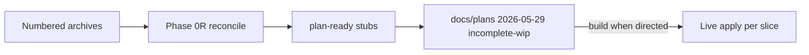
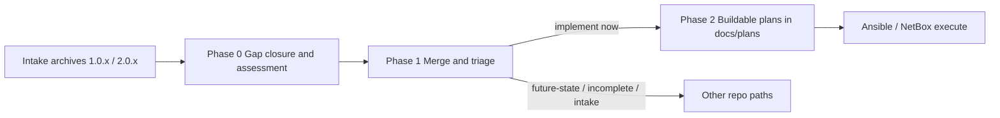
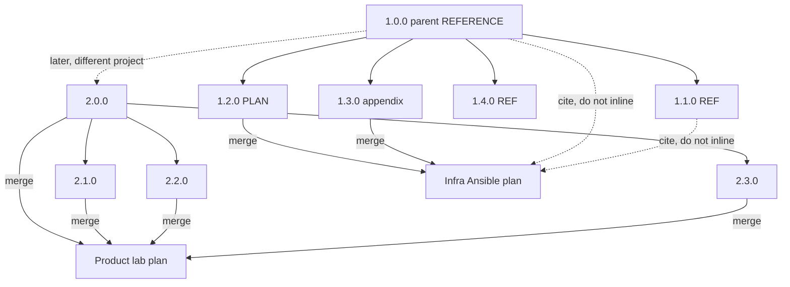

# NetBox AI infra — conversation archive index

ChatGPT exports kept as intake before promotion to `docs/plans/`. Original export titles remain the **H1** in each file.

---

## How to work this folder (current — 2026-05-29)

External AI exports were written **without** live inventory, naming schema, or Ansible context. **Phase 0** compared repo code to intake vocabulary ([ASSESSMENT.md](./ASSESSMENT.md)). The **real work now is Phase 0R**: adapt each capability to tangible hosts, multi-layer config (catalog → vLLM → LiteLLM → Langfuse → IDE), and **plan-ready** stubs you review before anything is built.

| Start here | Purpose |
|------------|---------|
| **[wip-intake-principles.md](./wip-intake-principles.md)** | Core principles (doc-first, layers, preserve rich intake wording in READMEs/plans) |
| **[intake-semantic-vocabulary.md](./intake-semantic-vocabulary.md)** | Design terms → repo artifacts; what meaning to carry into implementation |
| **[interim_intake_instructions.md](./interim_intake_instructions.md)** | Playbook: per-archive checklist, prohibited behaviors, file status |
| **[plan-ready/00-index.md](./plan-ready/00-index.md)** | Stubs + links to promoted governed plans |
| [_wip.md](./_wip.md) | Phase status and session log |
| **[AI execution program](../../../plans/2026-05-29--ai-homelab-intake-execution-incomplete-wip/README.md)** | Umbrella `docs/plans/2026-05-29--ai-*-incomplete-wip/` — NetBox-first build queue |



**Current step:** review or execute individual slices under the [execution program](../../../plans/2026-05-29--ai-homelab-intake-execution-incomplete-wip/README.md). **Not** raw Group B apply or intake GPU-lane SSOT.

**Reconciliation artifacts:** [capability-requirements-to-resources-evaluation.md](./capability-requirements-to-resources-evaluation.md), [gpu-lane-and-model-lane-mapping-evaluation.md](./gpu-lane-and-model-lane-mapping-evaluation.md), [langfuse-observability-reconciliation-evaluation.md](./langfuse-observability-reconciliation-evaluation.md), [archive-reconciliation/](./archive-reconciliation/) one-pager per numbered file.

---

## Prerequisite work (required before buildable plans)

Much of this material was planned **outside the repo** (ChatGPT projects without live inventory, naming schema, or Ansible context). Promoting it directly to `docs/plans/` would recreate the “planning gap” — recommendations that do not yet match repo truth or governance.

Do **not** skip to “merge and implement” until these phases are done (or explicitly scoped as a single assessment pass).

### Phase 0 — Close the repo gap (assess + align)

**Status:** `complete` — [ASSESSMENT.md](./ASSESSMENT.md), [ai-homelab-layer-model.md](../../reference/ai-homelab-layer-model.md)

**Goal:** Turn early conversation value into **repo-grounded** definitions — or mark what is still only aspirational.

Early exports (especially **`1.0.0`**, **`1.1.0`**) often describe how the homelab is set up, use terminology that names layers and roles more clearly than the repo had stated, and suggest ways to **simplify or refine** project description, docs, Ansible shape, and NetBox/inventory. That value is not automatically correct or complete for this repo until assessed.

| TODO | What to do | Primary sources |
|------|------------|-----------------|
| **0.1** | Inventory **terminology and architecture labels** from intake vs `docs/reference/naming-standards/`, active plans, and `roles/` / `playbooks/` layout | `1.0.0`, `1.1.0` |
| **0.2** | List **doc updates** (new or revised) so the project can be described consistently — without duplicating SSOT YAML in prose | `1.0.0`, `1.1.0`, Group A |
| **0.3** | List **Ansible structure** gaps (roles named in chat vs roles that exist; variable contracts; placement vs `list_tasks` / existing playbooks) | `1.1.0`, `1.2.0`, `1.3.0` |
| **0.4** | List **NetBox / inventory** gaps (hosts, services, GPU lanes, publication rows vs `live-object-registry.yml` and `roles/ipam_netbox/`) | `1.0.0`, `1.2.0`, `1.3.0` |
| **0.5** | **Buildability assessment** per topic: `repo-ready now` \| `needs gap closure` \| `blocked on prerequisite plan` — no plan packet until classified | All archives |
| **0.6** | Apply **safe, non-plan** repo updates where assessment is clear (naming schema rows, intake cross-links, registry stubs) — separate from full implementation | Outcome of 0.1–0.4 |

**Exit criteria for Phase 0:** Written assessment (can live in this folder as `ASSESSMENT.md` or a short `docs/intake/` note) that states, per major topic, whether it is accurate against the repo, what must change in repo SSOT first, and whether it is ready to become a plan.

**Pre-plans in the archive:** Some content (e.g. **`1.2.0`**, Group A HD-01-style blueprints) may be **close** to a plan packet. Treat as *candidate* until Phase 0.5 says otherwise — “close” is not “buildable now.”

---

### Phase 1 — Merge, triage, and route outcomes

**Status:** `complete` — see [_wip.md](./_wip.md), [phase-1-TRIAGE.md](./phase-1-TRIAGE.md)

**Goal:** Combine mergeable intake, then decide **implement now** vs **capture for later** — using repo plan patterns, not an ad hoc pile of chat exports.

| TODO | What to do | Status | Artifact |
|------|------------|--------|----------|
| **1.1** | **Merge Group A** (`2.0.0`–`2.3.0`) | `done` | [phase-1-GROUP-A-product-lab-intent-synthesis.md](./phase-1-GROUP-A-product-lab-intent-synthesis.md) |
| **1.2** | **Merge Group B** (`1.2.0` + `1.3.0`) | `done` | [phase-1-GROUP-B-infra-deployment-synthesis.md](./phase-1-GROUP-B-infra-deployment-synthesis.md) |
| **1.3** | **Triage** each capability / work item | `done` | [phase-1-TRIAGE.md](./phase-1-TRIAGE.md) |
| **1.4** | **Route outcomes** to repo home | `done` | Same triage file |

#### Triage routing (after Phase 0 + merge)

| Outcome | When to use | Repo destination (patterns) |
|---------|-------------|-----------------------------|
| **Implement now** | Phase 0.5 = `repo-ready now`; Apply/Verify/Undo can be stated; inventory/schema aligned | Promote to `docs/plans/YYYY-MM-DD--short-slug/README.md` (implementation scope) per [docs/plans/README.md](../../../plans/README.md) |
| **Buildable soon — gap first** | Sound plan but Phase 0 found SSOT or NetBox/inventory drift | `docs/plans/YYYY-MM-DD--short-slug-incomplete/README.md` with explicit “blocking gaps” section |
| **Future — not implementing now** | Worth keeping; no near-term execute | `docs/plans/YYYY-MM-DD--short-slug-future-state/README.md` (see e.g. [service-identity-dns-future-state](../../../plans/2026-05-27--service-identity-dns-future-state/README.md)) or labeled future section in an incomplete plan |
| **Idea / extract only** | Vocabulary, patterns, or observability notes (`1.4.0`) without a committed slice | Stay in `docs/intake/` or `docs/reference/`; link from plan when relevant |
| **Defer** | Duplicate of active plan or superseded by repo truth | Archive note in assessment; do not create a second plan |

**Exit criteria for Phase 1:** Every merged topic has exactly one routing label; no unassigned items left in “chat export only” form.

---

### Phase 2 — Create buildable plans (after Phase 0 + 1)

**Status:** `pending` — see [_wip.md](./_wip.md)

Only after Phase 0 assessment and Phase 1 triage:

| TODO | What to do |
|------|------------|
| **2.1** | Promote **implement now** / **incomplete** items to plan packets (`docs/plans/YYYY-MM-DD--slug/`) with diagram gate + change contract |
| **2.2** | Open or update GitHub issues for durable tracking (optional, per repo `framework-github-issue-workflow` rule) |
| **2.3** | No execution from raw chat exports |

### Phase 3 — Execute (after Phase 2)

**Status:** `pending` — see [_wip.md](./_wip.md)

| TODO | What to do |
|------|------------|
| **3.1** | Run playbooks / NetBox apply per approved plan |
| **3.2** | Plan verification receipt with evidence |
| **3.3** | Mark intake work complete only when live apply obligations are met |



---

## Archive numbering (read order)

**Lower number = earlier conversation or earlier in the read path. Higher number = handled later.**

| Range | When (your timeline) | ChatGPT project |
|-------|----------------------|-----------------|
| **`1.0.0`** | **First** — parent conversation (vLLM catalog / dev-setup context) | `ai-ripi-agent-driven-workflow` |
| **`1.1.0`–`1.4.0`** | After parent — branches / follow-ons in the same project arc | `ai-ripi-agent-driven-workflow` |
| **`2.0.0`–`2.3.0`** | **Later** — you re-asked the product-lab question in a **different** project | `ai-ansible-llm-plus-planning` |

```text
READ ORDER (chronological / filing order)

1.0.0  ← parent (start here for Group B context)
1.1.0 → 1.2.0 → 1.3.0 → 1.4.0   ← ripi project, after parent
2.0.0 → 2.1.0 → 2.2.0 → 2.3.0   ← product-lab re-asks, later
```

**`1.0.0`** is the parent conversation file (`1.0.0-parent-conversation-context-and-constraints-REFERENCE.md`). No rename needed — that placement is intentional.

---

## Merge groups (what to combine into plans)

Numbering shows **when you had the conversation**. **Merge groups** show **what to combine into a plan packet**. Those are separate ideas.

### What is mergeable?

| Merge group | Archive IDs | Merge into one plan? | Inline in plan body? |
|-------------|-------------|----------------------|----------------------|
| **A — Product lab intent** | `2.0.0` + `2.1.0` + `2.2.0` + `2.3.0` | **Yes** — one product-lab-intent packet | **Yes** — slim merged body |
| **B — Infra / Ansible map** | `1.2.0` + `1.3.0` | **Yes** — one infra deployment packet | **Yes** — `1.2.0` body; `1.3.0` optional appendix |
| **B — Reference only** | `1.0.0`, `1.1.0`, `1.4.0` | **No** — keep as separate files | **No** — link or appendix pointer only |

### What is not mergeable across groups?

| Rule | Why |
|------|-----|
| Do **not** merge Group B reference (`1.0.0`, `1.1.0`, `1.4.0`) into Group A (`2.0.x`) | Avoids context bloat in the product-lab plan |
| Do **not** merge Group A (`2.0.x`) into Group B infra plan body | Different question and project; cite if needed |
| Do **not** treat `2.0.x` as ChatGPT branches of `1.0.0` | Different projects — only thematic overlap |

### Group A — Product lab intent (`2.0.x`) — later re-asks

**Question:** What lab / development work types do I need for **product features** from older conversations?

**ChatGPT project:** `ai-ansible-llm-plus-planning`

| ID | File | Merge role |
|----|------|------------|
| 2.0.0 | `2.0.0-product-features-what-lab-work-types-standalone.md` | Merge peer |
| 2.1.0 | `2.1.0-product-features-capability-map-perspective.md` | Merge peer |
| 2.2.0 | `2.2.0-product-features-runtime-vs-dashboard-surfaces.md` | Merge peer |
| 2.3.0 | `2.3.0-product-features-hd01-governed-domain-blueprint.md` | Merge peer |

**After Phase 1 merge:** Combine all four → one **product lab intent synthesis** (intake). Promote to `docs/plans/` only after Phase 0 buildability assessment.

---

### Group B — vLLM / dev setup / homelab (`1.0.x`–`1.4.x`) — parent first, then follow-ons

**Question:** Dev setup, infra placement, multi-GPU, Ansible roles — around vLLM catalog work.

**ChatGPT project:** `ai-ripi-agent-driven-workflow`

| ID | File | Merge role |
|----|------|------------|
| 1.0.0 | `1.0.0-parent-conversation-context-and-constraints-REFERENCE.md` | **Reference** — parent; read first; do not inline into Group A |
| 1.1.0 | `1.1.0-dev-workflow-arch-layers-operating-mode-REFERENCE.md` | **Reference** — read before infra plan; do not inline into Group A |
| 1.2.0 | `1.2.0-infra-ansible-deployment-map-PLAN-INPUT.md` | **Plan input** — primary infra plan body |
| 1.3.0 | `1.3.0-infra-ansible-deployment-map-full-export.md` | **Plan appendix** — merge with `1.2.0` only |
| 1.4.0 | `1.4.0-langfuse-cookbook-patterns-REFERENCE.md` | **Reference** — observability slice when tracing work starts |

**After Phase 1 merge:** Infra synthesis from `1.2.0` (+ `1.3.0` appendix). Cite `1.0.0` / `1.1.0` as prerequisites — do not paste their full text into a plan body.

**Phase 0 note:** `1.0.0` / `1.1.0` are the main sources for **project vocabulary and structure refinement** (docs, Ansible, NetBox) — not only “background reading” for infra.

**Within Group B:** ChatGPT branch titles (e.g. on `1.1.0`, `1.3.0`) apply **inside that project only** — not to Group A.

---

## No forced cross-project hierarchy

| True | Not true |
|------|----------|
| `1.0.0` was your **first** conversation in this archive set | `2.0.x` is a **ChatGPT child branch** of `1.0.0` |
| `2.0.x` came **later** (different project, same theme re-asked) | `2.x` “inherits” merge rules from `1.0.0` as parent |
| `1.0.0` is **parent** of `1.1.0`–`1.4.0` in the ripi arc | `1.0.0` is parent of `2.0.x` across projects |

---

## Why these conversations exist (author context)

1. **Parent first (`1.0.0`)** — vLLM catalog / lab dev-setup problem; constraints and context you want preserved.
2. **Follow-ons (`1.1.0`–`1.4.0`)** — more depth, Ansible map, Langfuse patterns in the ripi project.
3. **Later re-asks (`2.0.x`)** — same product-lab question in another project because memory would not carry features or repo context.
4. **Merge when planning** — Group A together; Group B plan input together; reference files stay separate.

---

## Read order vs work order

| Purpose | Order |
|---------|--------|
| **Reading the archive** | `1.0.0` → `1.1.0` → … → `1.4.0` → `2.0.0` → … → `2.3.0` (low → high ID) |
| **Work order (required)** | **Phase 0** (gap + assessment) → **Phase 1** (merge + triage) → **Phase 2** (buildable `docs/plans/`) → execute |
| **Not yet** | Skipping straight to “promote Group A / Group B to plans” or Ansible implementation |

---

## Relationship diagram



---

## Document roles (quick reference)

| Role | Files |
|------|-------|
| **Parent / read first** | `1.0.0` |
| **Merge → product plan** | `2.0.0`–`2.3.0` |
| **Merge → infra plan** | `1.2.0`, `1.3.0` |
| **Reference only** | `1.0.0`, `1.1.0`, `1.4.0` |

---

## Original ChatGPT titles

| ID | Original filename |
|----|-------------------|
| 1.0.0 | AI Product sub-parent Conversation (context + constraints) |
| 1.1.0 | Parent-Context-to-Planning-Branch · Lab Setup - Need vllm implementaton help |
| 1.2.0 | AI Product sub-parent Conversation (Ansible map) |
| 1.3.0 | Initial Request to make a Plan--Branch · Branch · Lab Setup - Need vllm implementaton help |
| 1.4.0 | AI Product sub-parent Conversation (Langfuse) |
| 2.0.0 | Lab Setup for AI Development |
| 2.1.0 | AI Product Engineering Lab |
| 2.2.0 | AI Product Engineering Lab - name is correct for file |
| 2.3.0 | AI Product Lab Setup |
