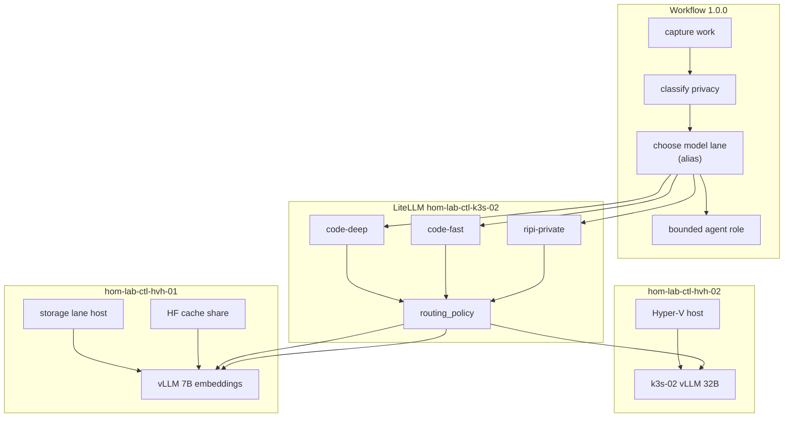

# GPU lane + model lane mapping — evaluation

**Type:** evaluation  
**Source:** [1.0.0-parent-conversation-context-and-constraints-REFERENCE.md](./1.0.0-parent-conversation-context-and-constraints-REFERENCE.md) (lines 79–93), [1.1.0-dev-workflow-arch-layers-operating-mode-REFERENCE.md](./1.1.0-dev-workflow-arch-layers-operating-mode-REFERENCE.md) (`model_aliases`, privacy)  
**Related:** [capability-requirements-to-resources-evaluation.md](./capability-requirements-to-resources-evaluation.md), [gpu-host-inventory-evaluation.md](./gpu-host-inventory-evaluation.md), [ai-homelab-layer-model.md](../../reference/ai-homelab-layer-model.md)

---

## Reconciliation rule (two different promotion paths)

| Intake concept | Promote to repo SSOT? | How |
|----------------|----------------------|-----|
| **Model lane** (`code-deep`, `ripi-private`, …) | **Yes** — real labels for LiteLLM, clients, Langfuse | Schema pattern + `k3s_litellm_gateway_model_list` + trace metadata |
| **Routing policy** (`local-5090`, `local-only`, …) | **Yes** — attached to each alias | Router/guardrail config + privacy rules (plan slice) |
| **“5090 lane” / “second GPU lane”** (1.0.0 table titles) | **No** — provenance only | Map **jobs** to hosts/guests/roles; do not mint `gpu_lane_*` IDs |

When inventory does not list “5090 lane,” that is expected. The job list is **decomposed below** into deployments on `hom-lab-ctl-hvh-02` / `hom-lab-ctl-k3s-02`, not into a parallel lane registry.

---

## Two different words (do not confuse)

| Term | What it is | Repo vocabulary |
|------|------------|-----------------|
| **GPU lane** *(intake only)* | 1.0.0 **job description** for a physical host | `hom-lab-ctl-hvh-02`, `hyperv_lane_gpu`, vLLM guest — **no** `lane-*` slug |
| **Model lane** | **Which API alias / policy** for this request | `code-deep`, `ripi-private`, `code-fast` — **yes**, schema + LiteLLM `model_name` |

Intake table (1.0.0 lines 82–84) = hardware **jobs** (provenance).  
Intake `model_aliases` in 1.1.0 (lines 1094–1105) = **model lanes** (implement).

They connect like this:

```text
Workflow step: "choose model lane"
        ↓
Client sends LiteLLM model_name = alias (e.g. code-deep)
        ↓
Routing policy on that alias (e.g. local-5090) + privacy class (e.g. private-code)
        ↓
LiteLLM model_list maps alias → provider model + api_base (vLLM OpenAI URL on k3s-02)
        ↓
vLLM on that guest runs a specific Hugging Face model id
```

**LiteLLM naming (authoritative):** Per [LiteLLM proxy config](https://docs.litellm.ai/docs/proxy/configs) and [vLLM provider](https://docs.litellm.ai/docs/providers/vllm):

| LiteLLM field | Who sets it | Example for `code-deep` |
|---------------|-------------|-------------------------|
| `model_list[].model_name` | **You** — friendly alias clients send | `code-deep` |
| `model_list[].litellm_params.model` | LiteLLM → upstream | `hosted_vllm/Qwen/Qwen2.5-Coder-32B-Instruct-AWQ` |
| `model_list[].litellm_params.api_base` | Points at **vLLM** OpenAI server | `http://vllm.vllm-runtime.svc.cluster.local:8000/v1` |
| `model_list[].litellm_params.api_key` | Usually `none` for local vLLM | `none` |
| `proxy_config.router_settings` | Fallback / load-balance / guardrails | See § full `proxy_config` below |

Intake `lane: local-5090` is **routing policy metadata** (+ future guardrails), not a second client-facing name.

---

## Multi-layer stack (do not collapse)

See [wip-intake-principles.md](./wip-intake-principles.md) — **fresh doc check** required for every **new** Langfuse / LiteLLM / IDE surface.

| Layer | Role | What it stores | Repo owner |
|-------|------|----------------|------------|
| **1 — Weights / catalog** | Downloaded HF repos, quant choice, disk path | `Qwen/Qwen2.5-Coder-32B-Instruct-AWQ` on `\\hom-lab-ctl-hvh-01\public\models\...` | [plan-ready/model-catalog-storage-incomplete.md](./plan-ready/model-catalog-storage-incomplete.md) |
| **2 — vLLM (runner)** | Loads **one** model (or configured set), serves OpenAI `/v1` | Helm release in `vllm-runtime` NS on **hom-lab-ctl-k3s-02** | [plan-ready/vllm-primary-stack-incomplete.md](./plan-ready/vllm-primary-stack-incomplete.md) |
| **3 — LiteLLM (gateway)** | Friendly **aliases** → `model_name`, `litellm_params.model`, `api_base` | `k3s_litellm_gateway` → `proxy_config.model_list` | [plan-ready/litellm-model-lanes-incomplete.md](./plan-ready/litellm-model-lanes-incomplete.md) |
| **4 — Langfuse (observability)** | Trace metadata, callbacks | `model_lane`, `context_class`, `agent_role` | [langfuse-observability-reconciliation-evaluation.md](./langfuse-observability-reconciliation-evaluation.md) |
| **5 — IDE / operator client** | OpenClaw / Cursor → LiteLLM | `OPENAI_API_BASE`, alias choice | capability eval §I; Mac playbook |

**Your read is correct:** vLLM is the **runner** (and local cache for weights it loads). LiteLLM **`code-deep`** is the **helpful name** that points at that runner. “Primary deep reasoning” and “Heavy coding” are **two intake jobs** that share **one vLLM deployment** but **different rows** in the table below (runtime vs alias).

---

## “5090 lane” job list — concrete values (1.0.0 lines 82–84)

Intake phrase **“5090 lane”** is not stored in inventory. Each **job** maps to real artifacts:

| Intake job | Layer | Concrete value (candidate — confirm at plan) | Ansible / plan |
|------------|-------|-----------------------------------------------|----------------|
| **Primary deep local reasoning** | vLLM + weights | HF id `Qwen/Qwen2.5-Coder-32B-Instruct-AWQ`; vLLM `--model` same id; guest **hom-lab-ctl-k3s-02**; NS `vllm-runtime` | `deploy_vllm_runtime.yaml` / `k3s_vllm_runtime` ([2026-05-19 plan](../../../plans/2026-05-19--vllm-runtime-and-huggingface-cache/README.md)) |
| **Heavy coding** | LiteLLM alias | `model_name: code-deep` → `litellm_params.model: hosted_vllm/Qwen/Qwen2.5-Coder-32B-Instruct-AWQ`, `api_base` = vLLM URL below | `k3s_litellm_gateway_model_list` |
| **vLLM primary** | Published service | Cluster: `http://vllm.vllm-runtime.svc.cluster.local:8000/v1`; operator (after publication): `http://vllm.hom.lab/v1`; NetBox slug `vllm-k3s-primary` / code `vlm` | [2026-05-28 publication plan](../../../plans/2026-05-28--k3s-vllm-service-publication-incomplete/README.md) |
| **Sensitive/private work** | LiteLLM policy | `router_settings` + guardrails: `context_class: private-core` → only `ripi-private`, `code-deep` (local backends) | Extend `build_helm_values.yml` `proxy_config` |

**Smoke path before 32B:** plan uses `Qwen/Qwen3-0.6B` for first vLLM bring-up; swap served model to 32B AWQ when VRAM validated — same URL, update vLLM deployment + `litellm_params.model` string.

**Second GPU path** (intake phrase only): separate vLLM on **hom-lab-ctl-hvh-01** / **k3s-01** when commissioned — see § second-stack table below.

---

## Full `proxy_config` target (Ansible → Helm)

Today `roles/k3s_litellm_gateway/tasks/build_helm_values.yml` sets only `model_list`, `general_settings`, `litellm_settings`. **Yes — we will add `router_settings`** in the **litellm-model-lanes** plan slice after vLLM URL exists. Reconciliation defines the values now; live apply is plan execute, not this doc.

```yaml
# Target proxy_config shape — values land in k3s_litellm_gateway_helm_values.proxy_config
# (Illustrative; api_base must match live vLLM Service DNS after VLLM-1)

proxy_config:
  model_list:
    # --- Local vLLM primary (hom-lab-ctl-k3s-02) ---
    - model_name: code-deep
      litellm_params:
        model: hosted_vllm/Qwen/Qwen2.5-Coder-32B-Instruct-AWQ
        api_base: http://vllm.vllm-runtime.svc.cluster.local:8000/v1
        api_key: none
      model_info:
        routing_policy: local-5090
        vllm_deployment: vllm-k3s-primary
        primary_guest: hom-lab-ctl-k3s-02

  # --- Local vLLM secondary (hom-lab-ctl-hvh-01) — when second vLLM exists ---
    - model_name: code-fast
      litellm_params:
        model: hosted_vllm/Qwen/Qwen2.5-Coder-7B-Instruct
        api_base: http://vllm-secondary.vllm-runtime.svc.cluster.local:8000/v1
        api_key: none
      model_info:
        routing_policy: local-preferred
        primary_guest: hom-lab-ctl-k3s-01

    - model_name: ripi-private
      litellm_params:
        model: hosted_vllm/Qwen/Qwen2.5-Coder-7B-Instruct
        api_base: http://vllm-secondary.vllm-runtime.svc.cluster.local:8000/v1
        api_key: none
      model_info:
        routing_policy: local-only

    - model_name: embeddings-local
      litellm_params:
        model: hosted_vllm/BAAI/bge-small-en-v1.5
        api_base: http://vllm-secondary.vllm-runtime.svc.cluster.local:8000/v1
        api_key: none

    # --- Cloud (vault keys via litellm-env-secret) ---
    - model_name: public-research
      litellm_params:
        model: gemini/gemini-2.5-flash
        api_key: os.environ/GEMINI_API_KEY
      model_info:
        routing_policy: azure-allowed

    - model_name: code-review
      litellm_params:
        model: hosted_vllm/Qwen/Qwen2.5-Coder-7B-Instruct
        api_base: http://vllm-secondary.vllm-runtime.svc.cluster.local:8000/v1
        api_key: none
      model_info:
        routing_policy: local-or-azure

    # --- Keep during migration ---
    - model_name: gpt-4o-mini
      litellm_params:
        model: gpt-4o-mini
        api_key: os.environ/OPENAI_API_KEY

    - model_name: default
      litellm_params:
        model: gpt-4o-mini
        api_key: os.environ/OPENAI_API_KEY

  router_settings:
    routing_strategy: simple-shuffle
    # Fallback example: code-fast tries local vLLM then cloud (decision D-2)
    # model_group_alias / fallbacks configured per LiteLLM docs when second backend live

  litellm_settings:
    success_callback: ["langfuse"]
    drop_params: true

  general_settings:
    master_key: os.environ/PROXY_MASTER_KEY
```

**Client call (OpenClaw / Cursor):** `POST http://litellm.hom.lab/v1/chat/completions` with `"model": "code-deep"` — LiteLLM resolves alias → vLLM.

**Implementation order (mandatory):**

1. Deploy vLLM (`VLLM-1`) → stable `api_base`
2. Add `model_list` rows with real `api_base` (litellm-model-lanes plan)
3. Add `router_settings` + guardrails (same plan, after aliases work)
4. Publish `vllm.hom.lab` + NetBox `vlm` row (publication plan)
5. Langfuse metadata keys match `model_name` slugs

---

## Second stack (hom-lab-ctl-hvh-01) — job → values

| Intake job (second GPU path) | vLLM / catalog | LiteLLM `model_name` |
|------------------------------|----------------|----------------------|
| Smaller models | `Qwen/Qwen2.5-Coder-7B-Instruct` on secondary vLLM | `code-fast`, `ripi-private`, `code-review` |
| Embeddings | `BAAI/bge-small-en-v1.5` | `embeddings-local` |
| Experiments | TBD small HF id | `experiment` |
| HF cache canonical | `\\hom-lab-ctl-hvh-01\public\models\huggingface\` | *(catalog manifest, not LiteLLM)* |

---

## Model lanes — research summary (1.1.0)

### Intake defines two vocabularies — pick one for SSOT

| Source in 1.1.0 | Examples | Repo decision |
|-----------------|----------|---------------|
| Prose table §2 (“Initial lanes”) | `coding-fast`, `coding-deep`, `private-reasoning` | **Do not** use as primary IDs — narrative only |
| YAML `model_aliases` | `code-deep`, `code-fast`, `ripi-private`, `code-review`, `public-research` | **Canonical model lane slugs** |

Add **`embeddings-local`** and **`experiment`** from crosswalk (capability eval); align Langfuse traces to the same slugs.

### Each model lane — schema + LiteLLM fields (1.1.0 `model_aliases`)

| `model_name` (client) | `routing_policy` | `litellm_params.model` | `litellm_params.api_base` (cluster) |
|-----------------------|------------------|------------------------|-------------------------------------|
| `code-deep` | `local-5090` | `hosted_vllm/Qwen/Qwen2.5-Coder-32B-Instruct-AWQ` | `http://vllm.vllm-runtime.svc.cluster.local:8000/v1` |
| `code-fast` | `local-preferred` | `hosted_vllm/Qwen/Qwen2.5-Coder-7B-Instruct` | `http://vllm-secondary.vllm-runtime.svc.cluster.local:8000/v1` |
| `ripi-private` | `local-only` | `hosted_vllm/Qwen/Qwen2.5-Coder-7B-Instruct` | same secondary vLLM |
| `code-review` | `local-or-azure` | `hosted_vllm/Qwen/Qwen2.5-Coder-7B-Instruct` (+ optional cloud route) | secondary vLLM |
| `embeddings-local` | local | `hosted_vllm/BAAI/bge-small-en-v1.5` | secondary vLLM |
| `public-research` | `azure-allowed` | `gemini/gemini-2.5-flash` | *(cloud — no vLLM)* |
| `experiment` | local | `hosted_vllm/<smoke-hf-id>` | secondary vLLM |

**Privacy is a separate axis.** 1.1.0 `ripi_context_class` + `allowed_model_lanes: [local-vllm, …]` describe **runtime class**, not alias slugs. Reconciliation:

| Privacy `context_class` | May use model lanes (aliases) | Blocked |
|-------------------------|------------------------------|---------|
| `private-code` | `code-deep`, `code-fast`, `ripi-private`, `code-review` (local backends only) | `public-research` |
| `private-core` | `ripi-private`, local-only aliases | all cloud routes |
| `public-research` | `public-research`, optional `code-review` cloud leg | — |

Automated enforcement = LiteLLM router / guardrails plan slice — not manual “5090 lane” labels.

---

## Schema entries to create (model lanes — real SSOT)

Per [capability_introduction_checklist.md](../../codex_framework/capability_introduction_checklist.md): **patterns first**, then registry instances, then `k3s_litellm_gateway_model_list`.

### 1. Pattern — `docs/reference/naming-standards/ansible.yml` *(proposed block)*

```yaml
# Proposed — add in litellm / gateway section when plan approved
model_lane_aliases:
  status: candidate
  slug_pattern: "^[a-z][a-z0-9]*(-[a-z0-9]+)*$"   # code-deep, ripi-private
  routing_policy_enum:
    - local-5090
    - local-only
    - local-preferred
    - local-or-azure
    - azure-allowed
  client_model_name: "<slug>"                      # LiteLLM model_list.model_name
  upstream_model: "<provider>/<model-id>"        # litellm_params.model
  ansible_variable: k3s_litellm_gateway_model_list
  trace_metadata_key: model_lane                  # Langfuse / proxy metadata
```

### 2. Reference instances — `live-object-registry.yml` *(proposed `model_lanes:` section)*

One row per alias: `slug`, `routing_policy`, `primary_guest`, `hf_repo_id` (when catalog exists). **No** `gpu_lane` field — use `primary_guest: hom-lab-ctl-k3s-02` etc.

### 3. Runtime — `roles/k3s_litellm_gateway`

- **Today:** `defaults/main.yml` → `k3s_litellm_gateway_model_list` (only `gpt-4o-mini`); `build_helm_values.yml` → `proxy_config.model_list` only.
- **Plan execute:** copy rows from § **Full `proxy_config` target** into `k3s_litellm_gateway_model_list` + add `router_settings` key beside `model_list` in `proxy_config`.
- **Schema:** each alias row in `live-object-registry.yml` `model_lanes:` with `slug`, `litellm_model`, `api_base`, `routing_policy`, `hf_repo_id`.

### 4. Router / policy — `router_settings` *(yes, in plan slice)*

| Intake `lane:` | LiteLLM surface | Concrete mechanism |
|----------------|-----------------|---------------------|
| `local-5090` | `model_info.routing_policy` + alias only hits primary vLLM `api_base` | No cloud fallback on `code-deep` |
| `local-only` | Guardrail (Enterprise or custom pre-call) | Block cloud models when `metadata.context_class: private-core` |
| `local-preferred` | `router_settings` + model fallbacks | Local `code-fast` deployment first, then `gemini/gemini-2.5-flash` (D-2) |
| `azure-allowed` | `public-research` row only | `gemini/...` + vault key |

**Status:** Not on disk yet → **`…--litellm-model-lanes-incomplete`** after **`k3s_vllm_runtime`** exposes `api_base`.

### 5. Langfuse — trace contract *(proposed, not NetBox)*

Align 1.1.0 trace example (lines 1119–1128) with alias slugs:

```yaml
# Per completion — observability plan slice
model_lane: code-deep          # same string as LiteLLM model_name
routing_policy: local-5090     # from model_info / router
context_class: private-code
agent_role: coder
primary_guest: hom-lab-ctl-k3s-02   # optional backend hint — host slug, not intake lane name
```

Do **not** add Langfuse dimension `gpu_lane: lane-5090-primary`.

---

## What is “choose model lane”? (1.0.0 line 91)

```text
capture work → classify privacy → choose model lane → run one bounded agent role
  → trace result → test/verify → promote/reject
```

| Step | Tangible today | Tangible after plan slices |
|------|----------------|----------------------------|
| **capture work** | Cursor chat / issue | RIPI work item (future) |
| **classify privacy** | You decide | `context_class` on LiteLLM extra body / metadata |
| **choose model lane** | Manual model pick | `model: code-deep` on `http://litellm.hom.lab/v1` |
| **run bounded agent role** | Cursor mode | Same + `agent_role` in trace |
| **trace result** | Langfuse partial | Full metadata contract above |
| **test/verify** | ansible-lint / pytest | Plan receipt |
| **promote/reject** | Git / plan lifecycle | Steward |

| Maturity | How “choose model lane” happens |
|----------|----------------------------------|
| **V0** | You pick alias in Cursor/OpenClaw (= `model_name`) |
| **V1** | Script sets `model=code-deep` on LiteLLM |
| **V2** | Router: `context_class: private-code` → allowlist aliases |

---

## Host mapping (intake job lists → existing repo only)

### `hom-lab-ctl-hvh-02` *(intake “5090 lane” — jobs only)*

| Repo surface | Value |
|--------------|-------|
| Inventory host | `hom-lab-ctl-hvh-02` |
| Inventory group | `hyperv_lane_gpu` |
| Inference guest | `hom-lab-ctl-k3s-02` |
| GPU fact | `gpu: rtx-5090` |
| Model lanes served here (via guest) | `code-deep` (primary) |
| HF weights | Read from hvh-01 share and/or local PVC — path in catalog plan |

### `hom-lab-ctl-hvh-01` *(intake “second GPU” — jobs only)*

| Repo surface | Value |
|--------------|-------|
| Inventory host | `hom-lab-ctl-hvh-01` |
| Inventory group | `hyperv_lane_storage` |
| Guests | `hom-lab-ctl-dkr-01`, `hom-lab-ctl-k3s-01` |
| GPU fact | TBD (`nvidia-smi`) |
| Model lanes (when commissioned) | `code-fast`, `code-review`, `embeddings-local`, `experiment`, `ripi-private` |
| Operator intent | Langfuse/MinIO placement — **drift** vs k3s-02; placement decision |
| HF cache vote | Public share on hvh-01 — confirm path (D-4) |

### Third desktop — out of scope

`dev-workstation-win` — stub/diagram only.

---

## What is missing today

| Gap | Create (approved naming) | Do not create |
|-----|--------------------------|---------------|
| Model lane aliases in LiteLLM | `k3s_litellm_gateway_model_list` rows + schema pattern | `homelab_gpu_lanes.yml` |
| Routing policies | `proxy_config.router_settings` in `k3s_litellm_gateway` | NetBox tag `gpu-lane-*` |
| vLLM service + publication | `k3s_vllm_runtime` + `vllm.hom.lab` | `gpu_lane_id` host_var |
| Langfuse metadata | `model_lane`, `context_class`, `agent_role` | Intake lane display names in SSOT |
| HF catalog | Share manifest + registry rows | Per-lane NetBox taxonomy |
| 5090 job list “not in inventory” | Satisfied by host + guest + alias rows above | Lane registry file |

**Plan slices:** `…--litellm-model-lanes-incomplete` (aliases + policies), vLLM plan, Langfuse observability — see §J in [capability-requirements-to-resources-evaluation.md](./capability-requirements-to-resources-evaluation.md).

---

## Diagram



---

Sources checked:
- [1.0.0-parent-conversation-context-and-constraints-REFERENCE.md](./1.0.0-parent-conversation-context-and-constraints-REFERENCE.md)
- [1.1.0-dev-workflow-arch-layers-operating-mode-REFERENCE.md](./1.1.0-dev-workflow-arch-layers-operating-mode-REFERENCE.md) (`model_aliases`, privacy, trace)
- [ai-homelab-layer-model.md](../../reference/ai-homelab-layer-model.md)
- [capability_introduction_checklist.md](../../codex_framework/capability_introduction_checklist.md)
- `roles/k3s_litellm_gateway/defaults/main.yml`
- [LiteLLM proxy config](https://docs.litellm.ai/docs/proxy/configs)
- [LiteLLM vLLM provider](https://docs.litellm.ai/docs/providers/vllm)
- `roles/k3s_litellm_gateway/tasks/build_helm_values.yml`
- [vllm-architecture-discussion.md](./vllm-architecture-discussion.md)
- `docs/plans/2026-05-19--vllm-runtime-and-huggingface-cache/`, `docs/plans/2026-05-28--k3s-vllm-service-publication-incomplete/`
- `inventory/group_vars/hyperv_lane_gpu/main.yml`
