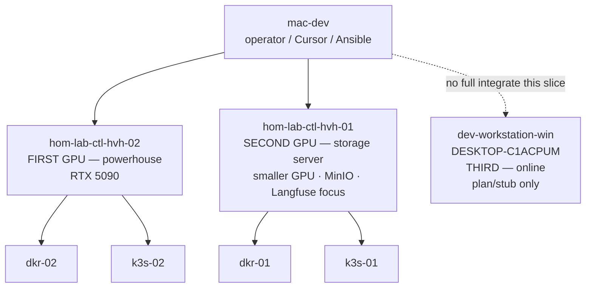

# Host role reconciliation — discussion

**Type:** discussion (operator truth vs ChatGPT intake vs repo deployment)  
**Not executable:** planning and documentation only until placement decisions are promoted into plans.

---

## Why this file exists

ChatGPT exports were written **without live inventory values**. They used placeholders (`second-gpu-host`, `ollama-experimental`, generic “storage server”) that **describe intent**, not your current Ansible/NetBox truth.

This document captures **your corrections** and **where the repo disagrees**, so Phase 2 plans target the right machines.

---

## Three-node model (operator truth)

| # | Your label | Host | Primary purpose |
|---|------------|------|----------------|
| 1 | **First GPU / powerhouse** | `hom-lab-ctl-hvh-02` | Heavy **vLLM** inference, private/deep coding models |
| 2 | **Second GPU / storage** | `hom-lab-ctl-hvh-01` | **MinIO**, **Langfuse**-oriented work, smaller-GPU lanes (reviewer/embeddings) |
| 3 | **Third desktop** | `dev-workstation-win` / `DESKTOP-C1ACPUM` | Documented and diagrammed; **not** fully integrated in current build work |

---

## Repo current state vs operator intent (important drift)

| Concern | Operator intent | Repo today (estate diagram + inventory) |
|---------|-----------------|----------------------------------------|
| Langfuse | Second GPU / storage server focus | Deployed on **`hom-lab-ctl-k3s-02`** (5090 lane) via `k3s_langfuse_platform` |
| MinIO | Storage server | Active **`hom-lab-ctl-dkr-02`** (5090 lane); hvh-01 has MinIO **exposure vars** for lane convergence |
| LiteLLM gateway | Shared platform | **`k3s-02`** (5090 lane) — likely stays near primary inference |
| vLLM | Powerhouse (5090) | **Not deployed** — plan targets K3s on GPU worker path |

**Architect reading:** You are not wrong about **roles** (powerhouse vs storage). The repo **already shipped** some storage/observability **on the 5090 lane guests** for operational convenience. Reconciliation choices:

1. **Keep services where they are** but update **documentation and NetBox narrative** so “second GPU” semantics apply to future vLLM/embeddings on hvh-01, OR  
2. **Migrate** Langfuse/MinIO toward storage-lane guests over a dedicated plan (larger change).

Phase 2 infra plan should **state which option** before any mutating Ansible.

---

## ChatGPT intake placeholders → inventory keys

| Intake placeholder | Replaced with |
|--------------------|---------------|
| `5090 server` / primary lane | `hom-lab-ctl-hvh-02` + guests dkr-02 / k3s-02 |
| `second-gpu-host` | **`hom-lab-ctl-hvh-01`** (+ guests dkr-01 / k3s-01 when commissioned) |
| `third-gpu-desktop` | **`dev-workstation-win`** (`DESKTOP-C1ACPUM`) — scope: design only |
| `mac-dev` | `mac-dev` in `execution_nodes` — unchanged |

---

## Third node scope boundary (mandatory)

For `dev-workstation-win` / `DESKTOP-C1ACPUM`:

- **Allowed now:** diagrams, evaluation docs, inventory stubs, comments in plans, optional **disabled** Ansible flags  
- **Not allowed now:** commissioning, driver convergence, vLLM/Ollama deploy, NetBox apply, “catch-up” reconciliation playbooks  
- **Reason:** Node was offline; operator not prepared for full integration in this slice  

See [gpu-host-inventory-evaluation.md](./gpu-host-inventory-evaluation.md) for AMD RX 9060 XT facts.

---

## Open decisions (block plan execute)

1. **Service migration:** Move Langfuse/MinIO narrative (or workloads) to storage lane, or split “observability on k3s-02” + “storage GPU inference on hvh-01”?  
2. **Second GPU model:** Record after `nvidia-smi` on hvh-01 — drives which reviewer/embedding models fit.  
3. **vLLM on hvh-02:** K3s pod on k3s-02 (repo plan) vs Windows-native on Windows host — see [vllm-architecture-discussion.md](./vllm-architecture-discussion.md).
