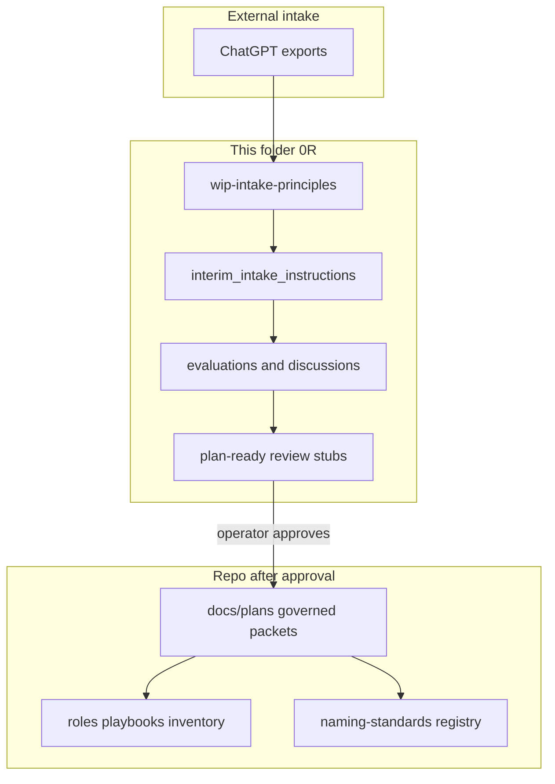
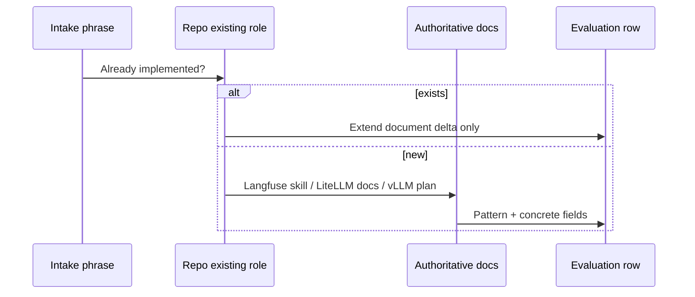

# Interim intake instructions — netbox_ai_infra_impl_planning_wip

**Status:** active playbook for this folder (interim until reconciliation + plan-ready review complete)  
**Principles:** [wip-intake-principles.md](./wip-intake-principles.md)  
**Tracker:** [_wip.md](./_wip.md)

---

## Start here

1. Read [wip-intake-principles.md](./wip-intake-principles.md).  
2. Run the **per-archive checklist** (below) for the file you are processing.  
3. Write or update `*-evaluation.md` / `*-discussion.md` — do **not** edit raw `1.x.0` / `2.x.0` export bodies except a one-line provenance footer.  
4. Add or update rows in [plan-ready/](./plan-ready/) when a slice is ready for operator review.  
5. Log progress in [_wip.md](./_wip.md) and the **file status matrix** (end of this doc).

---

## What we are actually doing (vs old README wording)

| Phase | Name | True status | What it means |
|-------|------|-------------|----------------|
| 0 | Repo gap assessment | **complete** | Compared intake vocabulary to roles/plans on disk — [ASSESSMENT.md](./ASSESSMENT.md) |
| **0R** | **Capability reconciliation** | **in progress** | Map generics → hosts, LiteLLM rows, Langfuse patterns, vLLM — **this is the real work now** |
| 1 | Merge + triage | complete (provisional) | GROUP-A/B + [phase-1-TRIAGE.md](./phase-1-TRIAGE.md) — **refresh after 0R** |
| 2 | Governed `docs/plans/` | **blocked** | Until plan-ready stubs reviewed and you approve promotion |
| 3 | Live apply | pending | After governed plans + execute approval |

**Current way to proceed:** follow this document + principles — not “promote Group B and implement.”



---

## Prohibited behaviors (learned the hard way)

| Do not | Do instead |
|--------|------------|
| Mint `gpu_lane_id`, `homelab_gpu_lanes.yml`, NetBox `gpu-lane-*` from intake titles | Map **jobs** to `hom-lab-ctl-hvh-*`, guests, roles |
| Collapse vLLM + LiteLLM + Langfuse into one vague row | **Multi-layer table** per intake job (see below) |
| Implement Langfuse/LiteLLM/IDE from memory | **Fresh doc check** per NEW surface (§ doc research gate) |
| Pin/download model candidates or assign them to hosts from brainstorm text alone | **Expert research + read-only live probes** before pinning (§ expert fill gate) |
| Leave explicit operator decisions only in chat | Add them immediately to `## On Deck — user decisions to integrate`, then wire them into scope/checklist/receipt before build |
| Use "do one first" wording to omit the rest of an approved scope | Keep the full model/agent/resource set in the plan; sequencing can only order execution |
| Copy `ai_*` role dirs from chat without evaluation | Map to `k3s_*` **and** record modularity review — [plan-ready/ansible-modularity-and-ai-role-names.md](./plan-ready/ansible-modularity-and-ai-role-names.md) |
| Skip `model_name` / `litellm_params` / `api_base` for model lanes | Full LiteLLM rows in evaluation + `k3s_litellm_gateway_model_list` target |
| Mark Phase 2 ready while 0R open | Update [plan-ready/](./plan-ready/) only |
| Run playbooks / NetBox apply from intake | Change contract + your approval |

---

## Doc research gate (mandatory for NEW surfaces)

Before adding a reconciliation row for a **new** Langfuse, LiteLLM, vLLM, IDE, or NetBox behavior:



| NEW surface | Minimum research |
|-------------|------------------|
| **Langfuse** trace metadata, scores, datasets, prompts | Langfuse skill: `llms.txt` + integration page for LiteLLM proxy; cite URL in row |
| **LiteLLM** alias, router, guardrail | LiteLLM proxy config + vLLM provider docs |
| **vLLM** model, cache, publication | Repo vLLM plans + vLLM OpenAI server docs |
| **IDE** OpenClaw / Cursor | Operator connection doc + `deploy_development_nodes` tasks |
| **Ansible** new role boundary | `list_tasks` on candidate playbooks + modularity review doc |

**Row is incomplete** without `Sources checked:` for that surface.

---

## Expert fill gate (mandatory for brainstorm-defined resources)

This folder exists because the numbered exports define capabilities, desired
workflows, and friendly purpose names before the exact implementation details
are fully known. When the intake says what is needed but not exactly what to
install, download, place, or model, do not guess from the brainstorm. Fill the
gap with research and read-only evidence.

Before a plan-ready stub or governed plan pins any of the following, add an
**Expert research and live probe receipt**:

- Hugging Face model IDs, quantization, model sizes, or download lists
- vLLM runtime placement, GPU host assignment, or model-to-host mapping
- LiteLLM aliases, routing policies, fallbacks, or privacy classes
- Langfuse trace fields tied to model/routing behavior
- NetBox objects, tags, config contexts, custom fields, or registry rows
- IDE/OpenClaw/Cursor client behavior that depends on current product docs

Minimum receipt:

| Field | Required content |
|-------|------------------|
| Intake need | Friendly purpose and archive link (`code-deep`, `code-review`, etc.) |
| Source research | Primary docs/model cards/vendor docs checked, with short conclusion |
| Repo facts | Existing roles, plans, inventory, registry, and NetBox seed surfaces checked |
| Live probes | Read-only host/GPU/service/NetBox probes, or explicit blocker |
| Decision | Candidate chosen, deferred, or rejected, with reason |
| Follow-on | Plan/checklist row that owns implementation |

For model-catalog work, this gate is required **before** marking a model row
anything stronger than `candidate`. For runtime placement, it is required
**before** assigning a model lane to a host/guest beyond `proposed`.

---

## Suggestion review and trajectory gate

For cookbook, evaluation, and pattern-heavy intake, review **every suggestion**
for ideas worth carrying forward. Do not treat "not this slice" as a disposal
bin.

Every suggestion must land in one row with:

| Field | Required content |
|-------|------------------|
| Suggestion | Intake phrase or cookbook/pattern name |
| Knowledge value | What idea, constraint, or workflow it contributes |
| Disposition | `implement-now`, `extract-knowledge`, `defer-with-trajectory`, or `reject` |
| Current artifact | Plan/checklist/README/schema row that carries the idea now |
| Full trajectory | What would fully implement it later, including prerequisite and owner plan |
| Research status | Docs fetched now, docs still needed, or live probe needed |

For Langfuse cookbook patterns, this means each pattern gets more than a
doc-check yes/no: it also gets a route and future implementation trajectory if
the current slice only absorbs part of the idea.

---

## On-deck decision gate

During review, explicit operator decisions must be captured in the active plan
or plan-ready stub immediately:

```markdown
## On Deck — user decisions to integrate
```

Use this when a decision is bigger than the paragraph currently being edited or
spans multiple plans. Before build/execute, every on-deck item must be either:

- integrated into the plan scope, checklist, dependency graph, and verification
  receipt;
- moved to a named sibling plan with `depends_on_plans` / `unblocks`; or
- closed by a later operator correction.

Rows may not stay as loose reminders once a plan is marked buildable.

Minimum row:

| ID | Operator decision | Target integration | Status |
|----|-------------------|--------------------|--------|
| OD-000 | Decision text | Plan section/checklist/receipt/sibling plan | on-deck |

For the current AI lane work, the decision "implement several agent types and
model lanes now" means the plan chain must carry the full friendly set from the
numbered docs, not only `code-deep`.

---

## Multi-layer table template (per intake job)

Use **one row per layer** when the job touches that layer:

| Intake job (provenance) | Layer | Concrete value | Repo / plan owner | Doc check done? |
|-------------------------|-------|----------------|-------------------|-----------------|
| e.g. Heavy coding | LiteLLM | `model_name: code-deep`, `litellm_params.model: hosted_vllm/Qwen/...`, `api_base: http://vllm...` | `k3s_litellm_gateway` | LiteLLM + vLLM URLs |
| e.g. Primary deep reasoning | vLLM | HF `Qwen/Qwen2.5-Coder-32B-Instruct-AWQ`, NS `vllm-runtime`, guest k3s-02 | `k3s_vllm_runtime` | vLLM plan |
| e.g. trace result | Langfuse | `model_lane`, `context_class`, `agent_role` on trace | `k3s_langfuse_platform` | Langfuse observability docs |
| e.g. OpenClaw setup | IDE | `OPENAI_API_BASE=http://litellm.hom.lab/v1`, model `code-deep` | Mac dev playbook | Langfuse optional via proxy |

**Golden example:** [gpu-lane-and-model-lane-mapping-evaluation.md](./gpu-lane-and-model-lane-mapping-evaluation.md) — § Three layers, § 5090 job list, § Full proxy_config.

**LiteLLM fields are retained** for mature model lanes — they are the SSOT for client-facing names; intake `lane: local-5090` attaches as `model_info.routing_policy` + `router_settings`, not a second client name.

---

## Per-archive playbook

Read order: `1.0.0` → `1.4.0` → `2.0.0` → `2.3.0` ([README](./README.md)).

### Checklist (every archive pass)

- [ ] List **capabilities** (bullets), not file title  
- [ ] Repo mapping: role, host, registry row, or gap  
- [ ] **Doc research gate** for each NEW Langfuse / LiteLLM / vLLM / IDE item  
- [ ] **Expert fill gate** for brainstorm-defined models, runtimes, host placement, NetBox metadata, and client behavior  
- [ ] **Suggestion trajectory gate** for cookbook/eval/reference suggestions, including partial adoptions  
- [ ] **On-deck decision gate**: explicit operator decisions are integrated or routed before build  
- [ ] Multi-layer table for each job  
- [ ] **Semantic capture:** add/update rows in [intake-semantic-vocabulary.md](./intake-semantic-vocabulary.md) (design meaning + where wording carries into READMEs, task names, parameter descriptions)  
- [ ] Plan-ready stub includes **Intake intent (preserved)** section with archive link  
- [ ] Route: plan-ready / future-state / extract / reject placeholder  
- [ ] Update [archive-reconciliation/](./archive-reconciliation/) one-pager  
- [ ] Update file status matrix (below)  
- [ ] Log in [_wip.md](./_wip.md)

### Semantic carryover (required at implementation time)

Intake archives are **agnostic modular design**; reconciliation is **repo-specific truth**. Both phases matter:

| Phase | Output | Loses if skipped |
|-------|--------|------------------|
| Design (archives) | Clear names, jobs, workflow, “why” | Operators don’t know what a slug is for |
| 0R (this folder) | Hosts, LiteLLM rows, doc checks | Wrong or placeholder tech |
| Build (after approval) | Ansible, plans, schema | — |

When writing or promoting implementation, **import rich wording** into:

- `roles/*/README.md` — purpose, workflow step, operator-facing names  
- Playbook task `name:` — human-readable capability (Ansible tag can stay `k3s_litellm_gateway`)  
- `meta/argument_specs.yml` — `description:` with intake meaning + technical constraint  
- `defaults/main.yml` — comment above each non-obvious var  
- Governed plan README — “Intake intent” + “What the operator sees” before checklist  

**Do not** paste large intake blocks into plan bodies (governance: no SSOT duplication). **Do** paraphrase and link to archive section + vocabulary row.

### File-specific guidance

| File | Merge group | Primary outputs | 0R status |
|------|-------------|-----------------|-----------|
| [1.0.0](./1.0.0-parent-conversation-context-and-constraints-REFERENCE.md) | B ref | [gpu-lane-and-model-lane-mapping-evaluation.md](./gpu-lane-and-model-lane-mapping-evaluation.md), [host-role-reconciliation-discussion.md](./host-role-reconciliation-discussion.md), [archive-reconciliation/1.0.0.md](./archive-reconciliation/1.0.0.md) | **reviewed** |
| [1.1.0](./1.1.0-dev-workflow-arch-layers-operating-mode-REFERENCE.md) | B ref | [capability-requirements-to-resources-evaluation.md](./capability-requirements-to-resources-evaluation.md), gpu-lane § model lanes, [archive-reconciliation/1.1.0.md](./archive-reconciliation/1.1.0.md) | **reviewed** |
| [1.2.0](./1.2.0-infra-ansible-deployment-map-PLAN-INPUT.md) | B plan | [plan-ready/ansible-modularity-and-ai-role-names.md](./plan-ready/ansible-modularity-and-ai-role-names.md), refresh GROUP-B, [archive-reconciliation/1.2.0.md](./archive-reconciliation/1.2.0.md) | **reviewed** |
| [1.3.0](./1.3.0-infra-ansible-deployment-map-full-export.md) | B appendix | Delta vs 1.2.0 in archive-reconciliation | **reviewed** |
| [1.4.0](./1.4.0-langfuse-cookbook-patterns-REFERENCE.md) | B ref | [langfuse-observability-reconciliation-evaluation.md](./langfuse-observability-reconciliation-evaluation.md), [plan-ready/langfuse-trace-metadata-incomplete.md](./plan-ready/langfuse-trace-metadata-incomplete.md) | **reviewed** |
| [2.0.0](./2.0.0-product-features-what-lab-work-types-standalone.md) | A merge | GROUP-A refresh, [archive-reconciliation/2.0.0.md](./archive-reconciliation/2.0.0.md) | **reviewed** |
| [2.1.0](./2.1.0-product-features-capability-map-perspective.md) | A merge | Same — product future-state | **reviewed** |
| [2.2.0](./2.2.0-product-features-runtime-vs-dashboard-surfaces.md) | A merge | Same | **reviewed** |
| [2.3.0](./2.3.0-product-features-hd01-governed-domain-blueprint.md) | A merge | Same — HD-01 not hostname code | **reviewed** |

---

## Plan-ready folder (your review target)

Stubs live under [plan-ready/](./plan-ready/). Each has change contract + dependencies — **not** governed plans until you promote to `docs/plans/`.

| Stub | Covers | Blocked on |
|------|--------|------------|
| [00-index.md](./plan-ready/00-index.md) | Master list + diagram | — |
| [vllm-primary-stack-incomplete.md](./plan-ready/vllm-primary-stack-incomplete.md) | vLLM + publication | GPU infra + read-only GPU probe |
| [litellm-model-lanes-incomplete.md](./plan-ready/litellm-model-lanes-incomplete.md) | model_list + router_settings | vLLM URL + model-lane research |
| [langfuse-trace-metadata-incomplete.md](./plan-ready/langfuse-trace-metadata-incomplete.md) | Trace contract | Langfuse doc check + per-pattern trajectory |
| [ansible-modularity-and-ai-role-names.md](./plan-ready/ansible-modularity-and-ai-role-names.md) | Role boundaries | Your modularity call |
| [model-catalog-storage-incomplete.md](./plan-ready/model-catalog-storage-incomplete.md) | HF share manifest | D-4 path confirm + model research receipt |

---

## Open decisions (do not resolve silently)

| ID | Question | Blocks |
|----|----------|--------|
| D-1 | ripi-private model-only vs Notion MCP | alias design |
| D-2 | code-fast local 7B vs Gemini default | router fallbacks |
| D-3 | Langfuse/MinIO on k3s-02 vs migrate to hvh-01 | placement rows |
| D-4 | HF share path on hvh-01 | catalog layer |

---

## File status matrix (living)

| Archive | Reconciliation one-pager | Evaluations updated | Plan-ready stub | Operator review |
|---------|------------------------|---------------------|-----------------|-----------------|
| 1.0.0 | yes | yes | vllm + host | pending |
| 1.1.0 | yes | yes | litellm + lanes | pending |
| 1.2.0 | yes | modularity doc | ansible slice | pending |
| 1.3.0 | yes | appendix delta | (part of B) | pending |
| 1.4.0 | yes | langfuse eval | langfuse slice | pending |
| 2.0.0 | yes | GROUP-A note | future-state | pending |
| 2.1.0 | yes | GROUP-A note | future-state | pending |
| 2.2.0 | yes | GROUP-A note | future-state | pending |
| 2.3.0 | yes | GROUP-A note | future-state | pending |

---

## After you approve plan-ready stubs

1. Promote to `docs/plans/YYYY-MM-DD--slug-incomplete/README.md` with diagram gate + verification receipt template.  
2. GitHub issue optional per framework rule.  
3. Execute only when you say **build** and prerequisites have probe evidence.

---

Sources checked:
- [wip-intake-principles.md](./wip-intake-principles.md)
- [README.md](./README.md), [_wip.md](./_wip.md)
- [reconciliation-workflow-discussion.md](./reconciliation-workflow-discussion.md)
- Langfuse skill (documentation-first principle)
- [gpu-lane-and-model-lane-mapping-evaluation.md](./gpu-lane-and-model-lane-mapping-evaluation.md)
