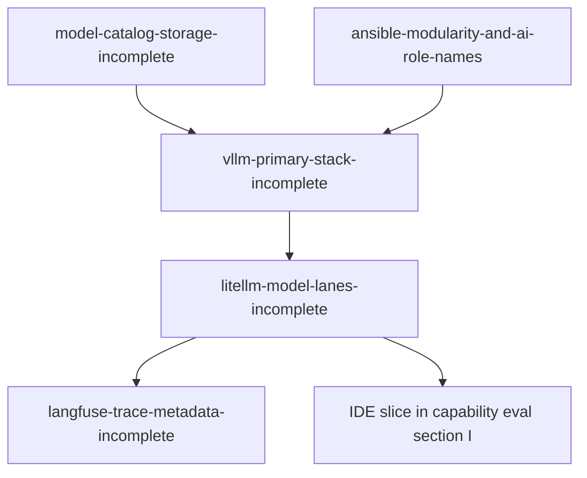

# Plan-ready index — operator review

**Purpose:** Slices massaged from intake → repo truth. Stubs remain here for diff/history; **governed plans** now live under `docs/plans/2026-05-29--ai-*-incomplete-wip/` (see promoted table below).

**Playbook:** [interim_intake_instructions.md](../interim_intake_instructions.md)  
**Principles:** [wip-intake-principles.md](../wip-intake-principles.md)

---

## Dependency order



| Order | Stub | Route after approval | Execute on homelab? |
|-------|------|----------------------|---------------------|
| 1 | [ansible-modularity-and-ai-role-names.md](./ansible-modularity-and-ai-role-names.md) | Shapes role boundaries | No — design only |
| 2 | [model-catalog-storage-incomplete.md](./model-catalog-storage-incomplete.md) | Incomplete plan | Partial (share path) |
| 3 | [vllm-primary-stack-incomplete.md](./vllm-primary-stack-incomplete.md) | Extends existing vLLM plans | Yes when approved |
| 4 | [litellm-model-lanes-incomplete.md](./litellm-model-lanes-incomplete.md) | Incomplete plan | Yes after vLLM URL |
| 5 | [langfuse-trace-metadata-incomplete.md](./langfuse-trace-metadata-incomplete.md) | Incomplete plan | Config only |

**Product / RIPI / HD-01:** stay in Group A — **future-state** until infra stubs land.

---

## Review status

**2026-05-29:** Operator pass — plans promoted to `docs/plans/2026-05-29--ai-*-incomplete-wip/`. Use governed READMEs for edits and execute; stubs kept for history.

## Review checklist (for Josh)

- [x] Host placement matches operator truth (hvh-02 primary, hvh-01 storage)  
- [ ] No intake GPU lane SSOT  
- [ ] LiteLLM rows include `model_name`, `litellm_params.model`, `api_base`  
- [ ] Langfuse slice cites doc research (not memory)  
- [ ] `ai_*` modularity notes acceptable or trigger cleanup issue  
- [ ] Dependencies honest (vLLM before aliases)  
- [ ] Ready to promote selected stubs to `docs/plans/`

---

## Promoted plans (2026-05-29 — incomplete-wip)

| Stub | Governed plan |
|------|----------------|
| [ansible-modularity-and-ai-role-names.md](./ansible-modularity-and-ai-role-names.md) | [ai-ansible-modularity-and-gaps-incomplete-wip](../../../plans/2026-05-29--ai-ansible-modularity-and-gaps-incomplete-wip/README.md) |
| [model-catalog-storage-incomplete.md](./model-catalog-storage-incomplete.md) | [ai-model-catalog-hf-storage-incomplete-wip](../../../plans/2026-05-29--ai-model-catalog-hf-storage-incomplete-wip/README.md) |
| [vllm-primary-stack-incomplete.md](./vllm-primary-stack-incomplete.md) | [ai-vllm-primary-stack-incomplete-wip](../../../plans/2026-05-29--ai-vllm-primary-stack-incomplete-wip/README.md) |
| [litellm-model-lanes-incomplete.md](./litellm-model-lanes-incomplete.md) | [ai-litellm-model-lanes-incomplete-wip](../../../plans/2026-05-29--ai-litellm-model-lanes-incomplete-wip/README.md) |
| [langfuse-trace-metadata-incomplete.md](./langfuse-trace-metadata-incomplete.md) | [ai-langfuse-observability-incomplete-wip](../../../plans/2026-05-29--ai-langfuse-observability-incomplete-wip/README.md) |

**Umbrella:** [ai-homelab-intake-execution-incomplete-wip](../../../plans/2026-05-29--ai-homelab-intake-execution-incomplete-wip/README.md)

---

## Promotion path

```text
plan-ready/*.md  →  docs/plans/YYYY-MM-DD--slug-incomplete-wip/README.md  (done 2026-05-29)
                   →  operator review / suggestions
                   →  optional GitHub issue
                   →  execute after explicit "build"
```
