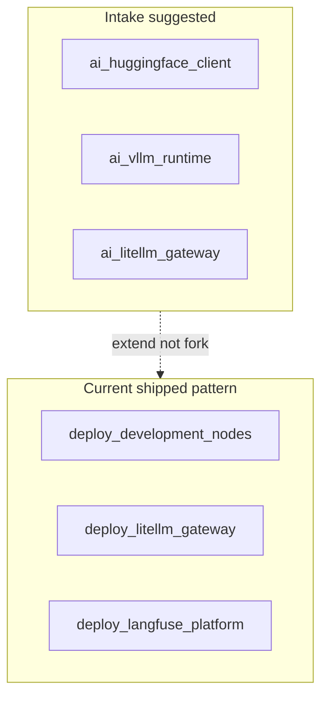

# Plan-ready — Ansible modularity + `ai_*` intake role names

**Status:** awaiting operator review  
**Outcome:** Design notes + optional cleanup backlog — not a mandate to rename shipped roles

---

## Why evaluate instead of only reject

ChatGPT proposed a **capability-separated** role list (`ai_vllm_runtime`, `ai_litellm_gateway`, `ai_langfuse_platform`, …). Repo ships overlapping `k3s_*` roles. The intake names may be **good vocabulary** even when implementation extends existing roles.

**Questions for operator review:**

1. Are any playbooks **bloated** (should split per capability)?  
2. Should intake labels become **schema candidates** (`capability_slug` in registry)?  
3. Is `k3s_` prefix still the right namespace for all K3s AI services?

---

## Mapping table (intake → repo)

| Intake role (1.2.0) | Shipped / planned repo surface | Modularity note |
|---------------------|-------------------------------|-----------------|
| `ai_litellm_gateway` | `k3s_litellm_gateway` | Shipped — extend, do not duplicate |
| `ai_langfuse_platform` | `k3s_langfuse_platform` | Shipped |
| `ai_vllm_runtime` | `k3s_vllm_runtime` (plan) | Align with vLLM plans |
| `ai_huggingface_client` | vault HF token + vLLM role | Could stay embedded vs tiny role |
| `ai_nvidia_runtime` | `llm_compute_windows` + validate playbook | GPU verify separate from vLLM |
| `ai_ollama_runtime` | **Reject** — vLLM per operator | — |
| `ai_ide_client` | `deploy_development_nodes`, `homelab_hosts_file_mac` | Cross-cutting — not one role |
| `ai_privacy_policy` | LiteLLM router + future guardrails | Policy not a role |
| `ipam_netbox_ai_services` | extend `ipam_netbox` | NetBox slice when URLs stable |

---

## Playbook composition review (from 1.2.0 order)

| Observation | Recommendation |
|-------------|----------------|
| Separate deploy playbooks per K3s service | **Keep** — matches repo pattern |
| Extra `ai_*` role dirs | **Avoid** — extend `k3s_*` unless deliberate rename pass approved |
| HF client as standalone role | **Defer** — fold into vLLM role unless reuse >2 consumers |

---

## Schema capture (optional future cleanup)

| Candidate slug | Source | Use if approved |
|----------------|--------|-----------------|
| `litellm-gateway` | intake `ai_litellm_gateway` | registry `deployed_by_role` alias label |
| `vllm-runtime` | intake | service slug `vllm-k3s-primary` |
| `langfuse-platform` | intake | already `lfs` code |

---

## Apply / Verify / Undo / Change class

| | |
|---|---|
| **Apply** | Documentation + triage row updates only in this slice |
| **Verify** | `sysoperator.list_tasks` on candidate playbooks shows clear tags |
| **Undo** | N/A |
| **Class** | Doc / design |

---

## Operator decision requested

- [ ] Keep `k3s_*` naming only  
- [ ] Add schema aliases for intake `ai_*` labels  
- [ ] Open cleanup issue for playbook split/merge (describe which playbook)
